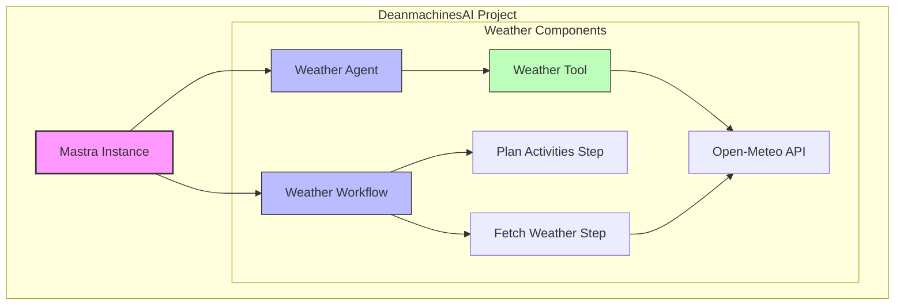
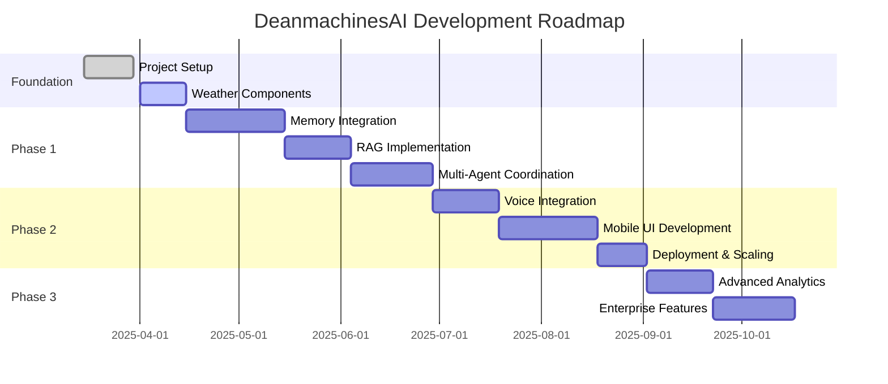
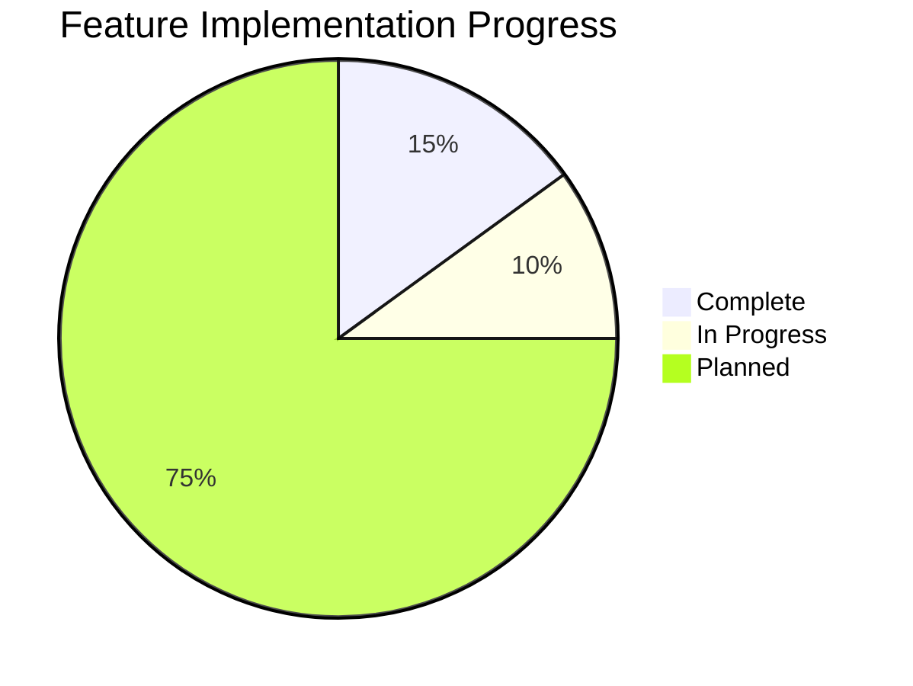
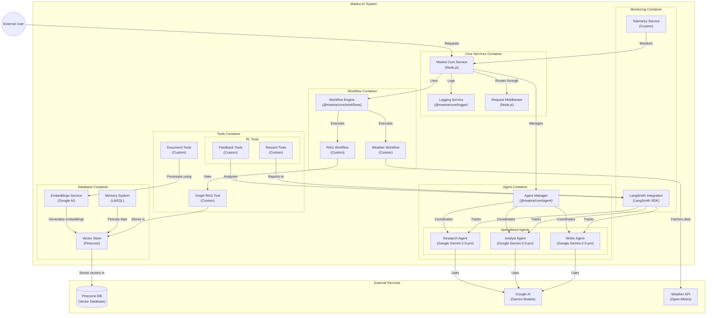

# DeanmachinesAI

A Mastra AI-powered application with intelligent agents and workflows for weather forecasting and activity planning.

## 📋 Project Overview

DeanmachinesAI leverages the Mastra TypeScript framework to build AI applications with agents, tools, and workflows. The project currently focuses on weather data retrieval and analysis, with planned expansions into other domains.

## 🏗️ Current Architecture



## 🛠️ Technology Stack

- **Framework**: Mastra AI (TypeScript)
- **LLM Provider**: Google AI (Gemini 1.5 Pro)
- **Storage**:
  - Turso (LibSQL) for agent memory
  - Pinecone for vector database
- **APIs**:
  - Open-Meteo for weather data
- **Monitoring**: LangSmith for tracing and evaluation

## 🔍 Current Features

- **Weather Agent**: Provides accurate weather information for locations
- **Weather Tool**: Fetches and formats current weather conditions
- **Weather Workflow**: Multi-step process to fetch weather and recommend activities

## 📈 Development Roadmap



## ✅ Current Progress



## 🌐 Environment Configuration

The project is configured with:

- Google AI API for LLM capabilities
- Turso Database for persistent agent memory
- LangSmith for observability and tracing
- Pinecone for vector database functionality
- Upstash for Redis-based caching (not currently in use)

## 🚀 Getting Started

### Prerequisites

- Node.js 18+
- API keys for Google AI, Turso, and other services

### Installation

```bash
# Clone the repository
git clone https://github.com/yourusername/DeanmachinesAI.git

# Navigate to project directory
cd DeanmachinesAI

# Install dependencies
npm install

# Set up environment variables
cp .env.example .env.development
# Edit .env.development with your API keys
```

### Running the Project

```bash
# Start the development server
npm run dev
```

## 📊 Future Scope

### Planned Components

1. **Memory System**
   - Persistent conversation history
   - Context-aware responses
   - User preference tracking

2. **RAG Implementation**
   - Document ingestion and vectorization
   - Semantic search capabilities
   - Knowledge base management

3. **Multi-Modal Agents**
   - Voice interface integration
   - Image recognition capabilities
   - Cross-modal reasoning

4. **Specialized Tools**
   - Calendar and scheduling
   - Personal finance assistant
   - Health and wellness tracker

## 📝 License

This project is licensed under the ISC License - see the LICENSE file for details.


