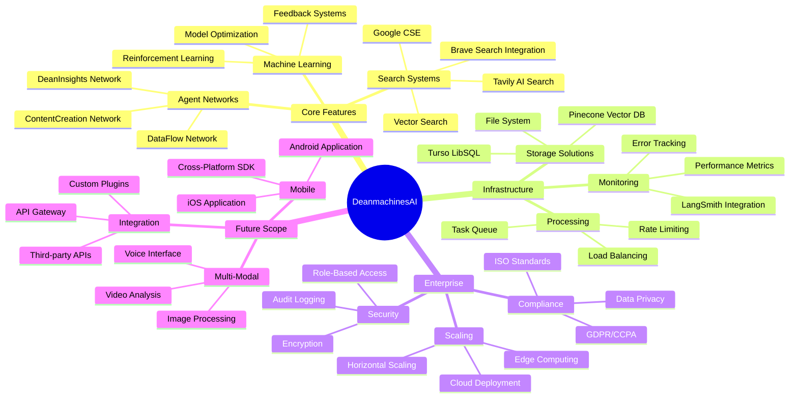
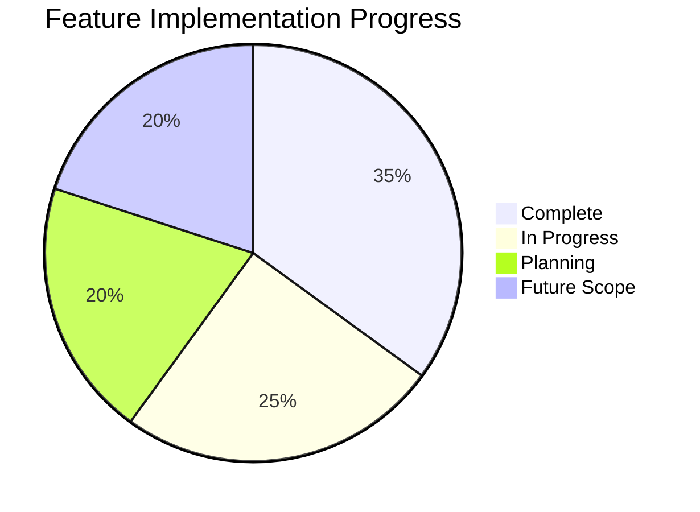

<div align="center">

# DeanmachinesAI

A Mastra AI-powered application with intelligent agents, networks, and workflows for research, analysis, and document processing with reinforcement learning capabilities and enhanced search functionality.


## 📋 Project Overview

DeanmachinesAI leverages the Mastra TypeScript framework to build advanced AI applications with specialized agents, flexible tools, and collaborative workflows. The system utilizes agent networks for dynamic task routing and reinforcement learning for continuous improvement, enabling sophisticated information processing and knowledge generation through vector search and web retrieval capabilities.

## 🏗️ Current Architecture

```mermaid
C4Component
    title DeanmachinesAI System Architecture

    Container_Boundary(agents, "Agent Layer") {
        Container_Boundary(search, "Search Tools") {
            Component(brave, "Brave Search")
            Component(tavily, "Tavily Search")
            Component(google, "Google Search")
            Component(calc, "Calculator")
        }

        Container_Boundary(core, "Core Tools") {
            Component(doc, "Document Tools")
            Component(rag, "RAG Tools")
            Component(rl, "RL Tools")
            Component(fs, "File System")
        }

        Container_Boundary(networks, "Agent Networks") {
            Component(dean, "DeanInsights")
            Component(data, "DataFlow")
            Component(content, "ContentCreation")
        }
    }

    Container_Boundary(infra, "Infrastructure") {
        Container_Boundary(vector, "Vector Storage") {
            Component(pinecone, "Pinecone DB")
            Component(turso, "Turso LibSQL")
        }

        Container_Boundary(ai, "AI Services") {
            Component(gemini, "Google Gemini")
            Component(langsmith, "LangSmith")
        }

        Container_Boundary(apis, "External APIs") {
            Component(weather, "Weather API")
            Component(exa, "Exa Search")
        }
    }

    Rel(networks, search, "Uses")
    Rel(networks, core, "Uses")
    Rel(core, vector, "Stores data")
    Rel(search, apis, "Queries")
    Rel(networks, ai, "LLM requests")
    UpdateRelStyle(networks, search, "blue", "thick")
    UpdateRelStyle(networks, ai, "red", "thick")
```

## 🛠️ Technology Stack

- **Framework**: Mastra AI (TypeScript)
- **LLM Provider**: Google AI (Gemini 2.0 Pro/Flash)
- **Storage**:
  - Turso (LibSQL) for agent memory
  - Pinecone for vector database
  - Upstash for backup vector storage
- **APIs**:
  - Open-Meteo for weather data
  - Exa for enhanced web search
- **Tokenization**: js-tiktoken with o200 encoding
- **Monitoring & Evaluation**:
  - LangSmith for tracing and observability
  - Custom reinforcement learning feedback loops

## 🔍 Key Features

### Agent Systems

- **Dynamic Agent Networks**: LLM-based routing between specialized agents
- **Collaborative Workflows**: Predefined execution paths for complex tasks
- **Specialized Agents**:
  - Research Agent for information gathering
  - Analyst Agent for data interpretation
  - Writer Agent for documentation
  - RL Trainer Agent for system improvement
  - Data Manager Agent for file operations

### Tools & Capabilities

- **File System Tools**:
  - Reading from files with encoding options
  - Writing to files with backup options
  - Line-based file access for large files
- **RL Feedback System**:
  - Collection of explicit and implicit feedback
  - Analysis of performance metrics
  - Automated policy improvement
- **RL Reward System**:
  - Custom reward function definitions
  - State-action pair evaluation
  - Policy optimization based on observed rewards
- **Document Processing**:
  - Semantic search for relevant content
  - Content analysis and insight generation
  - Formatting for various documentation types
- **Search Tools**:
  - **Brave Search**: Web search with privacy focus and customizable results
  - **Tavily Search**: AI-optimized search engine with comprehensive and quick modes
  - **Google Custom Search**: Enterprise-grade search with safe search options
  - **Calculator**: Mathematical expression evaluation and computation
- **Search & Retrieval**:
  - Exa-powered web search with metadata filtering
  - Vector query with js-tiktoken tokenization
  - Hybrid semantic search with reranking capabilities

### Workflow Implementations

- **RAG Research Workflow**: Research, analysis and documentation generation
- **Weather Workflow**: Location-based forecasts and activity recommendations

## 📈 Development Progress

```mermaid
gantt
    title DeanmachinesAI Development Roadmap
    dateFormat YYYY-MM-DD

    section Core Infrastructure
    Project Foundation           :done, found, 2025-03-15, 2025-03-25
    Base Architecture           :done, arch, 2025-03-20, 2025-04-01
    Agent System Core           :done, agent, 2025-03-25, 2025-04-10
    Memory Integration          :done, mem, 2025-04-01, 2025-04-15

    section Search & Retrieval
    Vector Store Setup         :done, vec, 2025-04-01, 2025-04-10
    RAG Implementation        :done, rag, 2025-04-05, 2025-04-20
    Brave Search              :done, brave, 2025-04-15, 2025-04-20
    Tavily Integration        :done, tavily, 2025-04-18, 2025-04-25
    Google CSE Setup          :done, gcse, 2025-04-20, 2025-04-28
    Search Optimization       :active, sopt, 2025-04-25, 2025-05-10

    section Agent Networks
    Network Architecture      :done, net, 2025-04-15, 2025-04-30
    Agent Communication       :active, comm, 2025-04-25, 2025-05-15
    Task Distribution        :active, task, 2025-05-01, 2025-05-20
    Network Optimization     :pending, netopt, 2025-05-15, 2025-06-01

    section Machine Learning
    RL Framework             :active, rl, 2025-05-01, 2025-05-25
    Feedback Systems         :active, feed, 2025-05-10, 2025-06-01
    Model Fine-tuning        :pending, tune, 2025-05-20, 2025-06-15
    Performance Analysis     :pending, perf, 2025-06-01, 2025-06-20

    section Enterprise Features
    Security Implementation  :pending, sec, 2025-06-01, 2025-06-25
    Compliance Framework    :pending, comp, 2025-06-15, 2025-07-10
    Enterprise UI           :pending, ui, 2025-06-20, 2025-07-15
    Documentation          :pending, docs, 2025-07-01, 2025-07-25

    section Future Expansion
    Multi-Modal Support     :pending, multi, 2025-07-15, 2025-08-15
    Voice Interface         :pending, voice, 2025-08-01, 2025-08-30
    Mobile Applications     :pending, mobile, 2025-08-15, 2025-09-15
    Edge Computing         :pending, edge, 2025-09-01, 2025-09-30
```

## 🎯 Project Scope



## 📊 Implementation Status



## 🧠 Agent Networks

DeanmachinesAI implements three specialized agent networks that enable dynamic collaboration between agents:

### 1. DeanInsights Network

Orchestrates all specialized agents to deliver comprehensive research and analysis with well-structured outputs.

### 2. DataFlow Network

Focused on data processing operations with an emphasis on reinforcement learning and continuous improvement.

### 3. ContentCreation Network

Specializes in researching topics and producing high-quality content with continuous improvement through feedback.

## 🔎 Enhanced Search & Retrieval

The system implements advanced search capabilities:

### ExaSearch Tool

- Provides high-quality web search results
- Supports filtering by site, date ranges, and content types
- Returns formatted results for RAG applications
- Handles full content retrieval for comprehensive analysis

### Vector Query Tool

- Uses js-tiktoken with o200 encoding for efficient tokenization
- Integrates with Pinecone for high-performance vector search
- Supports semantic reranking with configurable weight balancing
- Enables metadata filtering for precise result targeting

## 🤖 Reinforcement Learning

The system implements two reinforcement learning subsystems:

### RL Feedback System

- Collects explicit feedback from users
- Derives implicit feedback from system metrics
- Analyzes patterns to identify improvement opportunities
- Applies insights to improve agent prompts and behavior

### RL Reward System

- Defines custom reward functions for specific tasks
- Evaluates state-action pairs to calculate rewards
- Tracks reward history for policy optimization
- Suggests improvements based on historical performance

## 🌐 Environment Configuration

The project requires configuration for:

- Google AI API for LLM capabilities
- Turso Database for persistent agent memory
- LangSmith for observability and tracing
- Pinecone for vector database functionality
- Exa API for advanced web search

## 🚀 Getting Started

### Prerequisites

- Node.js 18+
- API keys for Google AI, Turso, Exa, and other services

### Installation

```bash
# Clone the repository
git clone https://github.com/yourusername/DeanmachinesAI.git

# Navigate to project directory
cd DeanmachinesAI

# Install dependencies
npm install

# Set up environment variables
cp .env.example .env.development
# Edit .env.development with your API keys
```

### Running the Project

```bash
# Start the development server
npm run dev
```

## 🔮 Future Scope

### Planned Enhancements

1. **Extended Agent Networks**
   - Domain-specific agent networks
   - Cross-network collaboration
   - Hierarchical decision making

2. **Advanced RL Capabilities**
   - Multi-objective reinforcement learning
   - Exploration vs. exploitation balancing
   - Transfer learning between agents

3. **Multi-Modal Support**
   - Voice interface integration
   - Image recognition capabilities
   - Cross-modal reasoning

4. **Enterprise Features**
   - Role-based access controls
   - Audit logging and compliance
   - High-availability deployment options

## 📝 License

This project is licensed under the ISC License - see the LICENSE file for details.

## 📊 System Architecture

```mermaid
graph TB
    User((External User))

    subgraph "Deanmachines AI System"
        subgraph "Agent Network Layer"
            DeanInsights["DeanInsights Network<br>AgentNetwork"]
            DataFlow["DataFlow Network<br>AgentNetwork"]
            ContentCreation["ContentCreation Network<br>AgentNetwork"]
        end

        subgraph "Core Agents"
            ResearchAgent["Research Agent<br>TypeScript"]
            AnalystAgent["Analyst Agent<br>TypeScript"]
            WriterAgent["Writer Agent<br>TypeScript"]
            RLTrainerAgent["RL Trainer Agent<br>TypeScript"]
            DataManagerAgent["Data Manager Agent<br>TypeScript"]
        end

        subgraph "Database Layer"
            VectorStore["Vector Store<br>Pinecone"]
            LibSQLStore["Memory Store<br>LibSQL"]
            RedisCache["Cache Layer<br>Redis"]
        end

        subgraph "Services Layer"
            LangChain["LangChain Service<br>TypeScript"]
            LangFuse["LangFuse Service<br>TypeScript"]
            LangSmith["LangSmith Service<br>TypeScript"]
            ExaSearch["ExaSearch Service<br>TypeScript"]
        end

        subgraph "Tool Components"
            subgraph "Search Tools"
                BraveSearch["Brave Search<br>REST API"]
                GoogleSearch["Google Search<br>REST API"]
                TavilySearch["Tavily Search<br>REST API"]
                ExaSearchTool["Exa Search<br>REST API"]
            end

            subgraph "Vector Tools"
                VectorQuery["Vector Query<br>TypeScript"]
                GoogleVectorQuery["Google Vector Query<br>TypeScript"]
                FilteredQuery["Filtered Query<br>TypeScript"]
            end

            subgraph "File Tools"
                ReadFile["Read File Tool<br>TypeScript"]
                WriteFile["Write File Tool<br>TypeScript"]
            end

            subgraph "RL Tools"
                FeedbackTools["Feedback Tools<br>TypeScript"]
                RewardTools["Reward Tools<br>TypeScript"]
            end
        end
    end

    subgraph "External Services"
        GoogleAI["Google AI<br>External API"]
        PineconeDB["Pinecone DB<br>Vector Database"]
    end

    %% Connections
    User -->|Interacts with| DeanInsights
    User -->|Interacts with| DataFlow
    User -->|Interacts with| ContentCreation

    %% Agent Network Connections
    DeanInsights -->|Coordinates| ResearchAgent
    DeanInsights -->|Coordinates| AnalystAgent
    DeanInsights -->|Coordinates| WriterAgent
    DeanInsights -->|Coordinates| RLTrainerAgent
    DeanInsights -->|Coordinates| DataManagerAgent

    DataFlow -->|Uses| DataManagerAgent
    DataFlow -->|Uses| AnalystAgent
    DataFlow -->|Uses| RLTrainerAgent

    ContentCreation -->|Uses| ResearchAgent
    ContentCreation -->|Uses| WriterAgent
    ContentCreation -->|Uses| RLTrainerAgent

    %% Agent Tool Connections
    ResearchAgent -->|Uses| SearchTools
    ResearchAgent -->|Uses| VectorTools
    AnalystAgent -->|Uses| VectorTools
    DataManagerAgent -->|Uses| FileTools
    RLTrainerAgent -->|Uses| FeedbackTools
    RLTrainerAgent -->|Uses| RewardTools

    %% Database Connections
    VectorStore -->|Stores Embeddings| PineconeDB
    LibSQLStore -->|Persists Memory| VectorStore
    RedisCache -->|Caches Data| LibSQLStore

    %% Service Connections
    LangChain -->|Integrates with| GoogleAI
    LangFuse -->|Monitors| LangChain
    LangSmith -->|Traces| LangChain
    ExaSearch -->|Provides Search| ExaSearchTool
```



</div>
