# DeanmachinesAI

DeanmachinesAI is a state-of-the-art, Mastra AI‑powered platform that transforms research, analysis, and document processing through intelligent agent orchestration, dynamic networks, and robust, automated workflows. By combining advanced reinforcement learning, high-performance vector search capabilities, and complete observability, this platform is engineered for scalability, resilience, and continuous improvement.

---

## Key Technologies & Badges

[](https://www.typescriptlang.org)
[](https://nodejs.org)
[](https://github.com/mastra-ai)
[](https://github.com/langchain-ai/langchainjs)
[](https://www.pinecone.io)
[](https://redis.io)
[](https://ai.google)
[](https://turso.tech)
[](https://nextjs.org)

---

## 📋 Project Overview

**DeanmachinesAI** integrates modern TypeScript practices with the Mastra framework to deliver an advanced platform composed of the following key features:

- **Intelligent Agent Orchestration:**
  Dynamic routing and coordination among an ecosystem of specialized agents:
  - **Research Agent:** Gathers and synthesizes data from diverse sources.
  - **Analyst Agent:** Interprets data to extract actionable insights.
  - **Writer Agent:** Generates high-quality documentation and reports.
  - **RL Trainer Agent:** Continuously improves system policies through reinforcement learning.
  - **Data Manager Agent:** Handles file operations and memory management.
  - **Builder Agent:** *(Upcoming)* Automatically builds and configures new agents to dynamically expand the system.

- **Robust Workflow Automation:**
  Seamless integration of reinforcement learning feedback, document processing pipelines, and high-performance vector search across distributed microservices enhances automation and minimizes human intervention.

- **Scalable, Resilient Architecture:**
  Utilizing dedicated services for:
  - Fast vector storage (via Pinecone)
  - Persistent memory storage (via Turso/LibSQL)
  - High-speed caching (via Redis)

- **Complete Observability:**
  End-to-end trace logging and real-time performance monitoring through LangSmith and LangFuse provide transparency, facilitate proactive error detection, and ensure security.

- **Future Frontend Integration:**
  Upcoming integration with a fully built Next.js frontend will provide dynamic dashboards, detailed metric visualizations, and interactive control over agent activities.

---

## 🏗️ Detailed System Architecture

The platform employs a multi-layered architecture. The following diagrams (using Mermaid syntax) depict the current system context and container relationships.

### System Context

```mermaid
C4Context
    title DeanmachinesAI - System Context
    Person(user, "User", "An external user interfacing with the system via a Next.js based web dashboard")
    System(deanam, "DeanmachinesAI", "A Mastra AI–powered platform for research, analysis, and document processing")
    Rel(user, deanam, "Interacts via web interface", "HTTPS")
```



### Container Diagram


---

## 🛠️ In-Depth Technology Stack

### Languages & Frameworks

- **[TypeScript](https://www.typescriptlang.org):**
  Leveraging ES modules in strict mode, all code adheres to best practices for immutability, purity, and type safety.
- **[Node.js](https://nodejs.org):**
  Supports asynchronous operations and high-concurrency, running on version >=18.0.0.
- **[Mastra AI](https://github.com/mastra-ai):**
  Provides robust frameworks for orchestrating a network of intelligent agents.

### Core Engine & Services

- **Agent Networking:**
  - Implements reinforcement learning (RL) feedback loops.
  - Utilizes Turso (LibSQL) and Redis for memory management.
  - Distributes document processing across parallel microservices.
- **Vector Storage & Caching:**
  - **[Pinecone](https://www.pinecone.io):** Provides efficient vector search.
  - **[Turso (LibSQL)](https://turso.tech):** Ensures persistent memory storage.
  - **[Redis](https://redis.io):** Offers fast caching for high performance.
- **Observability:**
  - **[LangSmith](https://langsmith.ai)** and **[LangFuse](https://langfuse.com):** Enable comprehensive trace logging and monitoring.
- **Next.js Integration:**
  - Planned interactive dashboards and real-time monitoring interfaces using Next.js.

### External Integrations & AI Features

- **Search Providers:**
  Brave, Google Custom Search, Tavily, and Exa Search each deliver specialized capabilities—from privacy to precision filtering.
- **Tokenization:**
  **js‑tiktoken** provides highly efficient textual encoding.
- **LLM Integration:**
  Interfaces with **[Google AI](https://ai.google)** (Google Gemini) and **[LangChain](https://github.com/langchain-ai/langchainjs)** for advanced language processing.

---

## ⚙️ Comprehensive Tool Registry

DeanmachinesAI is built upon a modular structure of independently testable tools. Below is an exhaustive list with detailed functionality.

### Core Tools

- **Vector Query Tools:**
  - **vectorQueryTool:**
    Handles queries using tiktoken-based embeddings.
  - **googleVectorQueryTool:**
    Implements semantic search using Google AI embeddings.
  - **filteredQueryTool:**
    Applies filtering logic to refine search results.

- **File System Operations:**
  - **read-file:**
    Reads files with extensive options:
    - Supports multiple encodings (UTF8, ASCII, UTF16LE, LATIN1, BASE64, HEX).
    - Allows reading specific line ranges for large files.
  - **write-file:**
    Writes file content in different modes:
    - OVERWRITE, APPEND, CREATE_NEW.
    - Checks directory existence and validates file size.

- **Memory & Feedback Tools:**
  - **memoryQueryTool:**
    Retrieves stored agent memory.
  - **collectFeedbackTool:**
    Gathers both explicit and implicit reinforcement learning feedback.
  - **analyzeFeedbackTool:**
    Processes gathered feedback to derive actionable insights.
  - **applyRLInsightsTool:**
    Applies RL-derived improvements to optimize agent performance.

- **RL Reward Modules:**
  - **calculateRewardTool:**
    Computes rewards for specific state-action pairs.
  - **defineRewardFunctionTool:**
    Allows customization of reward functions for tailored agent training.
  - **optimizePolicyTool:**
    Adjusts and optimizes agent policies based on collected rewards.

### Search Tools

- **Brave Search:**
  Delivers privacy-first and rapid web search.
- **Google Custom Search:**
  Provides enterprise-grade search with safe filtering.
- **Tavily Search:**
  Designed for comprehensive and swift results.
- **Exa Search:**
  Enhances metadata filtering for precise search outcomes.

### Document Processing Tools

- **Document Tools:**
  - **searchDocumentsTool:**
    Enables semantic search over extensive document corpora.
  - **embedDocumentTool:**
    Generates high-quality embeddings for document content.
- **Content Analysis & Formatting:**
  - **analyzeContentTool:**
    Extracts insights, summaries, and semantic data from text.
  - **formatContentTool:**
    Reformats documents to improve visual clarity and structure.

### Extra & Third-Party Tools

- **GitHub Client:**
  Facilitates seamless integration with GitHub for source management and automation tasks.
- **E2B:**
  Bridges functionality between external services.
- **AISDK:**
  Provides additional utility functions and auxiliary AI capabilities.
- **McpTools:**
  Includes miscellaneous utility functions supporting diverse tasks.
- **GraphRag Tools:**
  - **createGraphRagTool & graphRagQueryTool:**
    Enable advanced graph-based document linking and retrieval.
  - **GraphRag Alias ("graph-rag"):**
    A dedicated alias for the data-manager-agent.
- **LlamaIndex Tools:**
  Ensures efficient indexing and retrieval of document embeddings.
- **WikiBase Client:**
  Interfaces with external knowledge bases such as Wikipedia.

---

## ⏱️ Performance & Trace Timing Metrics

Below is a detailed table summarizing key function performance as measured during recent stress tests. These metrics guide optimizations and help ensure a responsive system.

| Function                   | ID                                    | Timestamp                   | Duration   |
|----------------------------|---------------------------------------|-----------------------------|------------|
| **getMemory**              | 11ab634e44c3e254041a98a296d711ac       | 2025-04-08, 14:40:47         | 0.066ms    |
| **stream**                 | 1237ac5c008c595a8ba1bf324aba1383       | 2025-04-08, 14:40:47         | 4916.513ms |
| **getMemory**              | 84271942d8bad66c973bc7971d1918a5       | 2025-04-08, 14:40:38         | 0.183ms    |
| **getMemory**              | e55f1fa720185c70f10ae4680a738db6       | 2025-04-08, 14:40:38         | 0.084ms    |
| **getMemory**              | 222b2bf7450e0ea4f47945265c4f21da       | 2025-04-08, 14:40:38         | 0.053ms    |
| **__registerMastra**       | cc0a56c8150039935d52e30813f212b7       | 2025-04-08, 14:37:21         | 0.009ms    |
| **__registerPrimitives**   | 988500080a031e3340a831a4bfa409ea       | 2025-04-08, 14:37:21         | 0.161ms    |

*Note: These timings are updated periodically as further optimizations are implemented.*

---

## 📈 Current Progress & Next Steps

### Current Achievements

- **Complete Tool Integration:**
  All core, search, document processing, reinforcement learning, and extra tool modules are fully integrated.

- **High-Performance Vector Search:**
  Multiple embedding strategies using Pinecone and js‑tiktoken have been successfully implemented.

- **Full Observability Setup:**
  End-to-end trace logging and performance monitoring are operational via LangSmith and LangFuse.

- **Robust Memory Infrastructure:**
  Turso and Redis are successfully integrated for persistent memory and caching.

- **Initial Next.js API Integration:**
  Early groundwork for the Next.js frontend is complete, providing a foundation for interactive dashboards and real-time monitoring.

### Planned Enhancements & Real Roadmap

#### Near-Term Roadmap (May–August 2025)

- **May 2025:**
  - **Next.js Dashboard Integration:**
    Finalize API endpoint expansion and integrate the Next.js dashboard for real-time metrics.
    *Milestone: Live updating dashboards showcasing agent statuses and trace metrics.*
- **June 2025:**
  - **Toolset Expansion & Agent Evolution:**
    Develop additional specialized tools and implement auto-configuration for new agents via the Builder Agent.
    *Milestone: New tools are deployed and an experimental agent-building feature is available for internal testing.*
- **July 2025:**
  - **Reinforcement Learning Enhancements:**
    Introduce multi-objective RL frameworks and cross-agent transfer learning to boost decision making and responsiveness.
    *Milestone: RL modules report improved learning curves and reduced latency in action optimization.*
- **August 2025:**
  - **System Optimization & Final Frontend Integration:**
    Optimize clustering, load balancing, and caching; finalize full Next.js frontend integration for production monitoring.
    *Milestone: Complete, production-ready frontend with full interactivity and real-time analytics.*

---

## 📖 Developer Guide & Onboarding

### Prerequisites

- **Node.js (>=18.0.0)**
- **pnpm** (or your preferred package manager, configured for ES modules)
- **Next.js** (for upcoming frontend development)

### Installation

Clone the repository and install dependencies:

```bash
git clone https://github.com/Deanmachines/deanmachinesai.git
cd deanmachinesai
pnpm install
```

### Running in Development Mode

Start the development server:

```bash
pnpm run dev
```

### Testing

Run the complete test suite:

```bash
pnpm test
```

### Deployment

Bundle and deploy the application with:

```bash
mastra build
```

Ensure that all required environment variables (see `.env.sample`) are properly configured and deploy using your chosen Node.js hosting provider.

### Documentation

For detailed developer guides, architecture documents, and integration tutorials, refer to the `/docs` directory.

---

## 📚 Additional Resources

- **[Open API Documentation](http://localhost:4111/openapi.json)**
- **[Swagger UI](http://localhost:4111/swagger-ui)**
- **[Project Playground](http://localhost:4111/)**

For more in-depth technical details on agent orchestration, tool integrations, and system design, please consult our comprehensive documentation within the `/docs` folder.

---

## 📝 License

DeanmachinesAI is licensed under the ISC License. See the [LICENSE](LICENSE) file for further details.

---

## 📊 Change Log & Release Notes

### Version 1.0.0 (Current)

- Complete integration of all tool modules (core, search, RL, document processing, extra integrations).
- High-performance vector search via Pinecone & js‑tiktoken.
- Full observability with LangSmith and preliminary Next.js integration.

### Upcoming Releases

- **v1.1.0 (May 2025):**
  - Next.js dashboard integration with live performance monitoring.
  - Introduction of experimental agent-building features.
  - Expansion of specialized tools and API endpoint enhancements.

- **v1.2.0 (June–August 2025):**
  - Finalization of Next.js frontend with full production readiness.
  - Enhanced reinforcement learning capabilities and system optimizations.
  - Advanced external data integrations and comprehensive logging improvements.

---

*This README is continually maintained as part of our project’s continuous improvement initiative. For any questions, contributions, or feedback, please open an issue or submit a pull request on GitHub.*
