# DeanmachinesAI

DeanmachinesAI is a state-of-the-art, Mastra AI‑powered platform that transforms research, analysis, and document processing through intelligent agent orchestration, dynamic networks, and robust, automated workflows. By combining advanced reinforcement learning, high-performance vector search capabilities, and complete observability, this platform is engineered for scalability, resilience, and continuous improvement.

---

## Key Technologies & Badges

[](https://www.typescriptlang.org)
[](https://nodejs.org)
[](https://github.com/mastra-ai)
[](https://github.com/langchain-ai/langchainjs)
[](https://www.pinecone.io)
[](https://redis.io)
[](https://ai.google)
[](https://turso.tech)
[](https://nextjs.org)

---

## 📋 Project Overview

**DeanmachinesAI** integrates modern TypeScript practices with the Mastra framework to deliver an advanced platform with the following key features:

- **Intelligent Agent Orchestration:**
  Dynamic routing and coordination among an ecosystem of specialized agents:
  - **Research Agent:** Gathers and synthesizes data from diverse sources.
  - **Analyst Agent:** Interprets data to extract actionable insights.
  - **Writer Agent:** Generates high-quality documentation and reports.
  - **RL Trainer Agent:** Continuously improves system policies through reinforcement learning.
  - **Data Manager Agent:** Handles file operations and memory management.
  - **Builder Agent:** *(Upcoming)* Automatically builds and configures new agents to dynamically expand the system.

- **Robust Workflow Automation:**
  Seamless integration of reinforcement learning feedback, document processing pipelines, and high-performance vector search across distributed microservices enhances automation and minimizes human intervention.

- **Scalable, Resilient Architecture:**
  Utilizing dedicated services for:
  - Fast vector storage (via Pinecone)
  - Persistent memory storage (via Turso/LibSQL)
  - High-speed caching (via Redis)

- **Complete Observability:**
  End-to-end trace logging and real-time performance monitoring through LangSmith and LangFuse provide transparency, facilitate proactive error detection, and ensure security.

- **Future Frontend Integration:**
  Upcoming integration with a fully built Next.js frontend will provide dynamic dashboards, detailed metric visualizations, and interactive control over agent activities.

---

## 🏗️ Detailed System Architecture

### System Context

```mermaid
C4Context
    title DeanmachinesAI - System Context
    Person(user, "User", "An external user interfacing with the system via a Next.js based web dashboard")
    System(deanam, "DeanmachinesAI", "A Mastra AI–powered platform for research, analysis, and document processing")
    Rel(user, deanam, "Interacts via web interface", "HTTPS")
```



### Container Diagram


---

## ⏱️ Planned Enhancements & Real Roadmap

### Current Achievements

- **Complete Tool Integration:**
  All core, search, document processing, reinforcement learning, and extra tool modules are fully integrated.
- **High-Performance Vector Search:**
  Multiple embedding strategies using Pinecone and js‑tiktoken have been successfully implemented.
- **Full Observability Setup:**
  End-to-end trace logging and performance monitoring are operational via LangSmith and LangFuse.
- **Robust Memory Infrastructure:**
  Turso and Redis are integrated for persistent memory and caching.
- **Initial Next.js API Integration:**
  Early groundwork for the Next.js frontend is complete, providing a foundation for interactive dashboards and real-time monitoring.

### Near-Term Roadmap (May–August 2025)

- **May 2025:**
  - **Next.js Dashboard Integration:**
    Finalize API endpoint expansion and integrate the Next.js dashboard for real-time metrics.
    *Milestone: Live updating dashboards showcasing agent statuses and trace metrics.*
- **June 2025:**
  - **Toolset Expansion & Agent Evolution:**
    Develop additional specialized tools and implement auto-configuration for new agents via the Builder Agent.
    *Milestone: New tools deployed and experimental agent-building feature available for internal testing.*
- **July 2025:**
  - **Reinforcement Learning Enhancements:**
    Introduce multi-objective RL frameworks and cross-agent transfer learning to boost decision making and responsiveness.
    *Milestone: RL modules report improved learning curves and reduced action optimization latency.*
- **August 2025:**
  - **System Optimization & Final Frontend Integration:**
    Optimize clustering, load balancing, and caching; finalize full Next.js frontend integration for production monitoring.
    *Milestone: Complete, production-ready frontend with full interactivity and real-time analytics.*

### Gantt Chart

```mermaid
gantt
    title DeanmachinesAI Development Roadmap
    dateFormat  YYYY-MM-DD
    excludes    weekends

    section Next.js Dashboard Integration
    Finalize API Endpoints       :done,    api,    2025-05-01, 2025-05-05
    Integrate Next.js Dashboard  :active,  nxjs,   2025-05-06, 2025-05-31

    section Toolset Expansion & Agent Evolution
    Develop Additional Tools     :active,  tools,  2025-06-01, 2025-06-15
    Implement Builder Agent      :pending, ab,     2025-06-16, 2025-06-30

    section Reinforcement Learning Enhancements
    Multi-Objective RL Framework :pending,  rlmo,   2025-07-01, 2025-07-15
    Cross-Agent Transfer Learning:pending,  catl,   2025-07-16, 2025-07-31

    section System Optimization & Final Frontend Integration
    Optimize Clustering & Load Balancing :pending, opt, 2025-08-01, 2025-08-15
    Finalize Next.js Frontend Integration   :pending, fin, 2025-08-16, 2025-08-31
```

---

## 📖 Developer Guide & Onboarding

### Prerequisites

- **Node.js (>=18.0.0)**
- **pnpm** (or your preferred package manager configured for ES modules)
- **Next.js** (for upcoming frontend development)

### Installation

Clone the repository and install dependencies:

```bash
git clone https://github.com/Deanmachines/deanmachinesai.git
cd deanmachinesai
pnpm install
```

### Running in Development Mode

Start the development server:

```bash
pnpm run dev
```

### Testing

Run the complete test suite:

```bash
pnpm test
```

### Deployment

Bundle and deploy the application with:

```bash
mastra build
```

Ensure that all required environment variables (see `.env.sample`) are properly configured and deploy using your chosen Node.js hosting provider.

### Documentation

For detailed developer guides, architecture documents, and integration tutorials, refer to the `/docs` directory.

---

## 📚 Additional Resources

- **[Open API Documentation](http://localhost:4111/openapi.json)**
- **[Swagger UI](http://localhost:4111/swagger-ui)**
- **[Project Playground](http://localhost:4111/)**

For more technical details on agent orchestration, tool integrations, and system design, please consult our comprehensive documentation within the `/docs` folder.

---

## 📝 License

DeanmachinesAI is licensed under the ISC License. See the [LICENSE](LICENSE) file for further details.

---

## 📊 Change Log & Release Notes

### Version 1.0.0 (Current)

- Complete integration of all tool modules (core, search, RL, document processing, extra integrations).
- High-performance vector search via Pinecone & js‑tiktoken.
- Full observability with LangSmith and preliminary Next.js integration.

### Upcoming Releases

- **v1.1.0 (May 2025):**
  - Next.js dashboard integration with live performance monitoring.
  - Introduction of experimental agent-building features.
  - Expansion of specialized tools and API endpoint enhancements.
- **v1.2.0 (June–August 2025):**
  - Finalization of Next.js frontend with full production readiness.
  - Enhanced reinforcement learning capabilities and system optimizations.
  - Advanced external data integrations and comprehensive logging improvements.

---

*This README is continually maintained as part of our project’s continuous improvement initiative. For any questions, contributions, or feedback, please open an issue or submit a pull request on GitHub.*


