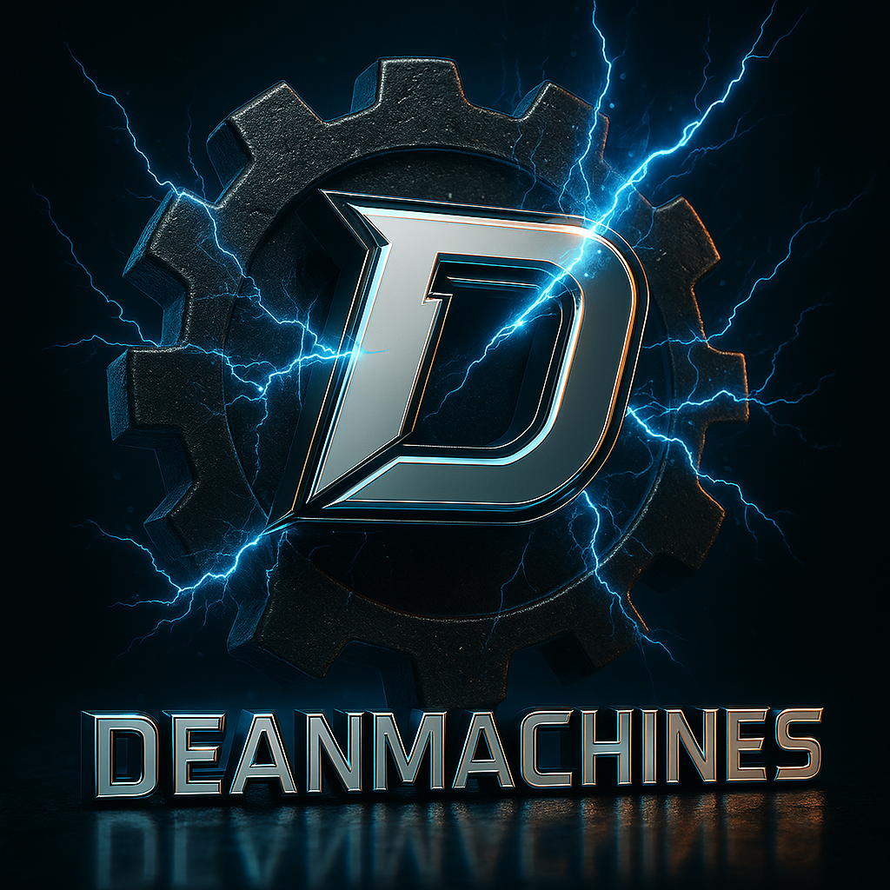

# DeanmachinesAI

A Mastra AI-powered application with intelligent agents, networks, and workflows for research, analysis, and document processing with reinforcement learning capabilities.



## 📋 Project Overview

DeanmachinesAI leverages the Mastra TypeScript framework to build advanced AI applications with specialized agents, flexible tools, and collaborative workflows. The system utilizes agent networks for dynamic task routing and reinforcement learning for continuous improvement, enabling sophisticated information processing and knowledge generation.

## 🏗️ Current Architecture


## 🛠️ Technology Stack

- **Framework**: Mastra AI (TypeScript)
- **LLM Provider**: Google AI (Gemini 2.0 Pro)
- **Storage**:
  - Turso (LibSQL) for agent memory
  - Pinecone for vector database
- **APIs**:
  - Open-Meteo for weather data
- **Monitoring & Evaluation**:
  - LangSmith for tracing and observability
  - Custom reinforcement learning feedback loops

## 🔍 Key Features

### Agent Systems

- **Dynamic Agent Networks**: LLM-based routing between specialized agents
- **Collaborative Workflows**: Predefined execution paths for complex tasks
- **Specialized Agents**:
  - Research Agent for information gathering
  - Analyst Agent for data interpretation
  - Writer Agent for documentation
  - RL Trainer Agent for system improvement
  - Data Manager Agent for file operations

### Tools & Capabilities

- **File System Tools**:
  - Reading from files with encoding options
  - Writing to files with backup options
  - Line-based file access for large files
- **RL Feedback System**:
  - Collection of explicit and implicit feedback
  - Analysis of performance metrics
  - Automated policy improvement
- **RL Reward System**:
  - Custom reward function definitions
  - State-action pair evaluation
  - Policy optimization based on observed rewards
- **Document Processing**:
  - Semantic search for relevant content
  - Content analysis and insight generation
  - Formatting for various documentation types

### Workflow Implementations

- **RAG Research Workflow**: Research, analysis and documentation generation
- **Weather Workflow**: Location-based forecasts and activity recommendations

## 📈 Development Progress


## ✅ Current Progress


## 🧠 Agent Networks

DeanmachinesAI implements three specialized agent networks that enable dynamic collaboration between agents:

### 1. DeanInsights Network

Orchestrates all specialized agents to deliver comprehensive research and analysis with well-structured outputs.

### 2. DataFlow Network

Focused on data processing operations with an emphasis on reinforcement learning and continuous improvement.

### 3. ContentCreation Network

Specializes in researching topics and producing high-quality content with continuous improvement through feedback.

## 🤖 Reinforcement Learning

The system implements two reinforcement learning subsystems:

### RL Feedback System

- Collects explicit feedback from users
- Derives implicit feedback from system metrics
- Analyzes patterns to identify improvement opportunities
- Applies insights to improve agent prompts and behavior

### RL Reward System

- Defines custom reward functions for specific tasks
- Evaluates state-action pairs to calculate rewards
- Tracks reward history for policy optimization
- Suggests improvements based on historical performance

## 🌐 Environment Configuration

The project requires configuration for:

- Google AI API for LLM capabilities
- Turso Database for persistent agent memory
- LangSmith for observability and tracing
- Pinecone for vector database functionality

## 🚀 Getting Started

### Prerequisites

- Node.js 18+
- API keys for Google AI, Turso, and other services

### Installation

```bash
# Clone the repository
git clone https://github.com/yourusername/DeanmachinesAI.git

# Navigate to project directory
cd DeanmachinesAI

# Install dependencies
npm install

# Set up environment variables
cp .env.example .env.development
# Edit .env.development with your API keys
```

### Running the Project

```bash
# Start the development server
npm run dev
```

## 🔮 Future Scope

### Planned Enhancements

1. **Extended Agent Networks**
   - Domain-specific agent networks
   - Cross-network collaboration
   - Hierarchical decision making

2. **Advanced RL Capabilities**
   - Multi-objective reinforcement learning
   - Exploration vs. exploitation balancing
   - Transfer learning between agents

3. **Multi-Modal Support**
   - Voice interface integration
   - Image recognition capabilities
   - Cross-modal reasoning

4. **Enterprise Features**
   - Role-based access controls
   - Audit logging and compliance
   - High-availability deployment options

## 📝 License

This project is licensed under the ISC License - see the LICENSE file for details.

## 📊 System Architecture


