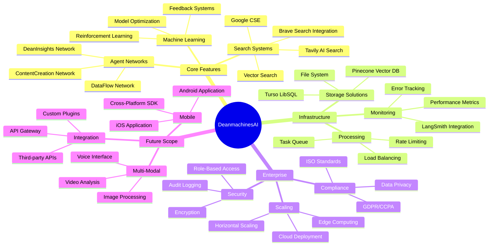
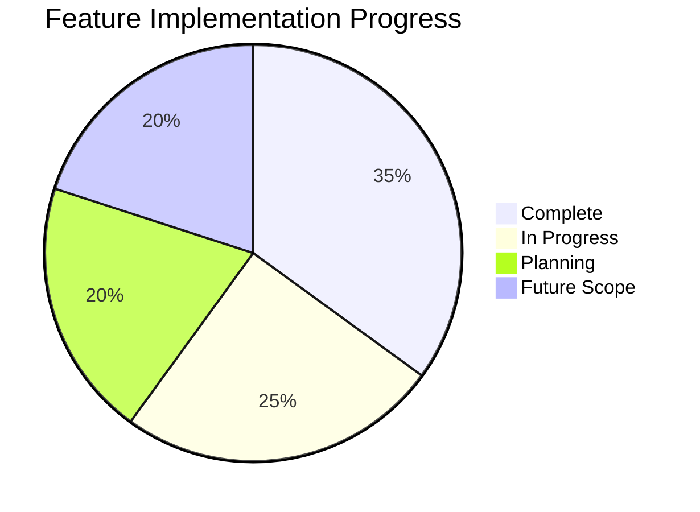

This file is a merged representation of the entire codebase, combined into a single document by Repomix.
The content has been processed where content has been formatted for parsing in markdown style, content has been compressed (code blocks are separated by ⋮---- delimiter).

# File Summary

## Purpose
This file contains a packed representation of the entire repository's contents.
It is designed to be easily consumable by AI systems for analysis, code review,
or other automated processes.

## File Format
The content is organized as follows:
1. This summary section
2. Repository information
3. Directory structure
4. Multiple file entries, each consisting of:
  a. A header with the file path (## File: path/to/file)
  b. The full contents of the file in a code block

## Usage Guidelines
- This file should be treated as read-only. Any changes should be made to the
  original repository files, not this packed version.
- When processing this file, use the file path to distinguish
  between different files in the repository.
- Be aware that this file may contain sensitive information. Handle it with
  the same level of security as you would the original repository.

## Notes
- Some files may have been excluded based on .gitignore rules and Repomix's configuration
- Binary files are not included in this packed representation. Please refer to the Repository Structure section for a complete list of file paths, including binary files
- Files matching patterns in .gitignore are excluded
- Files matching default ignore patterns are excluded
- Content has been formatted for parsing in markdown style
- Content has been compressed - code blocks are separated by ⋮---- delimiter
- Files are sorted by Git change count (files with more changes are at the bottom)

## Additional Info

# Directory Structure
```
knowledge/archive/
knowledge/categories/
knowledge/domain-knowledge/
knowledge/schemas/
knowledge/templates/
src/mastra/tools/code/
src/mastra/tools/common/
src/mastra/tools/data/
src/mastra/tools/search/
.env.example
.github/.copilot-instructions.md
.github/work/now.md
.gitignore
knowledge/codeviz-diagram-2025-04-08T16-19-49.drawio
mastra.config.ts
package.json
README.md
src/mastra/agents/agentic.agent.ts
src/mastra/agents/analyst.agent.ts
src/mastra/agents/base.agent.ts
src/mastra/agents/config/agentic.config.ts
src/mastra/agents/config/analyst.config.ts
src/mastra/agents/config/base.config.ts
src/mastra/agents/config/dataManager.config.ts
src/mastra/agents/config/index.ts
src/mastra/agents/config/research.config.ts
src/mastra/agents/config/rlTrainer.config.ts
src/mastra/agents/config/writer.config.ts
src/mastra/agents/dataManager.agent.ts
src/mastra/agents/index.ts
src/mastra/agents/research.agent.ts
src/mastra/agents/rlTrainer.agent.ts
src/mastra/agents/writer.agent.ts
src/mastra/database/examples.ts
src/mastra/database/index.ts
src/mastra/database/vector-store.ts
src/mastra/hooks/index.ts
src/mastra/index.ts
src/mastra/services/exasearch.ts
src/mastra/services/hyperbrowser.ts
src/mastra/services/langchain.ts
src/mastra/services/langfuse.ts
src/mastra/services/langsmith.ts
src/mastra/tools/ai-sdk.ts
src/mastra/tools/arxiv.ts
src/mastra/tools/brave-search.ts
src/mastra/tools/calculator.ts
src/mastra/tools/document.ts
src/mastra/tools/e2b.ts
src/mastra/tools/exasearch.ts
src/mastra/tools/github.ts
src/mastra/tools/google-search.ts
src/mastra/tools/graphRag.ts
src/mastra/tools/hyper-functionCalls.ts
src/mastra/tools/index.ts
src/mastra/tools/llamaindex.ts
src/mastra/tools/mcp.ts
src/mastra/tools/mcptools.ts
src/mastra/tools/memoryQueryTool.ts
src/mastra/tools/paginate.ts
src/mastra/tools/readwrite.ts
src/mastra/tools/rlFeedback.ts
src/mastra/tools/rlReward.ts
src/mastra/tools/tavily.ts
src/mastra/tools/types.ts
src/mastra/tools/utils.ts
src/mastra/tools/vectorquerytool.ts
src/mastra/tools/wikibase.ts
src/mastra/utils/index.ts
src/mastra/utils/memory-diagnostics.ts
src/mastra/utils/thread-manager.ts
src/mastra/voice/elevenlabs.ts
src/mastra/voice/googlevoice.ts
src/mastra/voice/index.ts
src/mastra/workflows/agentNetwork.ts
src/mastra/workflows/index.ts
tsconfig.json
```

# Files

## File: src/mastra/services/hyperbrowser.ts
````typescript
import { connect } from "puppeteer-core";
import { Hyperbrowser } from "@hyperbrowser/sdk";
import dotenv from "dotenv";
⋮----
// Create a new page
⋮----
// Navigate to a website
````

## File: src/mastra/tools/hyper-functionCalls.ts
````typescript
import { google } from "@ai-sdk/google";
import { Hyperbrowser } from "@hyperbrowser/sdk";
import {
  WebsiteCrawlTool,
  WebsiteScrapeTool,
  WebsiteExtractTool,
} from "@hyperbrowser/sdk/tools";
import { env } from "process";
⋮----
/**
 * Initialize Hyperbrowser and Google AI clients
 */
⋮----
interface ToolCall {
  id: string;
  function: {
    name: string;
    arguments: string;
  };
}
⋮----
/**
 * Handles tool calls from the AI and executes corresponding actions
 */
async function handleToolCall(tc: ToolCall)
⋮----
/**
 * Runs an interactive chat session with AI using website tools
 */
async function chat()
⋮----
// Start the chat session
````

## File: .github/.copilot-instructions.md
````markdown
# DeanmachinesAI: Strategic Analysis & Comprehensive Improvement Plan (v4 - ID/Tagged + Tasks)

**Document ID:** `DAI_PLAN_V4`
**Document Purpose:** This document provides a highly detailed analysis (`ANALYSIS`) of the `DeanmachinesAI` project's strengths (`S#`) and weaknesses (`W#`), derived *strictly* from the provided `repomix.txt` map and previous discussions. It outlines a strategic, phased improvement plan (`PLAN`) with granular steps (`P#_STEP#`) and trackable subtasks (`- [ ] P#_STEP#_SUB#`), designed to guide developers and AI assistants like GitHub Copilot. Includes extensive cross-referencing and relevant `#tags`.
**Approach:** Implement the improvement plan (`PLAN`) incrementally, phase by phase (`P#`). Test changes thoroughly using evaluations (`P3_STEP8`). Prioritize `P1` for foundational stability before moving to more complex phases like `P2` (RL), `P3` (Meta-Agents), `P5` (Optimization), and `P6` (Future Features).

## **ANALYSIS:** Project Strengths & Weaknesses

### **STRENGTHS:** Identified Strengths

* **S1:** **Robust Framework Foundation:** Built on **Mastra AI** (v0.7.0), providing core abstractions (`Agent`, `Memory`, `Tool`, `Workflow`, `AgentNetwork`). `#framework` `#mastra`
* **S2:** **Advanced Agentic Features:** Incorporates sophisticated concepts:
  * Integrated **Reinforcement Learning** (`rlFeedback.ts`, `rlReward.ts`). `#rl` `#agent` `#improvement`
  * **Hybrid Execution Models** (static `Workflows`, dynamic `AgentNetwork`s). `#workflow` `#network` `#agent` `#flexibility`
  * **Advanced RAG Techniques** (standard RAG, GraphRAG). `#rag` `#vector_store` `#knowledge_retrieval`
* **S3:** **Rich & Diverse Toolset:** Wide array of capabilities (Search APIs, Document Processing, Vector Querying, File I/O, Calculation, RL meta-tools). `#tools` `#capabilities` `#integration`
* **S4:** **Well-Defined Persistence Strategy:** Clear mechanisms:
  * **Operational Memory:** `LibSQLStore` (Turso) via `@mastra/memory` + `ThreadManager`. `#memory` `#persistence` `#state_management`
  * **Semantic Knowledge:** Pinecone vector store. `#vector_store` `#pinecone` `#knowledge_retrieval`
* **S5:** **Modular Architecture (Foundation & Potential):** Good separation of concerns (`agents/`, `tools/`, `services/`). Enhanced by proposed refactoring (`P1_STEP2`, `P1_STEP3`). `#modularity` `#architecture` `#maintainability`
* **S6:** **Integrated Observability:** **LangSmith** integration provides essential tracing. `#observability` `#langsmith` `#debugging`
* **S7:** **Explicit Configuration:** Separation between code (`mastra.config.ts`), environment (`.env`), and potentially agent configs (`P1_STEP3`). `#config` `#separation_of_concerns`
* **S8:** **High-Quality Documentation:** Comprehensive `README.md` with diagrams. `#documentation`

### **WEAKNESSES:** Identified Weaknesses & Improvement Links

* **W1:** **High System Complexity:** Numerous interacting components increase cognitive load and debugging difficulty. `#complexity` `#debugging` `#maintenance`
  * *Insight:* Modularity helps manage, not eliminate, complexity. Robust testing (`P3_STEP8`), error handling (`P4_STEP9`), and observability (`S6`) are critical mitigations, especially as meta-agents (`P3_STEP6`, `P3_STEP7`) are added.
  * *Addressed By:* `P1` (Modularity), `P3_STEP8` (Evaluation), `P4_STEP9` (Error Handling), `P4_STEP10` (Config Mgt).
* **W2:** **Tool Initialization & Dependency Risk:** Potential fragility in `tools/index.ts` regarding tool instantiation using `.env` variables. Errors here can disable agents. `#tools` `#reliability` `#config` `#env_vars` `#startup`
  * *Insight:* This initialization point is foundational; reliability here is paramount.
  * *Addressed By:* `P1_STEP1`.
* **W3:** **RL Loop Effectiveness & Opacity:** RL success depends heavily on internal LLM analysis prompts and captured data quality. Debugging the *learning process* itself can be opaque. `#rl` `#effectiveness` `#debugging` `#prompt_engineering`
  * *Insight:* Requires meticulous prompt engineering *for RL tools* and deep logging (`P2_STEP5`) of their internal reasoning.
  * *Addressed By:* `P2_STEP5`, `P3_STEP8` (Evaluation).
* **W4:** **Memory Query Complexity:** Storing diverse structured data (feedback, rewards) in generic message threads might lead to inefficient retrieval. `#memory` `#state_management` `#performance` `#querying`
  * *Insight:* A dedicated query mechanism (`P2_STEP4`) becomes essential as state complexity grows.
  * *Addressed By:* `P2_STEP4`.
* **W5:** **Agent Configuration Lifecycle Management:** Undefined process for managing, versioning, reviewing, and applying agent config changes (especially RL-driven ones). `#config` `#lifecycle` `#rl` `#deployment`
  * *Insight:* Safely closing the RL loop requires a defined process for integrating suggested changes (from `P3_STEP6`).
  * *Addressed By:* `P1_STEP3` (External Config), `P3_STEP6` (Proposal Mechanism), `P4_STEP10` (Process Definition).
* **W6:** **Implicit Error Handling Strategy:** Lack of systematic error handling (retries, fallbacks) beyond basic tracing. `#error_handling` `#reliability` `#resilience`
  * *Insight:* Crucial for system stability and user trust in complex interactions.
  * *Addressed By:* `P4_STEP9`.
* **W7:** **Lack of Visible Testing/Evaluation:** No implemented tests visible, despite `@mastra/evals` dependency. Essential for validation. `#testing` `#evaluation` `#reliability` `#regression`
  * *Insight:* Automated evaluations are critical for safely evolving complex/learning systems.
  * *Addressed By:* `P3_STEP8`.
* **W8:** **Security Considerations:** Potential risks in tool input validation, file system access (`readwrite.ts`), local execution (`mcp.ts`), and API key management. `#security` `#input_validation` `#secrets_management` `#permissions`
  * *Insight:* Requires proactive design, especially robust input validation at tool boundaries.
  * *Addressed By:* `P4_STEP9` (Input Validation), `P4_STEP10` (Secrets Mgt), General Vigilance.
* **W9:** **Performance Bottlenecks (Potential):** Latency in LLM calls, tool execution, state access, or network routing could impact user experience, especially under load. `#performance` `#latency` `#cost` `#efficiency`
  * *Insight:* Optimization often follows initial implementation and requires profiling/measurement.
  * *Addressed By:* `P5`.
* **W10:** **Scalability Limitations (Potential):** Current design might face challenges scaling horizontally under significantly increased load without specific architectural considerations. `#scaling` `#architecture` `#performance`
  * *Insight:* Scaling often requires reviewing state management, deployment strategies, and potential bottlenecks.
  * *Addressed By:* `P6_STEP17`.

## **PLAN:** Detailed Improvement Plan

### **P1:** Phase 1: Solidify Core Structure & Tooling (Foundation) `#refactor` `#reliability` `#tools` `#modularity`

**(Phase Goal: Improve reliability, maintainability, and clarity of foundational agent and tool components, addressing core weaknesses `W1`, `W2`, `W5`)**

#### **P1_STEP1:** Ensure Reliable Tool Instantiation and Export `#tools` `#config` `#reliability` `#env_vars` `#startup`

* **Step Goal:** Guarantee all necessary agent tools initialize correctly (loading config/secrets from `.env`) and are reliably exported for agent use. Addresses: `W2`. Builds foundation for `P1_STEP3`.
* **Location:** `src/mastra/tools/index.ts`
* **Subtasks:**
  * `- [ ]` **P1_STEP1_SUB1:** Add startup checks for required environment variables (list them explicitly, e.g., `TAVILY_API_KEY`, `GOOGLE_API_KEY`, etc.) needed by tools, logging warnings via `@mastra/core/logger` if missing. `#config` `#env_vars` `#reliability` `#validation`
  * `- [ ]` **P1_STEP1_SUB2:** Ensure all imported tool factory functions (e.g., `createTavilySearchTool`) are explicitly called within this file. `#tools` `#instantiation`
  * `- [ ]` **P1_STEP1_SUB3:** Pass necessary API keys/configs from `process.env` explicitly to factory functions if they accept arguments; otherwise, verify the factories correctly read `process.env`. `#config` `#env_vars` `#security`
  * `- [ ]` **P1_STEP1_SUB4:** Export each created tool instance with a clear, consistent name (e.g., `export const tavilySearch = ...;`). `#tools` `#export`
  * `- [ ]` **P1_STEP1_SUB5:** Group related tool instances into logical, exported arrays (e.g., `export const webSearchTools: Tool<any, any>[] = [tavilySearch, ...];`). `#tools` `#organization`
  * `- [ ]` **P1_STEP1_SUB6:** Re-export tool instances defined and instantiated in separate tool files (e.g., `export * from './document';`). Ensure those files export *instances*, not factories. `#tools` `#export` `#modularity`
  * `- [ ]` **P1_STEP1_SUB7:** Create and export `allToolsMap = new Map(...)` containing *all* instantiated tools, keyed by their unique `id` (defined in `createTool`). Add error logging if `id` is missing. `#tools` `#map` `#config` `#validation`
* **Copilot Guidance:** "Copilot, in `src/mastra/tools/index.ts`:
    1. **(SUB1)** Add checks for required env vars (list: `TAVILY_API_KEY`, `GOOGLE_API_KEY`, `GOOGLE_CSE_ID`, `BRAVE_API_KEY`, `PINECONE_API_KEY`, `EXA_API_KEY`, etc.) using `process.env`, log warnings via logger if missing.
    2. **(SUB2, SUB3)** Call all imported tool factories (e.g., `createTavilySearchTool`). Pass env vars explicitly where needed (e.g., `{ apiKey: process.env.TAVILY_API_KEY }`).
    3. **(SUB4)** Export each instance (e.g., `export const tavilySearch = ...;`).
    4. **(SUB5)** Create exported arrays grouping tools logically (e.g., `webSearchTools`).
    5. **(SUB6)** Ensure `export * from ...` points to files exporting tool *instances*.
    6. **(SUB7)** Create `allToolsArray` with all tools. Create and export `allToolsMap` keyed by `tool.id!`, logging errors for missing IDs."

#### **P1_STEP2:** Implement Modular Agent Structure `#agent` `#modularity` `#refactor` `#maintainability`

* **Step Goal:** Improve code organization and maintainability by defining each agent in its own file. Addresses: `W1`. Leverages: `S5`.
* **Location:** `src/mastra/agents/` directory and `src/mastra/agents/index.ts`.
* **Subtasks:**
  * `- [ ]` **P1_STEP2_SUB1:** Create individual `*.agent.ts` files (e.g., `research.agent.ts`, `analyst.agent.ts`). `#refactor` `#file_structure`
  * `- [ ]` **P1_STEP2_SUB2:** Move the corresponding `new Agent({...})` definition into each new file. `#refactor` `#agent`
  * `- [ ]` **P1_STEP2_SUB3:** Update imports within each `*.agent.ts` file to correctly reference shared `memory` (`../database`) and specific tools/tool groups (e.g., `webSearchTools` from `../tools`). `#imports` `#dependencies`
  * `- [ ]` **P1_STEP2_SUB4:** Export the agent instance from each `*.agent.ts` file (e.g., `export const researchAgent;`). `#export`
  * `- [ ]` **P1_STEP2_SUB5:** Modify `src/mastra/agents/index.ts` to remove old definitions, import all individual agent instances, and export the collective `agents` object and `AgentIds` type. `#refactor` `#aggregation`
* **Copilot Guidance:** "Copilot, refactor agent definitions from `src/mastra/agents/index.ts`:
    1. **(SUB1, SUB2)** Create `src/mastra/agents/research.agent.ts`. Move `researchAgent` definition here. Export it.
    2. **(SUB3)** Update imports in `research.agent.ts` for tools (e.g., `import { webSearchTools, documentTools } from '../tools';`) and `sharedMemory`. Add JSdoc comments explaining the agent's role.
    3. Repeat for `analystAgent`, `writerAgent`, `rlTrainerAgent`, `dataManagerAgent`.
    4. **(SUB5)** Modify `src/mastra/agents/index.ts`: Remove definitions, import instances (e.g., `import { researchAgent } from './research.agent';`), export `agents = { researchAgent, ... }` and `AgentIds` type. Add comments."

#### **P1_STEP3:** Externalize Agent Configuration `#agent` `#config` `#modularity` `#maintainability` `#refactor`

* **Step Goal:** Separate agent configuration (prompts, tools, model) from code logic for easier management. Addresses: `W1`, `W5`. Leverages: `S5`. Depends on: `P1_STEP1` (`allToolsMap`).
* **Location:** Create `src/mastra/agents/config/`. Modify `*.agent.ts` files.
* **Subtasks:**
  * `- [ ]` **P1_STEP3_SUB1:** Create `src/mastra/agents/config/` directory. `#file_structure`
  * `- [ ]` **P1_STEP3_SUB2:** Create `*.config.ts` files (e.g., `research.config.ts`) defining exported config objects (`researchAgentConfig`) with properties: `id` (string, must match tool ID), `name`, `description`, `model` (imported), `systemPrompt`, `toolIds` (array of tool ID strings). Add comments explaining fields. `#config` `#typescript`
  * `- [ ]` **P1_STEP3_SUB3:** Refactor each `*.agent.ts` file: Import its corresponding config object and `allToolsMap` from `tools/index.ts`. `#refactor` `#imports`
  * `- [ ]` **P1_STEP3_SUB4:** Modify the `new Agent({...})` call in `*.agent.ts` to use properties from the imported config object. `#refactor` `#agent`
  * `- [ ]` **P1_STEP3_SUB5:** Implement logic in `*.agent.ts` to map `config.toolIds` to tool instances using `allToolsMap`, including robust error handling if a `toolId` from the config is not found in the map. `#tools` `#validation` `#error_handling`
  * `- [ ]` **P1_STEP3_SUB6:** Ensure config files are added to version control (Git). `#version_control`
* **Copilot Guidance:** "Copilot, implement external agent configuration:
    1. **(SUB1, SUB2)** Create `src/mastra/agents/config/` and `research.config.ts`. Export `researchAgentConfig` object with `id`, `name`, `description`, `model` (import model), `systemPrompt`, `toolIds` (string array). Add comments.
    2. **(SUB3, SUB4, SUB5)** Refactor `src/mastra/agents/research.agent.ts`: Import `researchAgentConfig` and `allToolsMap`. In `new Agent({...})`, use config values. For `tools`, map `researchAgentConfig.toolIds` using `allToolsMap`, throwing an error if a tool ID is not found.
    3. Repeat for all other agents.
    4. **(SUB6)** Ensure config files are tracked by Git."

### **P2:** Phase 2: Enhance RL & State Management (Data Flow & Learning) `#rl` `#memory` `#state_management` `#performance` `#debugging`

**(Phase Goal: Improve the efficiency, reliability, and debuggability of the reinforcement learning loop and underlying state access, addressing weaknesses `W3`, `W4`)**

#### **P2_STEP4:** Implement Dedicated Memory Query Tool `#memory` `#state_management` `#performance` `#querying` `#sql` `#refactor` `#new_feature`

* **Step Goal:** Provide efficient, targeted querying for structured RL/state data within `memory` threads. Addresses: `W4`. Enables: `P2_STEP5`, `P3_STEP6`.
* **Location:** Create `src/mastra/tools/memoryQuery.tool.ts`. Update `tools/index.ts`. Update relevant RL tools/agents.
* **Subtasks:**
  * `- [ ]` **P2_STEP4_SUB1:** Define the `memoryQueryTool` using `createTool` in `memoryQuery.tool.ts`. `#tools`
  * `- [ ]` **P2_STEP4_SUB2:** Define precise input schema (`zod`) with optional filters (`threadId`, `agentId`, `startDate`, `endDate`, `contentType` [e.g., 'feedback', 'reward'], `limit`). `#schema` `#zod` `#filtering`
  * `- [ ]` **P2_STEP4_SUB3:** Define precise output schema (`zod`) for structured results (e.g., array of feedback/reward records). `#schema` `#zod`
  * `- [ ]` **P2_STEP4_SUB4:** Implement `execute`: Securely get LibSQL client instance. `#database` `#sql` `#security`
  * `- [ ]` **P2_STEP4_SUB5:** Construct **parameterized** SQL `SELECT` queries targeting memory tables. Use filters, potentially `json_extract` on metadata. **Parameterize all inputs.** `#sql` `#security` `#querying`
  * `- [ ]` **P2_STEP4_SUB6:** Execute query, handle DB errors, format results. `#sql` `#error_handling`
  * `- [ ]` **P2_STEP4_SUB7:** Instantiate/export `memoryQueryTool` in `tools/index.ts`, add to `allToolsMap`. `#tools` `#export`
  * `- [ ]` **P2_STEP4_SUB8:** Refactor `analyzeFeedbackTool`, `optimizePolicyTool` (and later `promptOptimizerAgent`) to use `memoryQueryTool`. `#refactor` `#rl` `#dependencies`
* **Copilot Guidance:** "Copilot, create `src/mastra/tools/memoryQuery.tool.ts` and implement `memoryQueryTool`:
    1. **(SUB1-SUB3)** Use `createTool`. Define input/output schemas (`zod`) with filters and structured results.
    2. **(SUB4-SUB6)** In `execute`, get LibSQL client. Construct parameterized SQL `SELECT` using filters (use `json_extract` if needed). Parameterize inputs! Execute, handle errors, format results.
    3. **(SUB7)** Instantiate/export in `tools/index.ts`, add to `allToolsMap`.
    4. **(SUB8)** Refactor RL analysis tools to use `memoryQueryTool`." *(Dev oversight needed for SQL/schema).*

#### **P2_STEP5:** Refine RL Analysis Prompts & Add Internal Logging `#rl` `#prompt_engineering` `#debugging` `#observability` `#langsmith`

* **Step Goal:** Improve RL effectiveness and debuggability via better internal LLM analysis prompts and detailed tracing. Addresses: `W3`. Depends on: `S6`.
* **Location:** `src/mastra/tools/rlFeedback.ts`, `src/mastra/tools/rlReward.ts`.
* **Subtasks:**
  * `- [ ]` **P2_STEP5_SUB1:** Locate internal LLM calls (e.g., `generateText`) within `analyzeFeedbackTool`, `applyRLInsightsTool`, `optimizePolicyTool`. `#rl` `#llm`
  * `- [ ]` **P2_STEP5_SUB2:** Review and rewrite prompts for clarity, specifying input data structure and required JSON output format for insights/suggestions. `#prompt_engineering` `#clarity` `#json`
  * `- [ ]` **P2_STEP5_SUB3:** Wrap these internal LLM calls using LangSmith SDK tracing (e.g., `await createLangSmithRun(...)`). `#langsmith` `#tracing` `#observability`
  * `- [ ]` **P2_STEP5_SUB4:** Within the trace, log critical context: exact `prompt`, `inputData` summary, `rawResponse`, and parsed structured output. Add comments explaining the trace. `#logging` `#debugging`
* **Copilot Guidance:** "Copilot, in `rlFeedback.ts` and `rlReward.ts`, find LLM calls within `analyzeFeedbackTool`, `applyRLInsightsTool`, `optimizePolicyTool`:
    1. **(SUB2)** Refine prompt strings for clarity, specifying JSON output format.
    2. **(SUB3, SUB4)** Wrap LLM call with LangSmith tracing. Log `prompt`, `inputData` summary, `rawResponse`, and parsed results. Add comments."

### **P3:** Phase 3: Implement Advanced Agents & Evaluation (Capabilities & Validation) `#new_feature` `#agent` `#rl` `#testing` `#evaluation`

**(Phase Goal: Add meta-learning capabilities (`promptOptimizerAgent`, `agentArchitectAgent`) and establish robust validation processes, addressing weaknesses `W1`, `W5`, `W7`)**

#### **P3_STEP6:** Implement `promptOptimizerAgent` `#agent` `#rl` `#prompt_engineering` `#config` `#new_feature`

* **Step Goal:** Create agent to suggest prompt improvements based on performance data. Addresses: `W5`. Depends on: `P1_STEP3`, `P2_STEP4`.
* **Location:** `agents/config/promptOptimizer.config.ts`, `agents/promptOptimizer.agent.ts`, `tools/` (new tools), `agents/index.ts`.
* **Subtasks:**
  * `- [ ]` **P3_STEP6_SUB1:** Implement `readPromptTool` using `readFileTool` to read externalized agent prompts. `#tools` `#file_io`
  * `- [ ]` **P3_STEP6_SUB2:** Implement `proposePromptUpdateTool` using `writeToFileTool` to save suggestions + reasoning to `knowledge/review/prompts/`. `#tools` `#file_io` `#workflow`
  * `- [ ]` **P3_STEP6_SUB3:** Instantiate/export new tools in `tools/index.ts`, add to `allToolsMap`. `#tools` `#export`
  * `- [ ]` **P3_STEP6_SUB4:** Define `promptOptimizerAgent` config (`agents/config/`) with system prompt and tool IDs (`memoryQueryTool`, analysis tools, new tools). `#agent` `#config`
  * `- [ ]` **P3_STEP6_SUB5:** Implement `promptOptimizerAgent` (`agents/`) using its config and `allToolsMap`. `#agent` `#implementation`
  * `- [ ]` **P3_STEP6_SUB6:** Update `agents/index.ts` to include `promptOptimizerAgent`. `#aggregation`
  * *Insight:* Test this agent thoroughly in isolation before relying on its suggestions. Define the review process (`P4_STEP10_SUB1`).
* **Copilot Guidance:** "Copilot, implement `promptOptimizerAgent`:
    1. **(SUB1)** Create `readPromptTool` in `tools/` using `readFileTool`.
    2. **(SUB2)** Create `proposePromptUpdateTool` in `tools/` using `writeToFileTool` to save suggestions.
    3. **(SUB3)** Instantiate/export new tools in `tools/index.ts`, add to `allToolsMap`.
    4. **(SUB4)** Create `promptOptimizer.config.ts` with config.
    5. **(SUB5)** Create `promptOptimizer.agent.ts`, instantiate agent.
    6. **(SUB6)** Update `agents/index.ts`."

#### **P3_STEP7:** Implement `agentArchitectAgent` `#agent` `#config` `#developer_experience` `#new_feature` `#code_generation`

* **Step Goal:** Create agent to assist developers in bootstrapping new agents. Addresses: `W1` (by aiding dev). Depends on: `P1_STEP1` (`allToolsMap`).
* **Location:** `agents/config/agentArchitect.config.ts`, `agents/agentArchitect.agent.ts`, `tools/` (new tools), `agents/index.ts`.
* **Subtasks:**
  * `- [ ]` **P3_STEP7_SUB1:** Implement `listAvailableToolsTool` to return details from `allToolsMap`. `#tools` `#introspection`
  * `- [ ]` **P3_STEP7_SUB2:** Implement `generateAgentConfigTool` using LLM + tool list -> config JSON. `#tools` `#llm` `#config`
  * `- [ ]` **P3_STEP7_SUB3:** Implement `generateAgentBoilerplateTool` using `writeToFileTool` -> save `*.agent.ts` code template. `#tools` `#file_io`
  * `- [ ]` **P3_STEP7_SUB4:** Instantiate/export new tools in `tools/index.ts`, add to `allToolsMap`. `#tools` `#export`
  * `- [ ]` **P3_STEP7_SUB5:** Define `agentArchitectAgent` config and implementation. `#agent` `#config` `#implementation`
  * `- [ ]` **P3_STEP7_SUB6:** Update `agents/index.ts`. `#aggregation`
* **Copilot Guidance:** "Copilot, implement `agentArchitectAgent`:
    1. **(SUB1)** Create `listAvailableToolsTool` in `tools/` accessing `allToolsMap`.
    2. **(SUB2)** Create `generateAgentConfigTool` in `tools/` using LLM -> config JSON.
    3. **(SUB3)** Create `generateAgentBoilerplateTool` in `tools/` using `writeToFileTool` -> save code string.
    4. **(SUB4)** Instantiate/export new tools in `tools/index.ts`, add to `allToolsMap`.
    5. **(SUB5)** Create agent config and implementation files.
    6. **(SUB6)** Update `agents/index.ts`."

#### **P3_STEP8:** Implement Comprehensive Evaluation Suite `#testing` `#evaluation` `#reliability` `#regression` `#rl`

* **Step Goal:** Establish automated testing for validation, regression prevention, and assessing RL improvements. Addresses: `W7`. Crucial for managing `W1`, `W3`.
* **Location:** `evals/` directory.
* **Subtasks:**
  * `- [ ]` **P3_STEP8_SUB1:** Set up `evals/` directory and `@mastra/evals` config. `#testing` `#setup`
  * `- [ ]` **P3_STEP8_SUB2:** Create datasets (`evals/datasets/`) covering key use cases, edge cases, failure modes. `#testing` `#dataset`
  * `- [ ]` **P3_STEP8_SUB3:** Implement eval files (`evals/*.eval.ts`) using `defineEval`. `#testing` `#implementation`
  * `- [ ]` **P3_STEP8_SUB4:** Define diverse evaluators (correctness, safety, error handling, performance metrics). `#testing` `#criteria`
  * `- [ ]` **P3_STEP8_SUB5:** Integrate eval runs into CI/CD pipeline. `#cicd` `#workflow`
  * *Insight:* Evaluations are vital for trusting complex systems, especially those that learn or self-modify. Test RL-driven changes rigorously before deploying them.
* **Copilot Guidance:** "Copilot, scaffold evaluations using `@mastra/evals`:
    1. **(SUB1, SUB2)** Create `evals/datasets/rag_workflow_inputs.jsonl`.
    2. **(SUB3, SUB4)** Create `evals/ragWorkflow.eval.ts`. Import `ragWorkflow`, `defineEval`, evaluators (`LLMAsJudge`, `ContainsKeywords`). Define eval config using dataset and multiple evaluators checking relevance, structure, safety. Add comments explaining criteria.
    3. **(SUB5)** Add script to `package.json` to run evals (e.g., `"eval": "mastra eval run"`)."

### **P4:** Phase 4: Hardening & Production Readiness `#reliability` `#security` `#error_handling` `#deployment` `#config`

**(Phase Goal: Improve system robustness, security, and operational aspects for reliable deployment, addressing weaknesses `W6`, `W8`, `W5`)**

#### **P4_STEP9:** Enhance Error Handling and Input Validation `#error_handling` `#reliability` `#resilience` `#security` `#input_validation` `#zod`

* **Step Goal:** Make system resilient to unexpected inputs (esp. from LLMs) and internal/external failures. Addresses: `W6`, `W8`.
* **Location:** Throughout `tools/*.ts`, `services/*.ts`, `workflows/*.ts`, `workflows/agentNetwork.ts`.
* **Subtasks:**
  * `- [ ]` **P4_STEP9_SUB1:** **Rigorously validate inputs** at start of tool `execute` functions using `zod` schema (`ToolInputSchema.parse(input);`). Catch validation errors. `#input_validation` `#zod` `#security` `#reliability`
  * `- [ ]` **P4_STEP9_SUB2:** Wrap critical I/O (API calls, DB access, file I/O) and complex logic in `try...catch`. `#error_handling`
  * `- [ ]` **P4_STEP9_SUB3:** Implement detailed error logging in `catch` (use logger, LangSmith) with context. `#logging` `#observability`
  * `- [ ]` **P4_STEP9_SUB4:** Implement simple, bounded retry logic (e.g., `async-retry`) for transient network errors in services/tools. `#resilience` `#retry`
  * `- [ ]` **P4_STEP9_SUB5:** Define and document error propagation strategy for Workflows/AgentNetworks. `#workflow` `#network` `#strategy`
* **Copilot Guidance:** "Copilot, in `src/mastra/tools/readwrite.ts`, within `readFileTool`'s `execute`:
    1. **(SUB1)** Add `const safeInput = readFileTool.input.parse(input);`. Use `safeInput`. Add specific checks for path safety within `knowledge/` if not already present.
    2. **(SUB2)** Wrap `fs.promises.readFile` in `try...catch`.
    3. **(SUB3)** In `catch`, log error with context (`logger.error(...)`) and track via LangSmith. Re-throw or return structured error.
    Apply this pattern (Zod parse, try/catch, logging) to other tools, especially `writeToFileTool` and external API tools."

#### **P4_STEP10:** Improve Configuration Management & Deployment Process `#config` `#deployment` `#security` `#secrets_management` `#workflow` `#rl` `#cicd`

* **Step Goal:** Formalize configuration lifecycle (esp. RL updates) and ensure secure, reliable deployments. Addresses: `W5`, `W8`.
* **Location:** Process-oriented, affects `agents/config/`, `.env` management, deployment scripts (`@mastra/deployer`), CI/CD.
* **Subtasks:**
  * `- [ ]` **P4_STEP10_SUB1:** Define/document workflow for reviewing/testing/applying RL-suggested config changes (from `P3_STEP6`). `#rl` `#workflow` `#change_management`
  * `- [ ]` **P4_STEP10_SUB2:** Implement secure secrets management for staging/production (e.g., cloud provider secrets manager); load into env vars at runtime. Ensure no secrets in Git. `#security` `#secrets_management`
  * `- [ ]` **P4_STEP10_SUB3:** Configure and utilize `@mastra/deployer` for consistent builds/deployments. `#deployment` `#automation`
  * `- [ ]` **P4_STEP10_SUB4:** Integrate linting, testing (`P3_STEP8`), building, and deployment (`SUB3`) into a CI/CD pipeline. `#cicd` `#automation`
* **Copilot Guidance:** "Copilot, review `agents/config/` files. Ensure no secrets are hardcoded. Check `mastra.config.ts` and `tools/index.ts` ensure secrets are read from `process.env`. Review deployment scripts (if available) for secure handling of environment variables/secrets."

### **P5:** Phase 5: Performance & Cost Optimization `#optimization` `#performance` `#cost` `#efficiency` `#latency`

**(Phase Goal: Improve performance (latency), reduce operational costs (LLM tokens, compute), and enhance overall system efficiency, addressing potential weakness `W9`)**

#### **P5_STEP11:** Optimize LLM Calls `#llm` `#cost` `#latency` `#prompt_engineering` `#caching` `#optimization`

* **Step Goal:** Reduce token usage and latency for LLM interactions system-wide.
* **Location:** Agent prompts (`agents/config/`), Tool internal prompts (e.g., in RL tools), `services/langchain.ts`, potentially caching layer.
* **Subtasks:**
  * `- [ ]` **P5_STEP11_SUB1:** Analyze LangSmith traces (`S6`) to identify agents/tools/prompts with high token counts or latency. `#observability` `#profiling`
  * `- [ ]` **P5_STEP11_SUB2:** Refine high-usage prompts for conciseness without sacrificing necessary detail. Experiment with prompt compression techniques. `#prompt_engineering`
  * `- [ ]` **P5_STEP11_SUB3:** Evaluate using faster/cheaper models (e.g., Gemini Flash vs. Pro/Ultra, or alternatives via LangChain service) for specific, less complex tasks (e.g., simple classifications, maybe AgentNetwork routing). `#llm` `#cost` `#latency`
  * `- [ ]` **P5_STEP11_SUB4:** Implement caching for deterministic LLM calls if applicable (e.g., analyzing static tool descriptions, common summarization tasks on unchanged text). Requires careful cache invalidation strategy. `#caching` `#performance`
* **Copilot Guidance:** "Copilot, review system prompts in `agents/config/`. Suggest ways to make them more concise while retaining core instructions. Identify LLM calls within tools (e.g., `analyzeFeedbackTool`) and analyze potential for prompt shortening or using a potentially faster model specified via config."

#### **P5_STEP12:** Optimize Tool Execution Efficiency `#tools` `#performance` `#database` `#sql` `#file_io` `#parallelization` `#optimization`

* **Step Goal:** Reduce latency of frequently used or computationally intensive tools.
* **Location:** `tools/*.ts` (esp. those with I/O or complex logic).
* **Subtasks:**
  * `- [ ]` **P5_STEP12_SUB1:** Profile execution time of key tools using LangSmith traces (`S6`) or other profiling methods. `#profiling` `#observability`
  * `- [ ]` **P5_STEP12_SUB2:** Optimize database queries within tools (`memoryQueryTool`, vector search tools). Analyze query plans, ensure proper indexing (`P5_STEP13_SUB3`). `#database` `#sql` `#vector_store`
  * `- [ ]` **P5_STEP12_SUB3:** Optimize file I/O in `readwrite.ts` if it becomes a bottleneck (e.g., consider streaming for very large files if applicable). `#file_io`
  * `- [ ]` **P5_STEP12_SUB4:** Investigate opportunities for parallel execution within tools where appropriate (e.g., making multiple independent API calls concurrently using `Promise.all`). `#parallelization` `#async`
* **Copilot Guidance:** "Copilot, analyze the `execute` function of `graphRag.ts`. Identify potential bottlenecks, such as sequential database lookups for connected nodes. Suggest using `Promise.all` if multiple lookups can be done concurrently. Review the vector search calls for potential batching or parameter tuning."

#### **P5_STEP13:** Optimize Memory/State Access `#memory` `#database` `#sql` `#vector_store` `#pinecone` `#performance` `#indexing` `#optimization`

* **Step Goal:** Ensure efficient reading/writing to primary memory (LibSQL) and vector store (Pinecone).
* **Location:** `database/index.ts`, `database/vector-store.ts`, `tools/memoryQuery.tool.ts`.
* **Subtasks:**
  * `- [ ]` **P5_STEP13_SUB1:** Analyze performance of `memoryQueryTool` (`P2_STEP4`) under simulated load. `#profiling` `#sql`
  * `- [ ]` **P5_STEP13_SUB2:** Further optimize SQL queries used by `memoryQueryTool` based on profiling. `#sql`
  * `- [ ]` **P5_STEP13_SUB3:** Investigate and implement database indexing on LibSQL tables/columns frequently used in queries (e.g., `thread_id`, `timestamp`, metadata fields if using JSON functions). `#database` `#indexing` `#sql`
  * `- [ ]` **P5_STEP13_SUB4:** Review Pinecone usage (`vector-store.ts`, RAG tools): ensure efficient embedding generation (batching?), check Pinecone index configuration (pod type/size, replicas) for performance bottlenecks. `#vector_store` `#pinecone` `#embeddings`
* **Copilot Guidance:** "Copilot, review the SQL query structure suggested for `memoryQueryTool`. Suggest appropriate `CREATE INDEX` statements for the queried columns (`thread_id`, `timestamp`, potentially metadata fields) in the LibSQL database schema. Review the Pinecone query calls (`index.query`) - ensure `topK` is reasonable and explore if metadata filtering is efficient."

#### **P5_STEP14:** Optimize Agent Network Routing `#network` `#agent` `#routing` `#latency` `#cost` `#prompt_engineering` `#optimization`

* **Step Goal:** Improve the speed and accuracy of routing decisions within `AgentNetwork`s.
* **Location:** `workflows/agentNetwork.ts`, Agent descriptions (`agents/config/*.ts`).
* **Subtasks:**
  * `- [ ]` **P5_STEP14_SUB1:** Analyze LangSmith traces (`S6`) of `AgentNetwork` executions to identify inefficient routing paths (e.g., unnecessary back-and-forth, loops). `#observability` `#profiling` `#network`
  * `- [ ]` **P5_STEP14_SUB2:** Refine the main network prompt (passed to the routing LLM) and individual agent `description` fields in their configs (`P1_STEP3`) to provide clearer signals for routing decisions. `#prompt_engineering` `#agent` `#config`
  * `- [ ]` **P5_STEP14_SUB3:** Experiment with using a potentially faster/cheaper LLM specifically for the routing task within the `AgentNetwork` configuration, if the default model proves too slow. `#llm` `#cost` `#latency`
* **Copilot Guidance:** "Copilot, review the agent `description` fields in `agents/config/*.ts`. Suggest ways to make them more distinct and clearly state the agent's unique purpose to aid the routing LLM in `AgentNetwork`s. Look at `workflows/agentNetwork.ts` - consider if a faster model could be specified for the `model` property used by the network router."

### **P6:** Phase 6: Future Enhancements & Scaling `#future` `#scaling` `#integration` `#ux` `#new_feature` `#architecture`

**(Phase Goal: Implement planned future features from the README (`S8`) and prepare the system for potential scaling (`W10`) or broader integration)**

#### **P6_STEP15:** Implement Voice Interface `#voice` `#ux` `#new_feature` `#integration`

* **Step Goal:** Integrate configured voice providers (`src/mastra/voice/`) into a user-facing application layer. Leverages: `S1`.
* **Location:** Application layer code (outside `src/mastra/`, not fully mapped), `src/mastra/voice/`.
* **Subtasks:**
  * `- [ ]` **P6_STEP15_SUB1:** Develop frontend/client logic to capture user audio input. `#frontend` `#audio`
  * `- [ ]` **P6_STEP15_SUB2:** Call the chosen STT service (e.g., `GoogleVoiceProvider`'s STT functionality) via an API endpoint wrapping the Mastra voice service. `#api` `#stt`
  * `- [ ]` **P6_STEP15_SUB3:** Send the transcribed text to the Mastra backend (targeting appropriate agent/workflow). `#backend` `#api`
  * `- [ ]` **P6_STEP15_SUB4:** Receive the text response from the Mastra backend. `#backend` `#api`
  * `- [ ]` **P6_STEP15_SUB5:** Call the chosen TTS service (e.g., `createElevenLabsVoice`) via an API endpoint to convert response text to audio. `#api` `#tts`
  * `- [ ]` **P6_STEP15_SUB6:** Stream or play the generated audio back to the user. `#frontend` `#audio`
* **Copilot Guidance:** "Copilot, scaffold a basic API endpoint (e.g., using Express or Next.js API routes) that could handle voice interactions. It should:
    1. Accept audio input (e.g., multipart/form-data).
    2. Initialize a Mastra voice provider (e.g., `getGoogleVoice()` from `src/mastra/voice/`).
    3. Call the provider's STT method.
    4. Forward the text to the Mastra agent/workflow execution logic (details depend on how Mastra is exposed).
    5. Receive the text response.
    6. Call the provider's TTS method (e.g., `getElevenLabsVoice()`).
    7. Return the audio data/stream." *(Requires knowledge of application server setup).*

#### **P6_STEP16:** Explore Multi-Modal Support `#multi_modal` `#future` `#vision` `#llm` `#new_feature`

* **Step Goal:** Investigate and potentially integrate capabilities for handling image or other non-text inputs/outputs. Leverages: `S1`.
* **Location:** Research task, potentially new tools/services, agent prompts.
* **Subtasks:**
  * `- [ ]` **P6_STEP16_SUB1:** Research multi-modal capabilities of integrated models (e.g., Gemini Vision) and framework support (Mastra, LangChain, AI SDK). `#research` `#llm` `#framework`
  * `- [ ]` **P6_STEP16_SUB2:** Identify or design tools capable of processing/generating images or other modalities. `#tools` `#design`
  * `- [ ]` **P6_STEP16_SUB3:** Update agent prompts and potentially agent logic to handle multi-modal data. `#agent` `#prompt_engineering`
  * `- [ ]` **P6_STEP16_SUB4:** Implement a proof-of-concept workflow involving multi-modal input or output. `#poc` `#implementation`
* **Copilot Guidance:** "Copilot, show how to use the Vercel AI SDK or LangChainJS with Google Gemini Pro Vision model to describe an image provided as input (e.g., base64 encoded string or URL). How would this be wrapped as a Mastra tool?"

#### **P6_STEP17:** Prepare for Horizontal Scaling `#scaling` `#architecture` `#performance` `#database` `#deployment`

* **Step Goal:** Ensure the architecture can support increased user load or concurrent requests. Addresses: `W10`.
* **Location:** Architecture review, `database/index.ts`, deployment configuration.
* **Subtasks:**
  * `- [ ]` **P6_STEP17_SUB1:** Review `LibSQLStore` (Turso) capabilities regarding concurrent connections and write performance under load. Check Turso scaling options. `#database` `#memory` `#performance`
  * `- [ ]` **P6_STEP17_SUB2:** Review Pinecone index configuration (pod type/size, replicas) and query patterns for scalability. `#vector_store` `#pinecone` `#performance`
  * `- [ ]` **P6_STEP17_SUB3:** Ensure the Mastra application (agents/tools/workflows) is designed to be as stateless as possible, relying on `memory` for persistent state between requests. `#architecture` `#statelessness`
  * `- [ ]` **P6_STEP17_SUB4:** Configure deployment (`@mastra/deployer` or other) to support running multiple instances of the application server. `#deployment` `#automation`
  * `- [ ]` **P6_STEP17_SUB5:** Implement or configure a load balancer to distribute requests across instances. `#networking` `#load_balancing`
* **Copilot Guidance:** "Copilot, analyze the agent and tool structures. Identify any potential in-memory state that would prevent running multiple instances stateless-ly. All persistent state should ideally be managed via the `memory` instance (LibSQL) or external services."

#### **P6_STEP18:** Implement Additional External Integrations `#integration` `#tools` `#new_feature` `#api`

* **Step Goal:** Add new capabilities by integrating more external tools or APIs (e.g., Weather API mentioned in README). Leverages: `S3`.
* **Location:** `src/mastra/services/`, `src/mastra/tools/`, `tools/index.ts`, relevant agent configs.
* **Subtasks:**
  * `- [ ]` **P6_STEP18_SUB1:** Identify the target API and its client library or specifications. `#api` `#research`
  * `- [ ]` **P6_STEP18_SUB2:** Create a new service wrapper in `src/mastra/services/` to handle API authentication and requests. `#services` `#implementation`
  * `- [ ]` **P6_STEP18_SUB3:** Create a new tool in `src/mastra/tools/` using `createTool` that utilizes the service. Define clear input/output schemas (`zod`). `#tools` `#implementation`
  * `- [ ]` **P6_STEP18_SUB4:** Instantiate/export the new tool in `tools/index.ts`, add to `allToolsMap`. `#tools` `#export`
  * `- [ ]` **P6_STEP18_SUB5:** Update relevant agent configurations (`agents/config/`) by adding the new tool's ID to their `toolIds` list. `#agent` `#config`
* **Copilot Guidance:** "Copilot, scaffold a new tool for a hypothetical Weather API:
    1. Create `src/mastra/services/weather.service.ts`. Add placeholder functions for API calls.
    2. Create `src/mastra/tools/weather.tool.ts`. Use `createTool`. Define input (`location: string`) and output (`forecast: string`). In `execute`, call the service function.
    3. Instantiate/export the tool in `tools/index.ts`."

#### **P6_STEP19:** Develop Enterprise Features (Security/Compliance) `#security` `#compliance` `#enterprise` `#future` `#architecture`

* **Step Goal:** Implement advanced security, auditing, or compliance features if required (as mentioned in README). Addresses: `W8` more broadly.
* **Location:** Requires significant design across application layers (authentication, API gateway, logging, potentially memory/database).
* **Subtasks:**
  * `- [ ]` **P6_STEP19_SUB1:** Define specific security/compliance requirements (e.g., RBAC roles, audit log events, data retention policies). `#requirements` `#design`
  * `- [ ]` **P6_STEP19_SUB2:** Design and implement authentication/authorization layer (potentially upstream of Mastra). `#authentication` `#authorization`
  * `- [ ]` **P6_STEP19_SUB3:** Implement detailed audit logging for critical events (agent actions, config changes, data access) - potentially extending LangSmith usage or using a dedicated audit log service. `#logging` `#auditing`
  * `- [ ]` **P6_STEP19_SUB4:** Ensure data handling complies with relevant privacy regulations (e.g., GDPR, CCPA) if applicable. `#privacy` `#compliance`
* **Copilot Guidance:** (Guidance is highly dependent on specific requirements) "Copilot, show how to add detailed logging within a Mastra tool's `execute` function, capturing the input arguments and the user/principal associated with the request (assuming user context is available). Suggest logging critical actions like file writes (`writeToFileTool`) or RL updates (`applyRLInsightsTool`)."

## Conclusion

`DeanmachinesAI` exhibits a strong, feature-rich foundation (`S1`-`S8`). This comprehensive plan (`PLAN`) provides a clear roadmap to address potential weaknesses (`W1`-`W10`) and strategically enhance the system through phased improvements (`P1`-`P6`). By focusing on **modularity & reliability** (`P1`), **optimizing the learning loop & state** (`P2`), **adding meta-capabilities & validation** (`P3`), **hardening the system** (`P4`), **optimizing performance** (`P5`), and **implementing future features** (`P6`), the project can achieve exceptional robustness, maintainability, and intelligence. Consistent testing (`P3_STEP8`) and leveraging observability (`S6`) remain paramount throughout this evolution.
````

## File: .github/work/now.md
````markdown
# Copilot Context: DeanmachinesAI Project Structure

## 1. Project Overview

* **Project Name:** `DeanmachinesAI`
* **Framework:** Mastra AI (`@mastra/core`, `@mastra/memory`, `@mastra/core/network`, etc.)
* **Language:** TypeScript
* **Core Goal:** Build an agentic AI system for research, analysis, document processing, and content generation, featuring dynamic agent collaboration and reinforcement learning (RL) for self-improvement.
* **Architecture:** Modular, agent-based, primarily located under `src/mastra/`.

## 2. Key Directories & Purpose

* `src/mastra/`: Root directory for the core Mastra application logic.
  * `agents/`: Defines individual AI agents (`researchAgent`, `analystAgent`, `writerAgent`, `rlTrainerAgent`, `dataManagerAgent`). Exports via `index.ts`.
  * `database/`: Configures data persistence.
    * `index.ts`: Configures and exports shared `memory` instance using `@mastra/memory` with `LibSQLStore` (likely Turso).
    * `vector-store.ts`: Configures Pinecone vector store (`@langchain/pinecone`) and Google embeddings (`@langchain/google-genai`) via `MastraEmbeddingAdapter`.
    * `examples.ts`: Demonstrates memory usage patterns (persistence, multi-agent sharing).
  * `hooks/`: Contains agent lifecycle hooks, e.g., `createResponseHook` for response validation/processing (`index.ts`).
  * `services/`: Wrappers/clients for external APIs (e.g., `langchain.ts`, `langsmith.ts`, `exasearch.ts`).
  * `tools/`: Defines capabilities usable by agents. Includes Search (Brave, Tavily, Google, Exa), Document Processing (Chunk, Embed, Store, Retrieve, RAG, GraphRAG), File I/O (`readwrite.ts`), RL (Feedback, Reward), Calculator, MCP. Exports via `index.ts`.
  * `utils/`: General utility functions. `thread-manager.ts` is crucial for managing memory context IDs. `memory-diagnostics.ts` for basic checks. Exports via `index.ts`.
  * `voice/`: Integrations for voice input/output (Google, ElevenLabs). Exports via `index.ts`.
  * `workflows/`: Defines execution logic.
    * `index.ts`: Defines static `Workflow`s (e.g., `ragWorkflow`) using `@mastra/core/workflows`. Exports workflows and networks.
    * `agentNetwork.ts`: Defines dynamic `AgentNetwork`s (`deanInsightsNetwork`, `dataFlowNetwork`, `contentCreationNetwork`) using `@mastra/core/network`.
* `knowledge/`: (Contents not detailed in map) Likely contains domain-specific data, schemas, templates. Accessed by `readwrite.ts` tool.
* Root Directory:
  * `mastra.config.ts`: Central configuration file wiring up agents, workflows, networks, memory for the Mastra framework.
  * `package.json`: Project dependencies and scripts (`npm run dev`).
  * `.env.example`: Defines required environment variables for external services (API keys, endpoints).
  * `README.md`: Detailed project documentation with diagrams.

## 3. Core Concepts & Components

* **Agents:** Defined in `src/mastra/agents/index.ts`. Use `Tools`. Configured with shared `memory`. Key agents: `researchAgent`, `analystAgent`, `writerAgent`, `rlTrainerAgent`, `dataManagerAgent`.
* **Tools:** Agent capabilities defined in `src/mastra/tools/`. Use `zod` for schemas. Often integrate with `Services`. Re-exported via `src/mastra/tools/index.ts`.
* **Memory:** Persistent agent state via `@mastra/memory` configured in `src/mastra/database/index.ts`. Uses `LibSQLStore` (likely Turso). Context across interactions/agents managed by `ThreadManager` (`src/mastra/utils/thread-manager.ts`). RL feedback/reward data also stored in memory threads.
* **Vector Store:** Pinecone (`@langchain/pinecone`) configured in `src/mastra/database/vector-store.ts`. Uses Google Embeddings. Primary storage for RAG, GraphRAG, semantic search. Queried by tools like `document.ts`, `graphRag.ts`, `vectorquerytool.ts`.
* **Workflows:** Static, predefined sequences of agent steps (`src/mastra/workflows/index.ts`).
* **Agent Networks:** Dynamic, LLM-routed collaboration between agents (`src/mastra/workflows/agentNetwork.ts`).
* **Reinforcement Learning (RL):** Core feature for self-improvement. Tools in `src/mastra/tools/rlFeedback.ts` (collect, analyze, apply feedback) and `src/mastra/tools/rlReward.ts` (define, calculate, optimize rewards). Uses LLMs for analysis/optimization.
* **Services:** API clients/wrappers in `src/mastra/services/`.
* **Hooks:** Logic injected into agent lifecycle (`src/mastra/hooks/`).

## 4. Key Technologies & Libraries

* **Framework:** `@mastra/*` (core, memory, network, workflows, tools, voice, etc.)
* **AI/LLM:** `@ai-sdk/google`, `@google/generative-ai`, `langchain`, `@langchain/*` (core, google-genai, pinecone)
* **Vector DB:** `@pinecone-database/pinecone`, `@langchain/pinecone`
* **Memory DB:** `@mastra/core/storage/libsql` (backed by Turso via `@turso/libsql-client` inferred from `.env.example`)
* **Agentic Tools:** `@agentic/*` (ai-sdk, brave-search, calculator, google-custom-search, tavily, mcp, etc.)
* **Search APIs:** `exa-js`
* **Observability:** `langsmith`, `langfuse` (from `.env.example`)
* **Schema Validation:** `zod`
* **Tokenization:** `js-tiktoken` (used in `vectorquerytool.ts`)
* **Environment:** `dotenv`

## 5. Configuration & Execution

* **Main Config:** `mastra.config.ts` (integrates components for Mastra).
* **Environment:** `.env` / `.env.development` based on `.env.example`.
* **Execution:** `npm run dev` likely starts the Mastra development server (`mastra dev`).
* **Entry Point:** `src/mastra/index.ts` exports the main configured `Mastra` instance.

## 6. Common Patterns

* Extensive use of `index.ts` barrel files for exporting modules within directories.
* Separation of concerns: `agents`, `tools`, `services`, `database`, `workflows`.
* Factory functions (`createXTool`, `createMemory`) for component initialization.
* Dependency injection (passing `memory`, `embeddings`, etc.).
* `zod` schemas for tool inputs/outputs.
* `LangSmith` tracing integrated in many tools and services.
* Use of `ThreadManager` for managing context via thread IDs in memory operations.
````

## File: knowledge/codeviz-diagram-2025-04-08T16-19-49.drawio
````
<?xml version="1.0" encoding="UTF-8"?>
      <mxfile host="codeviz.app" modified="2025-04-08T16:19:49.852Z" agent="CodeViz Exporter" version="14.6.5" type="device">
        <diagram id="codeviz-diagram" name="System Diagram">
          <mxGraphModel dx="1000" dy="1000" grid="1" gridSize="10" guides="1" tooltips="1" connect="1" arrows="1" fold="1" page="1" pageScale="1" pageWidth="1169" pageHeight="827" math="0" shadow="0">
            <root>
              <mxCell id="0"/>
              <mxCell id="1" parent="0"/>
              <mxCell id="subGraph7" value="" style="html=1;whiteSpace=wrap;container=1;fillColor=#dae8fc;strokeColor=#6c8ebf;dashed=1;fillOpacity=20;strokeWidth=2;containerType=none;recursiveResize=0;movable=1;resizable=1;autosize=0;dropTarget=0" vertex="1" parent="subGraph8">
                <mxGeometry x="50" y="95" width="380" height="220" as="geometry"/>
              </mxCell>
              <mxCell id="subGraph7_label" value="RL Tools" style="edgeLabel;html=1;align=center;verticalAlign=middle;resizable=0;labelBackgroundColor=white;spacing=5" vertex="1" parent="subGraph8">
                <mxGeometry x="58" y="103" width="304" height="24" as="geometry"/>
              </mxCell>
<mxCell id="subGraph6" value="" style="html=1;whiteSpace=wrap;container=1;fillColor=#dae8fc;strokeColor=#6c8ebf;dashed=1;fillOpacity=20;strokeWidth=2;containerType=none;recursiveResize=0;movable=1;resizable=1;autosize=0;dropTarget=0" vertex="1" parent="subGraph8">
                <mxGeometry x="410" y="92.5" width="380" height="220" as="geometry"/>
              </mxCell>
              <mxCell id="subGraph6_label" value="File Tools" style="edgeLabel;html=1;align=center;verticalAlign=middle;resizable=0;labelBackgroundColor=white;spacing=5" vertex="1" parent="subGraph8">
                <mxGeometry x="418" y="100.5" width="304" height="24" as="geometry"/>
              </mxCell>
<mxCell id="subGraph5" value="" style="html=1;whiteSpace=wrap;container=1;fillColor=#dae8fc;strokeColor=#6c8ebf;dashed=1;fillOpacity=20;strokeWidth=2;containerType=none;recursiveResize=0;movable=1;resizable=1;autosize=0;dropTarget=0" vertex="1" parent="subGraph8">
                <mxGeometry x="770" y="92.5" width="520" height="220" as="geometry"/>
              </mxCell>
              <mxCell id="subGraph5_label" value="Vector Tools" style="edgeLabel;html=1;align=center;verticalAlign=middle;resizable=0;labelBackgroundColor=white;spacing=5" vertex="1" parent="subGraph8">
                <mxGeometry x="778" y="100.5" width="444" height="24" as="geometry"/>
              </mxCell>
<mxCell id="subGraph4" value="" style="html=1;whiteSpace=wrap;container=1;fillColor=#dae8fc;strokeColor=#6c8ebf;dashed=1;fillOpacity=20;strokeWidth=2;containerType=none;recursiveResize=0;movable=1;resizable=1;autosize=0;dropTarget=0" vertex="1" parent="subGraph8">
                <mxGeometry x="1270" y="95" width="660" height="220" as="geometry"/>
              </mxCell>
              <mxCell id="subGraph4_label" value="Search Tools" style="edgeLabel;html=1;align=center;verticalAlign=middle;resizable=0;labelBackgroundColor=white;spacing=5" vertex="1" parent="subGraph8">
                <mxGeometry x="1278" y="103" width="584" height="24" as="geometry"/>
              </mxCell>
<mxCell id="subGraph8" value="" style="html=1;whiteSpace=wrap;container=1;fillColor=#dae8fc;strokeColor=#6c8ebf;dashed=1;fillOpacity=20;strokeWidth=2;containerType=none;recursiveResize=0;movable=1;resizable=1;autosize=0;dropTarget=0" vertex="1" parent="subGraph9">
                <mxGeometry x="180" y="752.5" width="1940" height="322.5" as="geometry"/>
              </mxCell>
              <mxCell id="subGraph8_label" value="Tool Components" style="edgeLabel;html=1;align=center;verticalAlign=middle;resizable=0;labelBackgroundColor=white;spacing=5" vertex="1" parent="subGraph9">
                <mxGeometry x="188" y="760.5" width="1864" height="24" as="geometry"/>
              </mxCell>
<mxCell id="subGraph3" value="" style="html=1;whiteSpace=wrap;container=1;fillColor=#dae8fc;strokeColor=#6c8ebf;dashed=1;fillOpacity=20;strokeWidth=2;containerType=none;recursiveResize=0;movable=1;resizable=1;autosize=0;dropTarget=0" vertex="1" parent="subGraph9">
                <mxGeometry x="1882" y="390" width="400" height="320" as="geometry"/>
              </mxCell>
              <mxCell id="subGraph3_label" value="Services Layer" style="edgeLabel;html=1;align=center;verticalAlign=middle;resizable=0;labelBackgroundColor=white;spacing=5" vertex="1" parent="subGraph9">
                <mxGeometry x="1890" y="398" width="324" height="24" as="geometry"/>
              </mxCell>
<mxCell id="subGraph2" value="" style="html=1;whiteSpace=wrap;container=1;fillColor=#dae8fc;strokeColor=#6c8ebf;dashed=1;fillOpacity=20;strokeWidth=2;containerType=none;recursiveResize=0;movable=1;resizable=1;autosize=0;dropTarget=0" vertex="1" parent="subGraph9">
                <mxGeometry x="2133" y="735" width="240" height="420" as="geometry"/>
              </mxCell>
              <mxCell id="subGraph2_label" value="Database Layer" style="edgeLabel;html=1;align=center;verticalAlign=middle;resizable=0;labelBackgroundColor=white;spacing=5" vertex="1" parent="subGraph9">
                <mxGeometry x="2141" y="743" width="164" height="24" as="geometry"/>
              </mxCell>
<mxCell id="subGraph1" value="" style="html=1;whiteSpace=wrap;container=1;fillColor=#dae8fc;strokeColor=#6c8ebf;dashed=1;fillOpacity=20;strokeWidth=2;containerType=none;recursiveResize=0;movable=1;resizable=1;autosize=0;dropTarget=0" vertex="1" parent="subGraph9">
                <mxGeometry x="50" y="428.52941176470586" width="800" height="220" as="geometry"/>
              </mxCell>
              <mxCell id="subGraph1_label" value="Core Agents" style="edgeLabel;html=1;align=center;verticalAlign=middle;resizable=0;labelBackgroundColor=white;spacing=5" vertex="1" parent="subGraph9">
                <mxGeometry x="58" y="436.52941176470586" width="724" height="24" as="geometry"/>
              </mxCell>
<mxCell id="subGraph0" value="" style="html=1;whiteSpace=wrap;container=1;fillColor=#dae8fc;strokeColor=#6c8ebf;dashed=1;fillOpacity=20;strokeWidth=2;containerType=none;recursiveResize=0;movable=1;resizable=1;autosize=0;dropTarget=0" vertex="1" parent="subGraph9">
                <mxGeometry x="190" y="95" width="520" height="220" as="geometry"/>
              </mxCell>
              <mxCell id="subGraph0_label" value="Agent Network Layer" style="edgeLabel;html=1;align=center;verticalAlign=middle;resizable=0;labelBackgroundColor=white;spacing=5" vertex="1" parent="subGraph9">
                <mxGeometry x="198" y="103" width="444" height="24" as="geometry"/>
              </mxCell>
<mxCell id="subGraph10" value="" style="html=1;whiteSpace=wrap;container=1;fillColor=#dae8fc;strokeColor=#6c8ebf;dashed=1;fillOpacity=20;strokeWidth=2;containerType=none;recursiveResize=0;movable=1;resizable=1;autosize=0;dropTarget=0" vertex="1" parent="1">
                <mxGeometry x="2132" y="1447" width="380" height="220" as="geometry"/>
              </mxCell>
              <mxCell id="subGraph10_label" value="External Services" style="edgeLabel;html=1;align=center;verticalAlign=middle;resizable=0;labelBackgroundColor=white;spacing=5" vertex="1" parent="1">
                <mxGeometry x="2140" y="1455" width="304" height="24" as="geometry"/>
              </mxCell>
<mxCell id="subGraph9" value="" style="html=1;whiteSpace=wrap;container=1;fillColor=#dae8fc;strokeColor=#6c8ebf;dashed=1;fillOpacity=20;strokeWidth=2;containerType=none;recursiveResize=0;movable=1;resizable=1;autosize=0;dropTarget=0" vertex="1" parent="1">
                <mxGeometry x="32" y="202" width="2383" height="1257" as="geometry"/>
              </mxCell>
              <mxCell id="subGraph9_label" value="Mastra AI System" style="edgeLabel;html=1;align=center;verticalAlign=middle;resizable=0;labelBackgroundColor=white;spacing=5" vertex="1" parent="1">
                <mxGeometry x="40" y="210" width="2307" height="24" as="geometry"/>
              </mxCell>
              <mxCell id="User" value="External User" style="rounded=1;whiteSpace=wrap;html=1;fillColor=#f5f5f5" vertex="1" parent="1">
                    <mxGeometry x="372" y="12" width="120" height="60" as="geometry"/>
                  </mxCell>
<mxCell id="DeanInsights" value="DeanInsights Network&lt;br&gt;AgentNetwork" style="rounded=1;whiteSpace=wrap;html=1;fillColor=#f5f5f5" vertex="1" parent="subGraph0">
                    <mxGeometry x="180" y="120" width="120" height="60" as="geometry"/>
                  </mxCell>
<mxCell id="DataFlow" value="DataFlow Network&lt;br&gt;AgentNetwork" style="rounded=1;whiteSpace=wrap;html=1;fillColor=#f5f5f5" vertex="1" parent="subGraph0">
                    <mxGeometry x="320" y="120" width="120" height="60" as="geometry"/>
                  </mxCell>
<mxCell id="ContentCreation" value="ContentCreation Network&lt;br&gt;AgentNetwork" style="rounded=1;whiteSpace=wrap;html=1;fillColor=#f5f5f5" vertex="1" parent="subGraph0">
                    <mxGeometry x="40" y="120" width="120" height="60" as="geometry"/>
                  </mxCell>
<mxCell id="ResearchAgent" value="Research Agent&lt;br&gt;TypeScript" style="rounded=1;whiteSpace=wrap;html=1;fillColor=#f5f5f5" vertex="1" parent="subGraph1">
                    <mxGeometry x="180" y="120" width="120" height="60" as="geometry"/>
                  </mxCell>
<mxCell id="AnalystAgent" value="Analyst Agent&lt;br&gt;TypeScript" style="rounded=1;whiteSpace=wrap;html=1;fillColor=#f5f5f5" vertex="1" parent="subGraph1">
                    <mxGeometry x="460" y="120" width="120" height="60" as="geometry"/>
                  </mxCell>
<mxCell id="WriterAgent" value="Writer Agent&lt;br&gt;TypeScript" style="rounded=1;whiteSpace=wrap;html=1;fillColor=#f5f5f5" vertex="1" parent="subGraph1">
                    <mxGeometry x="40" y="120" width="120" height="60" as="geometry"/>
                  </mxCell>
<mxCell id="RLTrainerAgent" value="RL Trainer Agent&lt;br&gt;TypeScript" style="rounded=1;whiteSpace=wrap;html=1;fillColor=#f5f5f5" vertex="1" parent="subGraph1">
                    <mxGeometry x="320" y="120" width="120" height="60" as="geometry"/>
                  </mxCell>
<mxCell id="DataManagerAgent" value="Data Manager Agent&lt;br&gt;TypeScript" style="rounded=1;whiteSpace=wrap;html=1;fillColor=#f5f5f5" vertex="1" parent="subGraph1">
                    <mxGeometry x="600" y="120" width="120" height="60" as="geometry"/>
                  </mxCell>
<mxCell id="VectorStore" value="Vector Store&lt;br&gt;Pinecone" style="rounded=1;whiteSpace=wrap;html=1;fillColor=#f5f5f5" vertex="1" parent="subGraph2">
                    <mxGeometry x="40" y="320" width="120" height="60" as="geometry"/>
                  </mxCell>
<mxCell id="LibSQLStore" value="Memory Store&lt;br&gt;LibSQL" style="rounded=1;whiteSpace=wrap;html=1;fillColor=#f5f5f5" vertex="1" parent="subGraph2">
                    <mxGeometry x="40" y="220" width="120" height="60" as="geometry"/>
                  </mxCell>
<mxCell id="RedisCache" value="Cache Layer&lt;br&gt;Redis" style="rounded=1;whiteSpace=wrap;html=1;fillColor=#f5f5f5" vertex="1" parent="subGraph2">
                    <mxGeometry x="40" y="120" width="120" height="60" as="geometry"/>
                  </mxCell>
<mxCell id="LangChain" value="LangChain Service&lt;br&gt;TypeScript" style="rounded=1;whiteSpace=wrap;html=1;fillColor=#f5f5f5" vertex="1" parent="subGraph3">
                    <mxGeometry x="180" y="220" width="120" height="60" as="geometry"/>
                  </mxCell>
<mxCell id="LangFuse" value="LangFuse Service&lt;br&gt;TypeScript" style="rounded=1;whiteSpace=wrap;html=1;fillColor=#f5f5f5" vertex="1" parent="subGraph3">
                    <mxGeometry x="60" y="120" width="120" height="60" as="geometry"/>
                  </mxCell>
<mxCell id="LangSmith" value="LangSmith Service&lt;br&gt;TypeScript" style="rounded=1;whiteSpace=wrap;html=1;fillColor=#f5f5f5" vertex="1" parent="subGraph3">
                    <mxGeometry x="200" y="120" width="120" height="60" as="geometry"/>
                  </mxCell>
<mxCell id="ExaSearch" value="ExaSearch Service&lt;br&gt;TypeScript" style="rounded=1;whiteSpace=wrap;html=1;fillColor=#f5f5f5" vertex="1" parent="subGraph3">
                    <mxGeometry x="40" y="220" width="120" height="60" as="geometry"/>
                  </mxCell>
<mxCell id="BraveSearch" value="Brave Search&lt;br&gt;REST API" style="rounded=1;whiteSpace=wrap;html=1;fillColor=#f5f5f5" vertex="1" parent="subGraph4">
                    <mxGeometry x="180" y="120" width="120" height="60" as="geometry"/>
                  </mxCell>
<mxCell id="GoogleSearch" value="Google Search&lt;br&gt;REST API" style="rounded=1;whiteSpace=wrap;html=1;fillColor=#f5f5f5" vertex="1" parent="subGraph4">
                    <mxGeometry x="320" y="120" width="120" height="60" as="geometry"/>
                  </mxCell>
<mxCell id="TavilySearch" value="Tavily Search&lt;br&gt;REST API" style="rounded=1;whiteSpace=wrap;html=1;fillColor=#f5f5f5" vertex="1" parent="subGraph4">
                    <mxGeometry x="40" y="120" width="120" height="60" as="geometry"/>
                  </mxCell>
<mxCell id="ExaSearchTool" value="Exa Search&lt;br&gt;REST API" style="rounded=1;whiteSpace=wrap;html=1;fillColor=#f5f5f5" vertex="1" parent="subGraph4">
                    <mxGeometry x="460" y="120" width="120" height="60" as="geometry"/>
                  </mxCell>
<mxCell id="VectorQuery" value="Vector Query&lt;br&gt;TypeScript" style="rounded=1;whiteSpace=wrap;html=1;fillColor=#f5f5f5" vertex="1" parent="subGraph5">
                    <mxGeometry x="180" y="120" width="120" height="60" as="geometry"/>
                  </mxCell>
<mxCell id="GoogleVectorQuery" value="Google Vector Query&lt;br&gt;TypeScript" style="rounded=1;whiteSpace=wrap;html=1;fillColor=#f5f5f5" vertex="1" parent="subGraph5">
                    <mxGeometry x="320" y="120" width="120" height="60" as="geometry"/>
                  </mxCell>
<mxCell id="FilteredQuery" value="Filtered Query&lt;br&gt;TypeScript" style="rounded=1;whiteSpace=wrap;html=1;fillColor=#f5f5f5" vertex="1" parent="subGraph5">
                    <mxGeometry x="40" y="120" width="120" height="60" as="geometry"/>
                  </mxCell>
<mxCell id="ReadFile" value="Read File Tool&lt;br&gt;TypeScript" style="rounded=1;whiteSpace=wrap;html=1;fillColor=#f5f5f5" vertex="1" parent="subGraph6">
                    <mxGeometry x="40" y="120" width="120" height="60" as="geometry"/>
                  </mxCell>
<mxCell id="WriteFile" value="Write File Tool&lt;br&gt;TypeScript" style="rounded=1;whiteSpace=wrap;html=1;fillColor=#f5f5f5" vertex="1" parent="subGraph6">
                    <mxGeometry x="180" y="120" width="120" height="60" as="geometry"/>
                  </mxCell>
<mxCell id="FeedbackTools" value="Feedback Tools&lt;br&gt;TypeScript" style="rounded=1;whiteSpace=wrap;html=1;fillColor=#f5f5f5" vertex="1" parent="subGraph7">
                    <mxGeometry x="40" y="120" width="120" height="60" as="geometry"/>
                  </mxCell>
<mxCell id="RewardTools" value="Reward Tools&lt;br&gt;TypeScript" style="rounded=1;whiteSpace=wrap;html=1;fillColor=#f5f5f5" vertex="1" parent="subGraph7">
                    <mxGeometry x="180" y="120" width="120" height="60" as="geometry"/>
                  </mxCell>
<mxCell id="GoogleAI" value="Google AI&lt;br&gt;External API" style="rounded=1;whiteSpace=wrap;html=1;fillColor=#f5f5f5" vertex="1" parent="subGraph10">
                    <mxGeometry x="40" y="120" width="120" height="60" as="geometry"/>
                  </mxCell>
<mxCell id="PineconeDB" value="Pinecone DB&lt;br&gt;Vector Database" style="rounded=1;whiteSpace=wrap;html=1;fillColor=#f5f5f5" vertex="1" parent="subGraph10">
                    <mxGeometry x="180" y="120" width="120" height="60" as="geometry"/>
                  </mxCell>
<mxCell id="SearchTools" value="SearchTools" style="rounded=1;whiteSpace=wrap;html=1;fillColor=#f5f5f5" vertex="1" parent="1">
                    <mxGeometry x="88.5" y="1437" width="120" height="60" as="geometry"/>
                  </mxCell>
<mxCell id="VectorTools" value="VectorTools" style="rounded=1;whiteSpace=wrap;html=1;fillColor=#f5f5f5" vertex="1" parent="1">
                    <mxGeometry x="1715" y="1437" width="120" height="60" as="geometry"/>
                  </mxCell>
<mxCell id="FileTools" value="FileTools" style="rounded=1;whiteSpace=wrap;html=1;fillColor=#f5f5f5" vertex="1" parent="1">
                    <mxGeometry x="1972" y="1437" width="120" height="60" as="geometry"/>
                  </mxCell>
              <mxCell id="edge-L_User_DeanInsights_0" style="edgeStyle=orthogonalEdgeStyle;rounded=1;orthogonalLoop=1;jettySize=auto;html=1;strokeColor=#808080;strokeWidth=2;jumpStyle=arc;jumpSize=10;spacing=15;labelBackgroundColor=white;labelBorderColor=none" edge="1" parent="1" source="User" target="DeanInsights">
                  <mxGeometry relative="1" as="geometry"/>
                </mxCell>
                <mxCell id="edge-L_User_DeanInsights_0_label" value="Interacts with" style="edgeLabel;html=1;align=center;verticalAlign=middle;resizable=0;points=[];" vertex="1" connectable="0" parent="edge-L_User_DeanInsights_0">
                  <mxGeometry x="-0.2" y="10" relative="1" as="geometry">
                    <mxPoint as="offset"/>
                  </mxGeometry>
                </mxCell>
<mxCell id="edge-L_User_DataFlow_1" style="edgeStyle=orthogonalEdgeStyle;rounded=1;orthogonalLoop=1;jettySize=auto;html=1;strokeColor=#808080;strokeWidth=2;jumpStyle=arc;jumpSize=10;spacing=15;labelBackgroundColor=white;labelBorderColor=none" edge="1" parent="1" source="User" target="DataFlow">
                  <mxGeometry relative="1" as="geometry"/>
                </mxCell>
                <mxCell id="edge-L_User_DataFlow_1_label" value="Interacts with" style="edgeLabel;html=1;align=center;verticalAlign=middle;resizable=0;points=[];" vertex="1" connectable="0" parent="edge-L_User_DataFlow_1">
                  <mxGeometry x="-0.2" y="10" relative="1" as="geometry">
                    <mxPoint as="offset"/>
                  </mxGeometry>
                </mxCell>
<mxCell id="edge-L_User_ContentCreation_2" style="edgeStyle=orthogonalEdgeStyle;rounded=1;orthogonalLoop=1;jettySize=auto;html=1;strokeColor=#808080;strokeWidth=2;jumpStyle=arc;jumpSize=10;spacing=15;labelBackgroundColor=white;labelBorderColor=none" edge="1" parent="1" source="User" target="ContentCreation">
                  <mxGeometry relative="1" as="geometry"/>
                </mxCell>
                <mxCell id="edge-L_User_ContentCreation_2_label" value="Interacts with" style="edgeLabel;html=1;align=center;verticalAlign=middle;resizable=0;points=[];" vertex="1" connectable="0" parent="edge-L_User_ContentCreation_2">
                  <mxGeometry x="-0.2" y="10" relative="1" as="geometry">
                    <mxPoint as="offset"/>
                  </mxGeometry>
                </mxCell>
<mxCell id="edge-L_DeanInsights_ResearchAgent_3" style="edgeStyle=orthogonalEdgeStyle;rounded=1;orthogonalLoop=1;jettySize=auto;html=1;strokeColor=#808080;strokeWidth=2;jumpStyle=arc;jumpSize=10;spacing=15;labelBackgroundColor=white;labelBorderColor=none" edge="1" parent="1" source="DeanInsights" target="ResearchAgent">
                  <mxGeometry relative="1" as="geometry"/>
                </mxCell>
                <mxCell id="edge-L_DeanInsights_ResearchAgent_3_label" value="Coordinates" style="edgeLabel;html=1;align=center;verticalAlign=middle;resizable=0;points=[];" vertex="1" connectable="0" parent="edge-L_DeanInsights_ResearchAgent_3">
                  <mxGeometry x="-0.2" y="10" relative="1" as="geometry">
                    <mxPoint as="offset"/>
                  </mxGeometry>
                </mxCell>
<mxCell id="edge-L_DeanInsights_AnalystAgent_4" style="edgeStyle=orthogonalEdgeStyle;rounded=1;orthogonalLoop=1;jettySize=auto;html=1;strokeColor=#808080;strokeWidth=2;jumpStyle=arc;jumpSize=10;spacing=15;labelBackgroundColor=white;labelBorderColor=none" edge="1" parent="1" source="DeanInsights" target="AnalystAgent">
                  <mxGeometry relative="1" as="geometry"/>
                </mxCell>
                <mxCell id="edge-L_DeanInsights_AnalystAgent_4_label" value="Coordinates" style="edgeLabel;html=1;align=center;verticalAlign=middle;resizable=0;points=[];" vertex="1" connectable="0" parent="edge-L_DeanInsights_AnalystAgent_4">
                  <mxGeometry x="-0.2" y="10" relative="1" as="geometry">
                    <mxPoint as="offset"/>
                  </mxGeometry>
                </mxCell>
<mxCell id="edge-L_DeanInsights_WriterAgent_5" style="edgeStyle=orthogonalEdgeStyle;rounded=1;orthogonalLoop=1;jettySize=auto;html=1;strokeColor=#808080;strokeWidth=2;jumpStyle=arc;jumpSize=10;spacing=15;labelBackgroundColor=white;labelBorderColor=none" edge="1" parent="1" source="DeanInsights" target="WriterAgent">
                  <mxGeometry relative="1" as="geometry"/>
                </mxCell>
                <mxCell id="edge-L_DeanInsights_WriterAgent_5_label" value="Coordinates" style="edgeLabel;html=1;align=center;verticalAlign=middle;resizable=0;points=[];" vertex="1" connectable="0" parent="edge-L_DeanInsights_WriterAgent_5">
                  <mxGeometry x="-0.2" y="10" relative="1" as="geometry">
                    <mxPoint as="offset"/>
                  </mxGeometry>
                </mxCell>
<mxCell id="edge-L_DeanInsights_RLTrainerAgent_6" style="edgeStyle=orthogonalEdgeStyle;rounded=1;orthogonalLoop=1;jettySize=auto;html=1;strokeColor=#808080;strokeWidth=2;jumpStyle=arc;jumpSize=10;spacing=15;labelBackgroundColor=white;labelBorderColor=none" edge="1" parent="1" source="DeanInsights" target="RLTrainerAgent">
                  <mxGeometry relative="1" as="geometry"/>
                </mxCell>
                <mxCell id="edge-L_DeanInsights_RLTrainerAgent_6_label" value="Coordinates" style="edgeLabel;html=1;align=center;verticalAlign=middle;resizable=0;points=[];" vertex="1" connectable="0" parent="edge-L_DeanInsights_RLTrainerAgent_6">
                  <mxGeometry x="-0.2" y="10" relative="1" as="geometry">
                    <mxPoint as="offset"/>
                  </mxGeometry>
                </mxCell>
<mxCell id="edge-L_DeanInsights_DataManagerAgent_7" style="edgeStyle=orthogonalEdgeStyle;rounded=1;orthogonalLoop=1;jettySize=auto;html=1;strokeColor=#808080;strokeWidth=2;jumpStyle=arc;jumpSize=10;spacing=15;labelBackgroundColor=white;labelBorderColor=none" edge="1" parent="1" source="DeanInsights" target="DataManagerAgent">
                  <mxGeometry relative="1" as="geometry"/>
                </mxCell>
                <mxCell id="edge-L_DeanInsights_DataManagerAgent_7_label" value="Coordinates" style="edgeLabel;html=1;align=center;verticalAlign=middle;resizable=0;points=[];" vertex="1" connectable="0" parent="edge-L_DeanInsights_DataManagerAgent_7">
                  <mxGeometry x="-0.2" y="10" relative="1" as="geometry">
                    <mxPoint as="offset"/>
                  </mxGeometry>
                </mxCell>
<mxCell id="edge-L_DataFlow_DataManagerAgent_8" style="edgeStyle=orthogonalEdgeStyle;rounded=1;orthogonalLoop=1;jettySize=auto;html=1;strokeColor=#808080;strokeWidth=2;jumpStyle=arc;jumpSize=10;spacing=15;labelBackgroundColor=white;labelBorderColor=none" edge="1" parent="1" source="DataFlow" target="DataManagerAgent">
                  <mxGeometry relative="1" as="geometry"/>
                </mxCell>
                <mxCell id="edge-L_DataFlow_DataManagerAgent_8_label" value="Uses" style="edgeLabel;html=1;align=center;verticalAlign=middle;resizable=0;points=[];" vertex="1" connectable="0" parent="edge-L_DataFlow_DataManagerAgent_8">
                  <mxGeometry x="-0.2" y="10" relative="1" as="geometry">
                    <mxPoint as="offset"/>
                  </mxGeometry>
                </mxCell>
<mxCell id="edge-L_DataFlow_AnalystAgent_9" style="edgeStyle=orthogonalEdgeStyle;rounded=1;orthogonalLoop=1;jettySize=auto;html=1;strokeColor=#808080;strokeWidth=2;jumpStyle=arc;jumpSize=10;spacing=15;labelBackgroundColor=white;labelBorderColor=none" edge="1" parent="1" source="DataFlow" target="AnalystAgent">
                  <mxGeometry relative="1" as="geometry"/>
                </mxCell>
                <mxCell id="edge-L_DataFlow_AnalystAgent_9_label" value="Uses" style="edgeLabel;html=1;align=center;verticalAlign=middle;resizable=0;points=[];" vertex="1" connectable="0" parent="edge-L_DataFlow_AnalystAgent_9">
                  <mxGeometry x="-0.2" y="10" relative="1" as="geometry">
                    <mxPoint as="offset"/>
                  </mxGeometry>
                </mxCell>
<mxCell id="edge-L_DataFlow_RLTrainerAgent_10" style="edgeStyle=orthogonalEdgeStyle;rounded=1;orthogonalLoop=1;jettySize=auto;html=1;strokeColor=#808080;strokeWidth=2;jumpStyle=arc;jumpSize=10;spacing=15;labelBackgroundColor=white;labelBorderColor=none" edge="1" parent="1" source="DataFlow" target="RLTrainerAgent">
                  <mxGeometry relative="1" as="geometry"/>
                </mxCell>
                <mxCell id="edge-L_DataFlow_RLTrainerAgent_10_label" value="Uses" style="edgeLabel;html=1;align=center;verticalAlign=middle;resizable=0;points=[];" vertex="1" connectable="0" parent="edge-L_DataFlow_RLTrainerAgent_10">
                  <mxGeometry x="-0.2" y="10" relative="1" as="geometry">
                    <mxPoint as="offset"/>
                  </mxGeometry>
                </mxCell>
<mxCell id="edge-L_ContentCreation_ResearchAgent_11" style="edgeStyle=orthogonalEdgeStyle;rounded=1;orthogonalLoop=1;jettySize=auto;html=1;strokeColor=#808080;strokeWidth=2;jumpStyle=arc;jumpSize=10;spacing=15;labelBackgroundColor=white;labelBorderColor=none" edge="1" parent="1" source="ContentCreation" target="ResearchAgent">
                  <mxGeometry relative="1" as="geometry"/>
                </mxCell>
                <mxCell id="edge-L_ContentCreation_ResearchAgent_11_label" value="Uses" style="edgeLabel;html=1;align=center;verticalAlign=middle;resizable=0;points=[];" vertex="1" connectable="0" parent="edge-L_ContentCreation_ResearchAgent_11">
                  <mxGeometry x="-0.2" y="10" relative="1" as="geometry">
                    <mxPoint as="offset"/>
                  </mxGeometry>
                </mxCell>
<mxCell id="edge-L_ContentCreation_WriterAgent_12" style="edgeStyle=orthogonalEdgeStyle;rounded=1;orthogonalLoop=1;jettySize=auto;html=1;strokeColor=#808080;strokeWidth=2;jumpStyle=arc;jumpSize=10;spacing=15;labelBackgroundColor=white;labelBorderColor=none" edge="1" parent="1" source="ContentCreation" target="WriterAgent">
                  <mxGeometry relative="1" as="geometry"/>
                </mxCell>
                <mxCell id="edge-L_ContentCreation_WriterAgent_12_label" value="Uses" style="edgeLabel;html=1;align=center;verticalAlign=middle;resizable=0;points=[];" vertex="1" connectable="0" parent="edge-L_ContentCreation_WriterAgent_12">
                  <mxGeometry x="-0.2" y="10" relative="1" as="geometry">
                    <mxPoint as="offset"/>
                  </mxGeometry>
                </mxCell>
<mxCell id="edge-L_ContentCreation_RLTrainerAgent_13" style="edgeStyle=orthogonalEdgeStyle;rounded=1;orthogonalLoop=1;jettySize=auto;html=1;strokeColor=#808080;strokeWidth=2;jumpStyle=arc;jumpSize=10;spacing=15;labelBackgroundColor=white;labelBorderColor=none" edge="1" parent="1" source="ContentCreation" target="RLTrainerAgent">
                  <mxGeometry relative="1" as="geometry"/>
                </mxCell>
                <mxCell id="edge-L_ContentCreation_RLTrainerAgent_13_label" value="Uses" style="edgeLabel;html=1;align=center;verticalAlign=middle;resizable=0;points=[];" vertex="1" connectable="0" parent="edge-L_ContentCreation_RLTrainerAgent_13">
                  <mxGeometry x="-0.2" y="10" relative="1" as="geometry">
                    <mxPoint as="offset"/>
                  </mxGeometry>
                </mxCell>
<mxCell id="edge-L_ResearchAgent_SearchTools_14" style="edgeStyle=orthogonalEdgeStyle;rounded=1;orthogonalLoop=1;jettySize=auto;html=1;strokeColor=#808080;strokeWidth=2;jumpStyle=arc;jumpSize=10;spacing=15;labelBackgroundColor=white;labelBorderColor=none" edge="1" parent="1" source="ResearchAgent" target="SearchTools">
                  <mxGeometry relative="1" as="geometry"/>
                </mxCell>
                <mxCell id="edge-L_ResearchAgent_SearchTools_14_label" value="Uses" style="edgeLabel;html=1;align=center;verticalAlign=middle;resizable=0;points=[];" vertex="1" connectable="0" parent="edge-L_ResearchAgent_SearchTools_14">
                  <mxGeometry x="-0.2" y="10" relative="1" as="geometry">
                    <mxPoint as="offset"/>
                  </mxGeometry>
                </mxCell>
<mxCell id="edge-L_ResearchAgent_VectorTools_15" style="edgeStyle=orthogonalEdgeStyle;rounded=1;orthogonalLoop=1;jettySize=auto;html=1;strokeColor=#808080;strokeWidth=2;jumpStyle=arc;jumpSize=10;spacing=15;labelBackgroundColor=white;labelBorderColor=none" edge="1" parent="1" source="ResearchAgent" target="VectorTools">
                  <mxGeometry relative="1" as="geometry"/>
                </mxCell>
                <mxCell id="edge-L_ResearchAgent_VectorTools_15_label" value="Uses" style="edgeLabel;html=1;align=center;verticalAlign=middle;resizable=0;points=[];" vertex="1" connectable="0" parent="edge-L_ResearchAgent_VectorTools_15">
                  <mxGeometry x="-0.2" y="10" relative="1" as="geometry">
                    <mxPoint as="offset"/>
                  </mxGeometry>
                </mxCell>
<mxCell id="edge-L_AnalystAgent_VectorTools_16" style="edgeStyle=orthogonalEdgeStyle;rounded=1;orthogonalLoop=1;jettySize=auto;html=1;strokeColor=#808080;strokeWidth=2;jumpStyle=arc;jumpSize=10;spacing=15;labelBackgroundColor=white;labelBorderColor=none" edge="1" parent="1" source="AnalystAgent" target="VectorTools">
                  <mxGeometry relative="1" as="geometry"/>
                </mxCell>
                <mxCell id="edge-L_AnalystAgent_VectorTools_16_label" value="Uses" style="edgeLabel;html=1;align=center;verticalAlign=middle;resizable=0;points=[];" vertex="1" connectable="0" parent="edge-L_AnalystAgent_VectorTools_16">
                  <mxGeometry x="-0.2" y="10" relative="1" as="geometry">
                    <mxPoint as="offset"/>
                  </mxGeometry>
                </mxCell>
<mxCell id="edge-L_DataManagerAgent_FileTools_17" style="edgeStyle=orthogonalEdgeStyle;rounded=1;orthogonalLoop=1;jettySize=auto;html=1;strokeColor=#808080;strokeWidth=2;jumpStyle=arc;jumpSize=10;spacing=15;labelBackgroundColor=white;labelBorderColor=none" edge="1" parent="1" source="DataManagerAgent" target="FileTools">
                  <mxGeometry relative="1" as="geometry"/>
                </mxCell>
                <mxCell id="edge-L_DataManagerAgent_FileTools_17_label" value="Uses" style="edgeLabel;html=1;align=center;verticalAlign=middle;resizable=0;points=[];" vertex="1" connectable="0" parent="edge-L_DataManagerAgent_FileTools_17">
                  <mxGeometry x="-0.2" y="10" relative="1" as="geometry">
                    <mxPoint as="offset"/>
                  </mxGeometry>
                </mxCell>
<mxCell id="edge-L_RLTrainerAgent_FeedbackTools_18" style="edgeStyle=orthogonalEdgeStyle;rounded=1;orthogonalLoop=1;jettySize=auto;html=1;strokeColor=#808080;strokeWidth=2;jumpStyle=arc;jumpSize=10;spacing=15;labelBackgroundColor=white;labelBorderColor=none" edge="1" parent="1" source="RLTrainerAgent" target="FeedbackTools">
                  <mxGeometry relative="1" as="geometry"/>
                </mxCell>
                <mxCell id="edge-L_RLTrainerAgent_FeedbackTools_18_label" value="Uses" style="edgeLabel;html=1;align=center;verticalAlign=middle;resizable=0;points=[];" vertex="1" connectable="0" parent="edge-L_RLTrainerAgent_FeedbackTools_18">
                  <mxGeometry x="-0.2" y="10" relative="1" as="geometry">
                    <mxPoint as="offset"/>
                  </mxGeometry>
                </mxCell>
<mxCell id="edge-L_RLTrainerAgent_RewardTools_19" style="edgeStyle=orthogonalEdgeStyle;rounded=1;orthogonalLoop=1;jettySize=auto;html=1;strokeColor=#808080;strokeWidth=2;jumpStyle=arc;jumpSize=10;spacing=15;labelBackgroundColor=white;labelBorderColor=none" edge="1" parent="1" source="RLTrainerAgent" target="RewardTools">
                  <mxGeometry relative="1" as="geometry"/>
                </mxCell>
                <mxCell id="edge-L_RLTrainerAgent_RewardTools_19_label" value="Uses" style="edgeLabel;html=1;align=center;verticalAlign=middle;resizable=0;points=[];" vertex="1" connectable="0" parent="edge-L_RLTrainerAgent_RewardTools_19">
                  <mxGeometry x="-0.2" y="10" relative="1" as="geometry">
                    <mxPoint as="offset"/>
                  </mxGeometry>
                </mxCell>
<mxCell id="edge-L_VectorStore_PineconeDB_20" style="edgeStyle=orthogonalEdgeStyle;rounded=1;orthogonalLoop=1;jettySize=auto;html=1;strokeColor=#808080;strokeWidth=2;jumpStyle=arc;jumpSize=10;spacing=15;labelBackgroundColor=white;labelBorderColor=none" edge="1" parent="1" source="VectorStore" target="PineconeDB">
                  <mxGeometry relative="1" as="geometry"/>
                </mxCell>
                <mxCell id="edge-L_VectorStore_PineconeDB_20_label" value="Stores Embeddings" style="edgeLabel;html=1;align=center;verticalAlign=middle;resizable=0;points=[];" vertex="1" connectable="0" parent="edge-L_VectorStore_PineconeDB_20">
                  <mxGeometry x="-0.2" y="10" relative="1" as="geometry">
                    <mxPoint as="offset"/>
                  </mxGeometry>
                </mxCell>
<mxCell id="edge-L_LibSQLStore_VectorStore_21" style="edgeStyle=orthogonalEdgeStyle;rounded=1;orthogonalLoop=1;jettySize=auto;html=1;strokeColor=#808080;strokeWidth=2;jumpStyle=arc;jumpSize=10;spacing=15;labelBackgroundColor=white;labelBorderColor=none" edge="1" parent="1" source="LibSQLStore" target="VectorStore">
                  <mxGeometry relative="1" as="geometry"/>
                </mxCell>
                <mxCell id="edge-L_LibSQLStore_VectorStore_21_label" value="Persists Memory" style="edgeLabel;html=1;align=center;verticalAlign=middle;resizable=0;points=[];" vertex="1" connectable="0" parent="edge-L_LibSQLStore_VectorStore_21">
                  <mxGeometry x="-0.2" y="10" relative="1" as="geometry">
                    <mxPoint as="offset"/>
                  </mxGeometry>
                </mxCell>
<mxCell id="edge-L_RedisCache_LibSQLStore_22" style="edgeStyle=orthogonalEdgeStyle;rounded=1;orthogonalLoop=1;jettySize=auto;html=1;strokeColor=#808080;strokeWidth=2;jumpStyle=arc;jumpSize=10;spacing=15;labelBackgroundColor=white;labelBorderColor=none" edge="1" parent="1" source="RedisCache" target="LibSQLStore">
                  <mxGeometry relative="1" as="geometry"/>
                </mxCell>
                <mxCell id="edge-L_RedisCache_LibSQLStore_22_label" value="Caches Data" style="edgeLabel;html=1;align=center;verticalAlign=middle;resizable=0;points=[];" vertex="1" connectable="0" parent="edge-L_RedisCache_LibSQLStore_22">
                  <mxGeometry x="-0.2" y="10" relative="1" as="geometry">
                    <mxPoint as="offset"/>
                  </mxGeometry>
                </mxCell>
<mxCell id="edge-L_LangChain_GoogleAI_23" style="edgeStyle=orthogonalEdgeStyle;rounded=1;orthogonalLoop=1;jettySize=auto;html=1;strokeColor=#808080;strokeWidth=2;jumpStyle=arc;jumpSize=10;spacing=15;labelBackgroundColor=white;labelBorderColor=none" edge="1" parent="1" source="LangChain" target="GoogleAI">
                  <mxGeometry relative="1" as="geometry"/>
                </mxCell>
                <mxCell id="edge-L_LangChain_GoogleAI_23_label" value="Integrates with" style="edgeLabel;html=1;align=center;verticalAlign=middle;resizable=0;points=[];" vertex="1" connectable="0" parent="edge-L_LangChain_GoogleAI_23">
                  <mxGeometry x="-0.2" y="10" relative="1" as="geometry">
                    <mxPoint as="offset"/>
                  </mxGeometry>
                </mxCell>
<mxCell id="edge-L_LangFuse_LangChain_24" style="edgeStyle=orthogonalEdgeStyle;rounded=1;orthogonalLoop=1;jettySize=auto;html=1;strokeColor=#808080;strokeWidth=2;jumpStyle=arc;jumpSize=10;spacing=15;labelBackgroundColor=white;labelBorderColor=none" edge="1" parent="1" source="LangFuse" target="LangChain">
                  <mxGeometry relative="1" as="geometry"/>
                </mxCell>
                <mxCell id="edge-L_LangFuse_LangChain_24_label" value="Monitors" style="edgeLabel;html=1;align=center;verticalAlign=middle;resizable=0;points=[];" vertex="1" connectable="0" parent="edge-L_LangFuse_LangChain_24">
                  <mxGeometry x="-0.2" y="10" relative="1" as="geometry">
                    <mxPoint as="offset"/>
                  </mxGeometry>
                </mxCell>
<mxCell id="edge-L_LangSmith_LangChain_25" style="edgeStyle=orthogonalEdgeStyle;rounded=1;orthogonalLoop=1;jettySize=auto;html=1;strokeColor=#808080;strokeWidth=2;jumpStyle=arc;jumpSize=10;spacing=15;labelBackgroundColor=white;labelBorderColor=none" edge="1" parent="1" source="LangSmith" target="LangChain">
                  <mxGeometry relative="1" as="geometry"/>
                </mxCell>
                <mxCell id="edge-L_LangSmith_LangChain_25_label" value="Traces" style="edgeLabel;html=1;align=center;verticalAlign=middle;resizable=0;points=[];" vertex="1" connectable="0" parent="edge-L_LangSmith_LangChain_25">
                  <mxGeometry x="-0.2" y="10" relative="1" as="geometry">
                    <mxPoint as="offset"/>
                  </mxGeometry>
                </mxCell>
<mxCell id="edge-L_ExaSearch_ExaSearchTool_26" style="edgeStyle=orthogonalEdgeStyle;rounded=1;orthogonalLoop=1;jettySize=auto;html=1;strokeColor=#808080;strokeWidth=2;jumpStyle=arc;jumpSize=10;spacing=15;labelBackgroundColor=white;labelBorderColor=none" edge="1" parent="1" source="ExaSearch" target="ExaSearchTool">
                  <mxGeometry relative="1" as="geometry"/>
                </mxCell>
                <mxCell id="edge-L_ExaSearch_ExaSearchTool_26_label" value="Provides Search" style="edgeLabel;html=1;align=center;verticalAlign=middle;resizable=0;points=[];" vertex="1" connectable="0" parent="edge-L_ExaSearch_ExaSearchTool_26">
                  <mxGeometry x="-0.2" y="10" relative="1" as="geometry">
                    <mxPoint as="offset"/>
                  </mxGeometry>
                </mxCell>
            </root>
          </mxGraphModel>
        </diagram>
      </mxfile>
````

## File: mastra.config.ts
````typescript
import { Mastra } from "@mastra/core";
import { createLogger } from "@mastra/core/logger";
import {
  researchAgent,
  analystAgent,
  writerAgent,
  rlTrainerAgent,
  dataManagerAgent,
} from "./src/mastra/agents";
import { ragWorkflow } from "./src/mastra/workflows";
import { networks } from "./src/mastra/workflows/agentNetwork";
import { memory } from "./src/mastra/database";
⋮----
// Track request timing for RL metrics
````

## File: src/mastra/agents/agentic.agent.ts
````typescript
/**
 * Agentic-style Agent Implementation
 *
 * This module implements an advanced agent using Mastra's core functionality,
 * combining multiple tools for enhanced capabilities.
 */
⋮----
import { Agent } from "@mastra/core/agent";
import { createLogger } from "@mastra/core/logger";
import { sharedMemory } from "../database";
import { allToolsMap } from "../tools";
import {
  agenticAssistantConfig,
  agenticResponseSchema,
  getToolsFromIds,
  type AgenticResponse,
} from "./config/agentic.config";
import { createResponseHook } from "../hooks";
⋮----
// Initialize logger for this module
⋮----
/**
 * Creates and initializes the agentic assistant agent with all required tools
 *
 * @returns An initialized Mastra agent instance
 * @throws {Error} If agent creation fails or required tools are missing
 */
export function createAgenticAssistant(): Agent
⋮----
// Get tools for the agent
⋮----
// Create response hook if validation is configured
⋮----
// Create the agent
⋮----
// Create the agent instance
⋮----
/**
 * Generates a structured response using the agentic assistant
 *
 * @param query - The user's question or request
 * @returns A promise resolving to the structured response
 * @throws {Error} If generation fails or response validation fails
 */
export async function getStructuredResponse(
  query: string
): Promise<AgenticResponse>
⋮----
// Use the agent with structured output schema
⋮----
/**
 * Streams a response from the agentic assistant
 *
 * @param query - The user's question or request
 * @returns A promise resolving to the streaming response
 * @throws {Error} If streaming setup fails
 */
export async function streamResponse(query: string)
⋮----
/**
 * Example usage:
 *
 * ```typescript
 * import { agenticAssistant, getStructuredResponse } from "./agents/agentic.agent";
 *
 * // Simple text response
 * const response = await agenticAssistant.generate("What's the weather like today?");
 * console.log(response.text);
 *
 * // Structured response with schema validation
 * const structuredResponse = await getStructuredResponse(
 *   "Analyze the current trends in renewable energy"
 * );
 * console.log(structuredResponse.answer);
 * console.log(structuredResponse.sources);
 * ```
 */
````

## File: src/mastra/agents/analyst.agent.ts
````typescript
/**
 * Analyst Agent Implementation
 *
 * This agent is specialized in interpreting data, identifying patterns,
 * and extracting meaningful insights from information.
 */
⋮----
import { createAgentFromConfig } from "./base.agent";
import { analystAgentConfig } from "./config/analyst.config";
⋮----
/**
 * Analyst Agent with data analysis capabilities
 *
 * @remarks
 * This agent can analyze information, identify trends and patterns,
 * and extract meaningful insights from data sources.
 */
````

## File: src/mastra/agents/config/agentic.config.ts
````typescript
/**
 * Agentic-style Agent Configuration
 *
 * This file configures a Mastra agent with advanced capabilities,
 * leveraging Mastra's core features and compatible tools.
 */
⋮----
import { google } from "@ai-sdk/google";
import { z } from "zod";
import type { Tool } from "@mastra/core/tools";
import { BaseAgentConfig, defaultResponseValidation } from "./base.config";
⋮----
/**
 * Configuration for retrieving relevant tools for the agent
 *
 * @param toolIds - Array of tool identifiers to include
 * @param allTools - Map of all available tools
 * @returns Record of tools mapped by their IDs
 * @throws {Error} When required tools are missing
 */
export function getToolsFromIds(
  toolIds: string[],
  allTools: Map<string, Tool>
): Record<string, Tool>
⋮----
/**
 * Configuration for the agentic assistant
 */
⋮----
/**
 * Schema for structured agent responses
 */
⋮----
/**
 * Type for structured responses from the agent
 */
export type AgenticResponse = z.infer<typeof agenticResponseSchema>;
````

## File: src/mastra/agents/config/analyst.config.ts
````typescript
/**
 * Analyst Agent Configuration
 *
 * This module defines the specific configuration for the Analyst Agent,
 * which specializes in interpreting data, identifying patterns,
 * and extracting meaningful insights.
 */
⋮----
import { google } from "@ai-sdk/google";
import {
  BaseAgentConfig,
  defaultResponseValidation,
  DEFAULT_MODEL_ID, // Import the shared constant
} from "./base.config";
⋮----
DEFAULT_MODEL_ID, // Import the shared constant
⋮----
/**
 * Configuration for the Analyst Agent
 *
 * @remarks
 * The Analyst Agent focuses on analyzing information, identifying trends and patterns,
 * and extracting meaningful insights from various data sources.
 */
⋮----
model: google(DEFAULT_MODEL_ID), // Use the constant here
````

## File: src/mastra/agents/config/dataManager.config.ts
````typescript
/**
 * Data Manager Agent Configuration
 *
 * This module defines the specific configuration for the Data Manager Agent,
 * which specializes in managing data operations, file organization,
 * storage, and retrieval of information.
 */
⋮----
import { google } from "@ai-sdk/google";
import { BaseAgentConfig, defaultResponseValidation } from "./base.config";
⋮----
/**
 * Configuration for the Data Manager Agent
 *
 * @remarks
 * The Data Manager Agent focuses on organizing, storing, retrieving, and managing
 * data assets across the system, including file operations and vector database management.
 */
````

## File: src/mastra/agents/config/research.config.ts
````typescript
/**
 * Research Agent Configuration
 *
 * This module defines the configuration for the Research Agent, which specializes in
 * gathering, synthesizing, and analyzing information from various sources.
 */
⋮----
import { google } from "@ai-sdk/google";
import {
  BaseAgentConfig,
  defaultResponseValidation,
  DEFAULT_MODEL_ID,
} from "./base.config";
⋮----
/**
 * Configuration for the Research Agent.
 *
 * @remarks
 * The Research Agent focuses on information gathering and synthesis
 * using web searches, document analysis, and file operations.
 *
 * @property {string[]} toolIds - The list of tool IDs required by the agent.
 */
````

## File: src/mastra/agents/config/rlTrainer.config.ts
````typescript
/**
 * RL Trainer Agent Configuration
 *
 * This module defines the specific configuration for the RL Trainer Agent,
 * which specializes in reinforcement learning, collecting and analyzing
 * feedback, and optimizing agent behaviors.
 */
⋮----
import { google } from "@ai-sdk/google";
import {
  BaseAgentConfig,
  defaultResponseValidation,
  DEFAULT_MODEL_ID, // Import the shared constant
} from "./base.config";
⋮----
DEFAULT_MODEL_ID, // Import the shared constant
⋮----
/**
 * Configuration for the RL Trainer Agent
 *
 * @remarks
 * The RL Trainer Agent focuses on collecting user feedback, analyzing agent performance,
 * and implementing reinforcement learning techniques to improve agent behaviors.
 */
⋮----
model: google(DEFAULT_MODEL_ID), // Use the constant here
````

## File: src/mastra/agents/config/writer.config.ts
````typescript
/**
 * Writer Agent Configuration
 *
 * This module defines the specific configuration for the Writer Agent,
 * which specializes in creating clear, engaging, and well-structured
 * documentation from complex information.
 */
⋮----
import { google } from "@ai-sdk/google";
import {
  BaseAgentConfig,
  defaultResponseValidation,
  DEFAULT_MODEL_ID, // Import the shared constant
} from "./base.config";
⋮----
DEFAULT_MODEL_ID, // Import the shared constant
⋮----
/**
 * Configuration for the Writer Agent
 *
 * @remarks
 * The Writer Agent focuses on transforming complex information into accessible content,
 * adapting tone and style for different audiences, and maintaining consistency across documents.
 */
⋮----
model: google(DEFAULT_MODEL_ID), // Use the constant here
````

## File: src/mastra/agents/dataManager.agent.ts
````typescript
/**
 * Data Manager Agent Implementation
 *
 * This agent is specialized in managing data operations, file organization,
 * storage, and retrieval of information across the system.
 */
⋮----
import { createAgentFromConfig } from "./base.agent";
import { dataManagerAgentConfig } from "./config/dataManager.config";
⋮----
/**
 * Data Manager Agent with file and storage management capabilities
 *
 * @remarks
 * This agent specializes in organizing, storing, retrieving, and managing
 * data assets across the system, including file operations and vector database management.
 */
````

## File: src/mastra/agents/research.agent.ts
````typescript
/**
 * Research Agent Implementation
 *
 * This agent is specialized in finding, gathering, and synthesizing information
 * from various sources including web searches, document repositories, and files.
 */
⋮----
import { createAgentFromConfig } from "./base.agent";
import { researchAgentConfig } from "./config/research.config";
⋮----
/**
 * Research Agent with web search capabilities
 *
 * @remarks
 * This agent can perform web searches, read and write files, and maintain
 * research context across interactions using semantic memory.
 */
````

## File: src/mastra/agents/rlTrainer.agent.ts
````typescript
/**
 * RL Trainer Agent Implementation
 *
 * This agent is specialized in reinforcement learning, collecting and analyzing
 * feedback, and optimizing agent behaviors based on performance data.
 */
⋮----
import { createAgentFromConfig } from "./base.agent";
import { rlTrainerAgentConfig } from "./config/rlTrainer.config";
⋮----
/**
 * RL Trainer Agent with reinforcement learning capabilities
 *
 * @remarks
 * This agent specializes in collecting user feedback, analyzing agent performance,
 * and implementing reinforcement learning techniques to improve agent behaviors.
 */
````

## File: src/mastra/agents/writer.agent.ts
````typescript
/**
 * Writer Agent Implementation
 *
 * This agent is specialized in creating clear, engaging, and well-structured
 * documentation from complex information.
 */
⋮----
import { createAgentFromConfig } from "./base.agent";
import { writerAgentConfig } from "./config/writer.config";
⋮----
/**
 * Writer Agent with content formatting capabilities
 *
 * @remarks
 * This agent can transform complex information into accessible content,
 * adapt tone and style for different audiences, and maintain consistency
 * across documents.
 */
````

## File: src/mastra/database/examples.ts
````typescript
/**
 * Example usage of memory persistence in agents
 *
 * This file demonstrates how to use memory persistence to maintain context
 * across multiple interactions with the same user or topic.
 */
⋮----
import { randomUUID } from "crypto";
import { researchAgent, writerAgent } from "../agents";
import { threadManager } from "../utils";
⋮----
/**
 * Demonstrates how to use memory persistence in a conversation with proper thread management
 */
export async function memoryConversationExample()
⋮----
// Generate a consistent user ID (in a real app, this would be your actual user ID)
⋮----
// Get or create a thread for this user - ensures consistent thread ID
⋮----
// Use the consistent thread ID for all interactions
⋮----
// Follow-up message using the same thread ID
⋮----
// Simulate returning later - retrieve the same thread
⋮----
// Get the same thread for the returning user
⋮----
// The agent will have access to the previous conversation history
⋮----
/**
 * Demonstrates how memory can be shared between different agent types with consistent thread IDs
 */
export async function multiAgentMemoryExample()
⋮----
// Create a consistent thread for multi-agent workflow
⋮----
// First agent (Research) gathers information
⋮----
threadId: threadInfo.id, // Use the same thread ID for all agents
⋮----
// Second agent (Writer) uses the same memory context to continue the work
⋮----
threadId: threadInfo.id, // Same thread ID ensures memory continuity
⋮----
/**
 * Helper function to test if memory is correctly reading from the database
 *
 * @param threadId - Thread ID to debug
 * @param userId - User ID associated with the thread
 */
export async function debugMemoryReading(threadId: string, userId: string)
⋮----
// Direct memory verification via agent
⋮----
// Use explicit memory options to ensure reading happens
⋮----
lastMessages: 50, // Request a larger message history
⋮----
topK: 10, // Request more semantic matches
````

## File: src/mastra/database/vector-store.ts
````typescript
/**
 * Vector store configuration for document embedding and retrieval.
 *
 * This module configures Pinecone as the primary vector database for
 * semantic search and RAG functionality with fallback to Upstash.
 */
⋮----
import { PineconeStore } from "@langchain/pinecone";
import { GoogleGenerativeAIEmbeddings } from "@langchain/google-genai";
import { env } from "process";
import { Pinecone } from "@pinecone-database/pinecone";
import { EmbeddingModelV1, EmbeddingModelV1Embedding } from "@ai-sdk/provider";
⋮----
/**
 * Adapter class that extends GoogleGenerativeAIEmbeddings to implement the EmbeddingModelV1 interface
 * required by Mastra's Memory system.
 */
export class MastraEmbeddingAdapter
extends GoogleGenerativeAIEmbeddings
⋮----
/**
   * Version of the embedding specification
   */
⋮----
/**
   * Provider of the embedding model
   */
⋮----
/**
   * ID of the embedding model being used
   */
⋮----
/**
   * Maximum number of embeddings allowed per API call
   */
⋮----
/**
   * Maximum input token length for the model
   */
⋮----
/**
   * Dimensionality of the embedding vectors
   */
⋮----
/**
   * Creates a new Mastra embedding adapter
   *
   * @param options - Configuration options for the embeddings model
   */
constructor(options: {
    apiKey?: string;
    modelName?: string;
    maxEmbeddingsPerCall?: number;
    dimensions?: number;
})
⋮----
doEmbed(options: { values: string[]; abortSignal?: AbortSignal; headers?: Record<string, string | undefined>; }): PromiseLike<{ embeddings: Array<EmbeddingModelV1Embedding>; usage? /** Pinecone environment (e.g., 'us-east-1') */: { tokens: number; }; rawResponse?: { headers?: Record<string, string>; }; }> {
⋮----
/**
 * Configuration for Pinecone vector store
 */
export interface PineconeConfig {
  /** Pinecone API key from environment */
  apiKey: string;
  /** Pinecone environment (e.g., 'us-east-1') */
  environment: string;
  /** Pinecone index name */
  index: string;
  /** Optional namespace for organization */
  namespace?: string;
  /** Dimension size for embeddings */
  dimension?: number;
  /** Distance metric for similarity search */
  metric?: "cosine" | "euclidean" | "dotproduct";
}
⋮----
/** Pinecone API key from environment */
⋮----
/** Pinecone environment (e.g., 'us-east-1') */
⋮----
/** Pinecone index name */
⋮----
/** Optional namespace for organization */
⋮----
/** Dimension size for embeddings */
⋮----
/** Distance metric for similarity search */
⋮----
/**
 * Creates and initializes a Pinecone vector store
 *
 * @param embeddings - GoogleGenerativeAIEmbeddings instance for embedding generation
 * @param config - Pinecone configuration options
 * @returns An initialized PineconeStore instance
 * @throws If Pinecone client initialization fails
 */
export async function createPineconeVectorStore(
  embeddings: GoogleGenerativeAIEmbeddings | MastraEmbeddingAdapter,
  config?: Partial<PineconeConfig>
)
⋮----
// Validate environment variables and configuration
⋮----
// Initialize Pinecone client
⋮----
/**
 * Creates and initializes embeddings model for vector storage
 *
 * @param apiKey - Google API key for generating embeddings
 * @param modelName - Name of the embedding model to use
 * @returns MastraEmbeddingAdapter instance that implements all required interface properties
 */
export function createEmbeddings(
  apiKey?: string,
  modelName?: string
): MastraEmbeddingAdapter
⋮----
/**
 * Creates a vector store backup using Upstash
 * Uses Upstash as a fallback if Pinecone is unavailable
 *
 * @param embeddings - Embeddings to use with Upstash
 * @returns Upstash vector store instance or undefined if not configured
 */
export function createUpstashBackup(embeddings: MastraEmbeddingAdapter)
⋮----
// Note: The Upstash integration would need actual implementation
// based on the specific Upstash client for Mastra
⋮----
return undefined; // Replace with actual implementation when needed
````

## File: src/mastra/hooks/index.ts
````typescript
// Define the AgentResponse type locally based on usage
interface AgentResponse {
  text?: string;
  object?: unknown; // Consider using a more specific type if the object structure is known
  error?: string;
  // Include other potential properties if needed based on the agent's actual response structure
}
⋮----
object?: unknown; // Consider using a more specific type if the object structure is known
⋮----
// Include other potential properties if needed based on the agent's actual response structure
⋮----
/**
 * Response hook configuration interface
 */
interface ResponseHookConfig {
  minResponseLength?: number;
  maxAttempts?: number;
  validateResponse?: (response: AgentResponse) => boolean;
}
⋮----
/**
 * Creates an onResponse hook for handling agent responses
 * @param config - Configuration options for the response hook
 */
export function createResponseHook(config: ResponseHookConfig =
⋮----
// Check if response is valid according to custom validation
⋮----
// Handle empty or invalid responses
⋮----
// Check response length if text is present
````

## File: src/mastra/services/langsmith.ts
````typescript
/**
 * LangSmith integration service for Mastra AI.
 *
 * Provides tracing and evaluation capabilities for monitoring and
 * improving LLM interactions within Mastra agents.
 */
⋮----
import { Client as LangSmithClient } from "langsmith";
import { env } from "process";
import { v4 as uuidv4 } from "uuid";
⋮----
/**
 * Configuration options for LangSmith tracing
 */
export interface LangSmithConfig {
  /** API key for LangSmith access */
  apiKey?: string;
  /** LangSmith API endpoint URL */
  endpoint?: string;
  /** Project name for organizing traces */
  projectName?: string;
  /** Whether to enable tracing */
  enabled?: boolean;
}
⋮----
/** API key for LangSmith access */
⋮----
/** LangSmith API endpoint URL */
⋮----
/** Project name for organizing traces */
⋮----
/** Whether to enable tracing */
⋮----
/**
 * Global LangSmith client instance
 */
⋮----
/**
 * Configures LangSmith tracing for the application
 *
 * @param config - Configuration options for LangSmith
 * @returns The configured LangSmith client
 * @throws If LangSmith configuration fails due to missing API key
 */
export function configureLangSmithTracing(
  config?: LangSmithConfig
): LangSmithClient | null
⋮----
// Skip if explicitly disabled
⋮----
// Use existing client if available
⋮----
// Set environment variables that LangSmith SDK relies on
⋮----
// Create LangSmith client
⋮----
/**
 * Creates a new LangSmith run for tracking a specific operation
 *
 * @param name - Name of the operation to trace
 * @param tags - Optional tags for categorizing the run
 * @returns A Promise resolving to the run ID for tracking the operation, or a fallback UUID
 */
export async function createLangSmithRun(
  name: string,
  tags?: string[]
): Promise<string>
⋮----
// Fallback to generating a UUID if LangSmith is unavailable
⋮----
// Generate a UUID locally to use as the run ID
⋮----
// Attempt to create the run in LangSmith, potentially passing the generated ID
// Note: createRun might return void, so we don't rely on its return value for the ID.
⋮----
id: runId, // Pass the generated UUID as the run ID if supported
⋮----
inputs: {}, // Add required inputs property
⋮----
// Return the locally generated UUID
⋮----
return uuidv4(); // Fallback UUID on error
⋮----
/**
 * Tracks feedback for a specific operation in LangSmith
 *
 * @param runId - The ID of the run to attach feedback to
 * @param feedback - Feedback information (rating, comment, etc.)
 * @returns Boolean indicating success or failure
 */
export async function trackFeedback(
  runId: string,
  feedback: {
    score?: number;
    comment?: string;
    key?: string;
    value?: any;
  }
): Promise<boolean>
⋮----
// Initialize LangSmith on module import
````

## File: src/mastra/tools/ai-sdk.ts
````typescript
import {
  type AIFunctionLike,
  AIFunctionSet,
  asAgenticSchema,
  isZodSchema,
} from "@agentic/core";
import { jsonSchema, tool } from "ai";
⋮----
/**
 * Converts a set of Agentic stdlib AI functions to an object compatible with
 * the Vercel AI SDK's `tools` parameter.
 */
export function createAISDKTools(...aiFunctionLikeTools: AIFunctionLike[])
````

## File: src/mastra/tools/arxiv.ts
````typescript
import {
  aiFunction,
  AIFunctionsProvider,
  pruneEmpty,
  sanitizeSearchParams,
} from "@agentic/core";
import { XMLParser } from "fast-xml-parser";
import defaultKy, { type KyInstance } from "ky";
import { z } from "zod";
⋮----
import { castArray, getProp } from "./utils";
⋮----
export type ValueOf<T extends NonNullable<unknown>> = T[keyof T];
⋮----
export interface ArXivResponse {
    totalResults: number;
    startIndex: number;
    itemsPerPage: number;
    entries: {
      id: string;
      title: string;
      summary: string;
      published: string;
      updated: string;
      authors: { name: string; affiliation: string[] }[];
      doi: string;
      comment: string;
      journalReference: string;
      primaryCategory: string;
      categories: string[];
      links: string[];
    }[];
  }
⋮----
export const extractId = (value: string)
⋮----
export type SearchParams = z.infer<typeof SearchParamsSchema>;
⋮----
/**
 * Lightweight wrapper around ArXiv for academic / scholarly research articles.
 *
 * @see https://arxiv.org
 */
export class ArXivClient extends AIFunctionsProvider {
⋮----
constructor({
    apiBaseUrl = arxiv.API_BASE_URL,
    ky = defaultKy,
  }: {
    apiKey?: string;
    apiBaseUrl?: string;
    ky?: KyInstance;
})
⋮----
/**
   * Searches for research articles published on arXiv.
   */
⋮----
async search(queryOrOpts: string | arxiv.SearchParams)
````

## File: src/mastra/tools/brave-search.ts
````typescript
import { createTool } from "@mastra/core/tools";
import { z } from "zod";
import { BraveSearchClient } from "@agentic/brave-search";
import { env } from "process";
⋮----
/**
 * Configuration for Brave search
 */
interface BraveSearchConfig {
  apiKey?: string;
  maxResults?: number;
  timeout?: number;
}
⋮----
/**
 * Creates a configured Brave search tool
 */
export function createBraveSearchTool(config: BraveSearchConfig =
⋮----
// BraveSearchClient.search only accepts query string
⋮----
// Filter results after receiving them
⋮----
// score is optional and not directly provided by this API result structure
````

## File: src/mastra/tools/calculator.ts
````typescript
import { createTool } from "@mastra/core/tools";
import { z } from "zod";
import { calculator } from "@agentic/calculator";
⋮----
/**
 * Configuration for the calculator tool
 */
interface CalculatorConfig {
  maxRetries?: number;
  timeout?: number;
}
⋮----
/**
 * Creates a configured calculator client
 */
export function createCalculatorTool(config: CalculatorConfig =
⋮----
// Updated to match calculator function signature
⋮----
steps: [], // Calculator doesn't return steps
````

## File: src/mastra/tools/document.ts
````typescript
/**
 * Document processing tools for Mastra AI.
 *
 * This module provides tools for document chunking, parsing, and embedding
 * to support various document-based operations within Mastra agents.
 */
⋮----
import { createTool } from "@mastra/core/tools";
import { z } from "zod";
import { RecursiveCharacterTextSplitter } from "langchain/text_splitter";
import { Document } from "langchain/document";
import { Pinecone } from "@pinecone-database/pinecone"; // Import the main Pinecone client
import { PineconeStore } from "@langchain/pinecone"; // Import the LangChain Pinecone vector store
import { createEmbeddings } from "../database/vector-store";
import { createLangSmithRun, trackFeedback } from "../services/langsmith";
import { env } from "process";
⋮----
/**
 * Options for chunking documents
 */
interface ChunkingOptions {
  /** Maximum size of each chunk in characters */
  chunkSize?: number;
  /** Overlap between chunks to maintain context */
  chunkOverlap?: number;
  /** Minimum chunk size to include */
  minChunkSize?: number;
}
⋮----
/** Maximum size of each chunk in characters */
⋮----
/** Overlap between chunks to maintain context */
⋮----
/** Minimum chunk size to include */
⋮----
/**
 * Chunks text into smaller segments for processing
 *
 * @param text - The text content to chunk
 * @param options - Chunking configuration options
 * @returns Array of document chunks
 */
async function chunkText(
  text: string,
  options: ChunkingOptions = {}
): Promise<Document[]>
⋮----
/**
 * Tool for embedding documents into the vector store
 */
⋮----
// Create embeddings for vector store
⋮----
// Create document chunks
⋮----
// Enrich chunks with metadata
⋮----
// Initialize Pinecone client
⋮----
// Store document in vector database
⋮----
// Track successful embedding in LangSmith
⋮----
// Track failure in LangSmith
⋮----
/**
 * Tool for retrieving documents from vector storage
 */
⋮----
// Initialize Pinecone client
⋮----
// Perform similarity search with metadata filter if provided
⋮----
// Format results
⋮----
score: (doc as any).score ?? (doc.metadata as any)?.score, // Attempt to get score if available
⋮----
// Track successful retrieval in LangSmith
⋮----
// Track failure in LangSmith
⋮----
}, // Added comma here
````

## File: src/mastra/tools/e2b.ts
````typescript
import { createAIFunction, getEnv } from "@agentic/core";
import { Sandbox } from "@e2b/code-interpreter";
import { z } from "zod";
⋮----
/**
 * E2B Python code interpreter sandbox.
 *
 * @see https://e2b.dev
 */
````

## File: src/mastra/tools/exasearch.ts
````typescript
import { createTool } from "@mastra/core/tools";
import { z } from "zod";
import {
  searchWeb,
  searchWithFilters,
  searchForRAG,
  type ExaSearchConfig,
  type ExaSearchResult,
} from "../services/exasearch";
⋮----
// Export types for consumers
⋮----
/**
 * Exa search tool for web content retrieval
 */
⋮----
// Default export for easier importing
````

## File: src/mastra/tools/github.ts
````typescript
import { aiFunction, AIFunctionsProvider, assert, getEnv } from "@agentic/core";
import { Octokit } from "octokit";
import { z } from "zod";
⋮----
export interface User {
    id: number;
    login: string;
    name: string;
    bio: string;
    node_id: string;
    gravatar_id: string;
    type: string;
    site_admin: boolean;
    company: string;
    blog?: string;
    location?: string;
    hireable?: boolean;
    twitter_username?: string;
    email?: string;
    public_repos: number;
    public_gists: number;
    followers: number;
    following: number;
    avatar_url: string;
    url: string;
    html_url: string;
    followers_url: string;
    following_url: string;
    gists_url: string;
    starred_url: string;
    subscriptions_url: string;
    organizations_url: string;
    repos_url: string;
    events_url: string;
    received_events_url: string;
    created_at: string;
    updated_at: string;
  }
⋮----
/**
 * Agentic GitHub client.
 */
export class GitHubClient extends AIFunctionsProvider {
⋮----
constructor({
    apiKey = getEnv("GITHUB_API_KEY"),
  }: {
    apiKey?: string;
} =
⋮----
/**
   * Get a user by username.
   */
⋮----
async getUserByUsername(
    usernameOrOpts: string | { username: string }
): Promise<github.User>
````

## File: src/mastra/tools/llamaindex.ts
````typescript
import {
  type AIFunctionLike,
  AIFunctionSet,
  asZodOrJsonSchema,
} from "@agentic/core";
import { FunctionTool } from "llamaindex";
⋮----
/**
 * Converts a set of Agentic stdlib AI functions to an array of LlamaIndex-
 * compatible tools.
 */
export function createLlamaIndexTools(
  ...aiFunctionLikeTools: AIFunctionLike[]
)
⋮----
// TODO: Investigate types here
````

## File: src/mastra/tools/mcp.ts
````typescript
import { createAISDKTools } from "@agentic/ai-sdk";
import { createMcpTools } from "@agentic/mcp";
import { google } from "@ai-sdk/google";
import { generateText } from "ai";
⋮----
async function main()
⋮----
// Create an MCP tools provider, which will start a local MCP server process
// and use the stdio transport to communicate with it.
⋮----
// This example uses a built-in example MCP server from Anthropic, which
// provides a set of tools to access the local filesystem.
⋮----
// Allow the MCP server to access the current working directory.
⋮----
// Feel free to add additional directories the tool should have access to.
⋮----
// Use the MCP tools provider to create a set of tools for the AI model.
````

## File: src/mastra/tools/mcptools.ts
````typescript
import type { Transport } from "@modelcontextprotocol/sdk/shared/transport.js";
import type {
  CallToolResult,
  ListToolsResult,
} from "@modelcontextprotocol/sdk/types.js";
import {
  AIFunctionSet,
  AIFunctionsProvider,
  assert,
  createAIFunction,
  createJsonSchema,
} from "@agentic/core";
import { Client as McpClient } from "@modelcontextprotocol/sdk/client/index.js";
import { type z } from "zod";
⋮----
import type { McpToolsFilter, McpToolsOptions } from "./types";
import { paginate } from "./paginate";
⋮----
/**
 * Agentic tools provider wrapping an MCP client.
 *
 * You likely want to use `createMcpTools` to create an instance of `McpTools`
 * which enables exposing MCP server tools to the agentic ecosystem.
 *
 * @see https://modelcontextprotocol.io
 */
export class McpTools extends AIFunctionsProvider {
⋮----
protected constructor({
    name,
    client,
    toolsFilter,
    rawToolResponses = false,
  }: {
    client: McpClient;
} & McpToolsOptions)
⋮----
override get functions(): AIFunctionSet
⋮----
/**
   * Initialize the McpTools instance by fetching all available tools from the MCP client.
   * This method must be called before using this class' tools.
   * It is called automatically when using `McpTools.from()`.
   */
protected async _init()
⋮----
// TODO: handle prompts, resources, etc.
⋮----
protected async _initTools()
⋮----
protected _updateFunctions()
⋮----
async callTool(name: string, args: z.infer<z.ZodObject<any>>)
⋮----
/**
   * Creates a new McpTools instance from an existing, fully initialized
   * MCP client.
   *
   * You probably want to use `createMcpTool` instead, which makes initializing
   * the MCP client and connecting to its transport easier.
   *
   * All tools within the `McpTools` instance will be namespaced under the given
   * `name`.
   */
static async fromMcpClient(params:
⋮----
/**
 * Creates a new McpTools instance by connecting to an MCP server. You must
 * provide either an existing `transport`, an existing `serverUrl`, or a
 * `serverProcess` to spawn.
 *
 * All tools within the `McpTools` instance will be namespaced under the given
 * `name`.
 */
export async function createMcpTools(
  params: McpToolsOptions
): Promise<McpTools>
⋮----
/**
 * Creates a new MCP transport from either an existing `transport`, an existing
 * `serverUrl`, or a `serverProcess` to spawn.
 */
export async function createMcpTransport(
  params: McpToolsOptions
): Promise<Transport>
⋮----
function toText(c: CallToolResult["content"])
⋮----
function processToolCallResult(result: CallToolResult)
````

## File: src/mastra/tools/paginate.ts
````typescript
export interface PaginateInput<T, C> {
  size: number;
  handler: (data: {
    cursor?: C;
    limit: number;
  }) => Promise<{ data: T[]; nextCursor?: C }>;
}
⋮----
export async function paginate<T, C = number>(
  input: PaginateInput<T, C>
): Promise<T[]>
````

## File: src/mastra/tools/tavily.ts
````typescript
import { createTool } from "@mastra/core/tools";
import { z } from "zod";
import { TavilyClient } from "@agentic/tavily";
import { env } from "process";
⋮----
/**
 * Configuration for Tavily search
 */
interface TavilyConfig {
  apiKey?: string;
}
⋮----
/**
 * Creates a configured Tavily search tool
 */
export function createTavilySearchTool(config: TavilyConfig =
````

## File: src/mastra/tools/types.ts
````typescript
import type { StdioServerParameters } from "@modelcontextprotocol/sdk/client/stdio.js";
import type { Transport } from "@modelcontextprotocol/sdk/shared/transport.js";
⋮----
export type McpToolsFilter = (toolName: string) => boolean;
⋮----
export interface McpToolsOptions {
  /**
   * Provide a name for this client which will be its namespace for all tools and prompts.
   */
  name: string;

  /**
   * Provide a version number for this client (defaults to 1.0.0).
   */
  version?: string;

  /**
   * If you already have an MCP transport you'd like to use, pass it here to connect to the server.
   */
  transport?: Transport;

  /**
   * Start a local server process using the stdio MCP transport.
   */
  serverProcess?: StdioServerParameters;

  /**
   * Connect to a remote server process using the SSE MCP transport.
   */
  serverUrl?: string;

  /**
   * Return tool responses in raw MCP form instead of processing them for Genkit compatibility.
   */
  rawToolResponses?: boolean;

  /**
   * An optional filter function to determine which tools should be enabled.
   *
   * By default, all tools available on the MCP server will be enabled, but you
   * can use this to filter a subset of those tools.
   */
  toolsFilter?: McpToolsFilter;
}
⋮----
/**
   * Provide a name for this client which will be its namespace for all tools and prompts.
   */
⋮----
/**
   * Provide a version number for this client (defaults to 1.0.0).
   */
⋮----
/**
   * If you already have an MCP transport you'd like to use, pass it here to connect to the server.
   */
⋮----
/**
   * Start a local server process using the stdio MCP transport.
   */
⋮----
/**
   * Connect to a remote server process using the SSE MCP transport.
   */
⋮----
/**
   * Return tool responses in raw MCP form instead of processing them for Genkit compatibility.
   */
⋮----
/**
   * An optional filter function to determine which tools should be enabled.
   *
   * By default, all tools available on the MCP server will be enabled, but you
   * can use this to filter a subset of those tools.
   */
⋮----
// TODO
// export interface McpServerOptions {
//   /** The name you want to give your server for MCP inspection. */
//   name: string
//
//   /** The version you want the server to advertise to clients. Defaults to 1.0.0. */
//   version?: string
// }
````

## File: src/mastra/tools/utils.ts
````typescript
export function hasProp<T>(
  target: T | undefined,
  key: keyof T
): key is keyof T
⋮----
export function getProp(
  target: unknown,
  paths: readonly (keyof any)[],
  defaultValue: any = undefined
)
⋮----
export function castArray<T>(arr: T)
````

## File: src/mastra/tools/wikibase.ts
````typescript
import {
  aiFunction,
  AIFunctionsProvider,
  assert,
  getEnv,
  throttleKy,
} from "@agentic/core";
import defaultKy, { type KyInstance } from "ky";
import pThrottle from "p-throttle";
import { z } from "zod";
⋮----
// Allow up to 200 requests per second by default.
⋮----
export interface SearchOptions {
    query: string;
    limit?: number;
  }
⋮----
export interface PageSearchResponse {
    pages: Page[];
  }
⋮----
export interface Page {
    id: number;
    key: string;
    title: string;
    matched_title: null;
    excerpt: string;
    description: null | string;
    thumbnail: Thumbnail | null;
  }
⋮----
export interface Thumbnail {
    url: string;
    width: number;
    height: number;
    mimetype: string;
    duration: null;
  }
⋮----
export interface PageSummaryOptions {
    title: string;
    redirect?: boolean;
    acceptLanguage?: string;
  }
⋮----
export interface PageSummaryResponse {
    ns?: number;
    index?: number;
    type: string;
    title: string;
    displaytitle: string;
    namespace: { id: number; text: string };
    wikibase_item: string;
    titles: { canonical: string; normalized: string; display: string };
    pageid: number;
    thumbnail: {
      source: string;
      width: number;
      height: number;
    };
    originalimage: {
      source: string;
      width: number;
      height: number;
    };
    lang: string;
    dir: string;
    revision: string;
    tid: string;
    timestamp: string;
    description: string;
    description_source: string;
    content_urls: {
      desktop: {
        page: string;
        revisions: string;
        edit: string;
        talk: string;
      };
      mobile: {
        page: string;
        revisions: string;
        edit: string;
        talk: string;
      };
    };
    extract: string;
    extract_html: string;
    normalizedtitle?: string;
    coordinates?: {
      lat: number;
      lon: number;
    };
  }
⋮----
/**
 * Basic Wikipedia API client for searching wiki pages and resolving page data.
 *
 * @see https://www.mediawiki.org/wiki/API
 */
export class WikipediaClient extends AIFunctionsProvider {
⋮----
constructor({
    apiBaseUrl = getEnv("WIKIPEDIA_API_BASE_URL") ??
      "https://en.wikipedia.org/api/rest_v1",
    apiUserAgent = getEnv("WIKIPEDIA_API_USER_AGENT") ??
      "Agentic (https://github.com/transitive-bullshit/agentic)",
    throttle = true,
    ky = defaultKy,
  }: {
    apiBaseUrl?: string;
    apiUserAgent?: string;
    throttle?: boolean;
    ky?: KyInstance;
} =
⋮----
/**
   * Searches Wikipedia for pages matching the given query. */
⋮----
async search(
⋮----
// https://www.mediawiki.org/wiki/API:REST_API
⋮----
/**
   * Gets a summary of the given Wikipedia page.
   */
⋮----
async getPageSummary({
    title,
    acceptLanguage = "en-us",
    redirect = true,
    ...opts
}: wikipedia.PageSummaryOptions)
⋮----
// https://en.wikipedia.org/api/rest_v1/
````

## File: src/mastra/utils/index.ts
````typescript
/**
 * Utility exports for DeanmachinesAI
 *
 * This module exports various utilities to support the application's functionality.
 */
````

## File: src/mastra/utils/memory-diagnostics.ts
````typescript
/**
 * Extremely simplified memory diagnostics utility
 */
⋮----
import { randomUUID } from "crypto";
import { memory } from "../database";
⋮----
/**
 * Run a simple memory diagnostic test
 *
 * @returns Diagnostic result
 */
export async function runMemoryDiagnostics()
⋮----
// Generate test IDs
````

## File: src/mastra/utils/thread-manager.ts
````typescript
/**
 * Thread Manager for consistent memory persistence
 *
 * This utility helps manage thread IDs consistently across conversations,
 * ensuring that memory context is properly maintained and retrieved.
 */
⋮----
import { randomUUID } from "crypto";
⋮----
/**
 * Thread information with creation metadata
 */
interface ThreadInfo {
  /** Unique thread identifier */
  id: string;
  /** User or entity associated with the thread */
  resourceId: string;
  /** When the thread was created */
  createdAt: Date;
  /** Optional metadata for thread categorization */
  metadata?: Record<string, unknown>;
}
⋮----
/** Unique thread identifier */
⋮----
/** User or entity associated with the thread */
⋮----
/** When the thread was created */
⋮----
/** Optional metadata for thread categorization */
⋮----
/**
 * Thread creation options
 */
interface CreateThreadOptions {
  /** Optional predefined thread ID (generates UUID if not provided) */
  threadId?: string;
  /** User or entity associated with the thread */
  resourceId: string;
  /** Optional metadata for thread categorization */
  metadata?: Record<string, unknown>;
}
⋮----
/** Optional predefined thread ID (generates UUID if not provided) */
⋮----
/** User or entity associated with the thread */
⋮----
/** Optional metadata for thread categorization */
⋮----
/**
 * Manages conversation threads to ensure consistent memory access
 */
export class ThreadManager {
⋮----
/**
   * Creates a new conversation thread
   *
   * @param options - Thread creation options
   * @returns Thread information including the ID
   */
public createThread(options: CreateThreadOptions): ThreadInfo
⋮----
// Track threads by resource ID for easier lookup
⋮----
/**
   * Retrieves a thread by its ID
   *
   * @param threadId - The ID of the thread to retrieve
   * @returns Thread information or undefined if not found
   */
public getThread(threadId: string): ThreadInfo | undefined
⋮----
/**
   * Gets all threads associated with a resource ID
   *
   * @param resourceId - The resource ID to look up threads for
   * @returns Array of thread information objects
   */
public getThreadsByResource(resourceId: string): ThreadInfo[]
⋮----
/**
   * Gets the most recent thread for a resource
   *
   * @param resourceId - The resource ID to find the most recent thread for
   * @returns Most recent thread information or undefined if none exists
   */
public getMostRecentThread(resourceId: string): ThreadInfo | undefined
⋮----
/**
   * Creates or retrieves a thread for a resource ID
   *
   * @param resourceId - The resource ID to get or create a thread for
   * @param metadata - Optional metadata for the thread if created
   * @returns Thread information with a consistent ID
   */
public getOrCreateThread(
    resourceId: string,
    metadata?: Record<string, unknown>
): ThreadInfo
⋮----
// Export a singleton instance for app-wide use
````

## File: src/mastra/voice/elevenlabs.ts
````typescript
/**
 * ElevenLabs Voice implementation for Mastra
 *
 * This module provides high-quality text-to-speech capabilities
 * using the ElevenLabs API with the Mastra voice interface.
 */
⋮----
import { MastraVoice } from "@mastra/core/voice";
import { ElevenLabsVoice } from "@mastra/voice-elevenlabs";
⋮----
/**
 * Interface for ElevenLabs voice configuration options
 */
interface ElevenLabsConfig {
  /** API key for ElevenLabs services */
  apiKey?: string;
  /** Default speaker/voice ID */
  speaker?: string;
  /** Model name to use for speech synthesis */
  modelName?: string;
}
⋮----
/** API key for ElevenLabs services */
⋮----
/** Default speaker/voice ID */
⋮----
/** Model name to use for speech synthesis */
⋮----
/**
 * Create an ElevenLabs voice provider with the specified configuration
 *
 * @param config - Configuration options for the ElevenLabs voice provider
 * @returns Configured ElevenLabs voice provider instance
 * @throws Error if required environment variables are missing
 */
export function createElevenLabsVoice(
  config: ElevenLabsConfig = {}
): MastraVoice
⋮----
speaker: voiceName, // Use the defined voiceName variable
````

## File: src/mastra/voice/googlevoice.ts
````typescript
/**
 * Google Voice implementation for Mastra
 *
 * This module provides text-to-speech and speech-to-text capabilities
 * using Google Cloud services with the Mastra voice interface.
 */
⋮----
import { MastraVoice } from "@mastra/core/voice";
import { GoogleVoice as GoogleVoiceProvider } from "@mastra/voice-google";
⋮----
/**
 * Interface for Google voice configuration options
 */
interface GoogleVoiceConfig {
  /** API key for Google Cloud services */
  apiKey?: string;
  /** Default speaker/voice ID */
  speaker?: string;
  /** Options for speech-to-text model */
  listeningOptions?: {
    /** Language code for speech recognition */
    languageCode?: string;
    /** Audio encoding format */
    encoding?: string;
  };
  /** Options for text-to-speech model */
  speechOptions?: {
    /** Language code for speech synthesis */
    languageCode?: string;
    /** Audio encoding format */
    audioEncoding?: string;
  };
}
⋮----
/** API key for Google Cloud services */
⋮----
/** Default speaker/voice ID */
⋮----
/** Options for speech-to-text model */
⋮----
/** Language code for speech recognition */
⋮----
/** Audio encoding format */
⋮----
/** Options for text-to-speech model */
⋮----
/** Language code for speech synthesis */
⋮----
/** Audio encoding format */
⋮----
/**
 * Create a Google voice provider with the specified configuration
 *
 * @param config - Configuration options for the Google voice provider
 * @returns Configured Google voice provider instance
 * @throws Error if required environment variables are missing
 */
export function createGoogleVoice(config: GoogleVoiceConfig =
````

## File: src/mastra/voice/index.ts
````typescript
/**
 * Voice module for Mastra
 *
 * This module provides voice capabilities for Mastra agents,
 * including text-to-speech, speech-to-text, and speech-to-speech
 * functionalities using different provider implementations.
 */
⋮----
import { MastraVoice } from "@mastra/core/voice";
import { createGoogleVoice } from "./googlevoice";
import { createElevenLabsVoice } from "./elevenlabs";
⋮----
/**
 * Available voice provider types
 */
export enum VoiceProvider {
  GOOGLE = "google",
  ELEVENLABS = "elevenlabs",
}
⋮----
/**
 * Configuration for voice providers
 */
export interface VoiceConfig {
  /** Provider type to use */
  provider: VoiceProvider;
  /** API key for the voice service */
  apiKey?: string;
  /** Default speaker ID */
  speaker?: string;
  /** Provider-specific options */
  options?: Record<string, unknown>;
}
⋮----
/** Provider type to use */
⋮----
/** API key for the voice service */
⋮----
/** Default speaker ID */
⋮----
/** Provider-specific options */
⋮----
/**
 * Create a voice provider based on the specified configuration
 *
 * @param config - Voice provider configuration
 * @returns Configured voice provider instance
 * @throws Error if the specified provider is not supported
 */
export function createVoice(config: VoiceConfig): MastraVoice
⋮----
/**
 * Helper to get a Google voice provider with default settings
 *
 * @returns Google voice provider instance
 */
export function getGoogleVoice(): MastraVoice
⋮----
/**
 * Helper to get an ElevenLabs voice provider with default settings
 *
 * @returns ElevenLabs voice provider instance
 */
export function getElevenLabsVoice(): MastraVoice
⋮----
// Export all voice-related functions and types
⋮----
// Re-export the MastraVoice type for external use
````

## File: tsconfig.json
````json
{
  "compilerOptions": {
    "target": "ESNext",
    "module": "ESNext",
    "moduleResolution": "bundler",
    "strict": true,
    "esModuleInterop": true,
    "skipLibCheck": true,
    "forceConsistentCasingInFileNames": true,
    "outDir": "dist"
  },
  "include": ["src/**/*"],
  "exclude": ["node_modules"]
}
````

## File: src/mastra/agents/base.agent.ts
````typescript
/**
 * Base Agent Implementation
 *
 * This module provides utility functions to create agents from configurations,
 * ensuring consistent agent creation patterns across the application.
 */
⋮----
import { google } from "@ai-sdk/google";
import { Agent } from "@mastra/core/agent";
import { Tool } from "@mastra/core/tools";
import { createLogger } from "@mastra/core/logger";
import { sharedMemory } from "../database";
import {
  BaseAgentConfig,
  defaultErrorHandler,
  DEFAULT_MODEL_ID,
} from "./config/base.config";
import { createResponseHook } from "../hooks";
import { allToolsMap } from "../tools";
⋮----
// Configure logger for agent initialization
⋮----
/**
 * Creates an agent instance from a configuration object
 *
 * @param config The agent configuration object
 * @returns A configured Agent instance
 * @throws Error if required tools are not available
 */
export function createAgentFromConfig(config: BaseAgentConfig): Agent
⋮----
// Validate configuration
⋮----
// Resolve tools from toolIds
⋮----
// Log and throw error for missing tools
⋮----
// Create response hook if validation options are provided
⋮----
// Create and return the agent instance
````

## File: src/mastra/agents/config/base.config.ts
````typescript
/**
 * Base Agent Configuration
 *
 * This module defines the core configuration types and shared settings
 * for all agents in the system. It serves as a foundation for more
 * specialized agent configurations.
 */
import { google } from "@ai-sdk/google";
⋮----
/** Default Google AI Model ID */
⋮----
/** Default Maximum Tokens for Model Output */
⋮----
/** Default Maximum Context Tokens for Model Input */
⋮----
/**
 * Response hook options interface
 */
export interface ResponseHookOptions {
  minResponseLength?: number;
  maxAttempts?: number;
  validateResponse?: (response: any) => boolean;
}
⋮----
/**
 * Base configuration interface for all agent configs
 *
 * @interface BaseAgentConfig
 */
export interface BaseAgentConfig {
  /** Unique identifier for the agent */
  id: string;

  /** Display name of the agent */
  name: string;

  /** Brief description of the agent's purpose and capabilities */
  description: string;

  /** Model instance from @ai-sdk/google */
  model: ReturnType<typeof google>;

  /** Main instructions that define the agent's behavior */
  instructions: string;

  /** Tool IDs that this agent has access to */
  toolIds: string[];

  /** Optional response validation settings */
  responseValidation?: ResponseHookOptions;
}
⋮----
/** Unique identifier for the agent */
⋮----
/** Display name of the agent */
⋮----
/** Brief description of the agent's purpose and capabilities */
⋮----
/** Model instance from @ai-sdk/google */
⋮----
/** Main instructions that define the agent's behavior */
⋮----
/** Tool IDs that this agent has access to */
⋮----
/** Optional response validation settings */
⋮----
/**
 * Standard response validation options
 */
⋮----
/**
 * Standard error handler function for agents
 */
export const defaultErrorHandler = async (error: Error) =>
````

## File: src/mastra/agents/config/index.ts
````typescript
/**
 * Agent Configuration Module
 *
 * This module exports all agent configurations and configuration types.
 * Each agent has its own configuration file, and this module serves as
 * the central export point.
 */
⋮----
// All agent configurations are now exported here
````

## File: src/mastra/services/exasearch.ts
````typescript
/**
 * Exa Search service for Mastra AI.
 *
 * Provides utility functions to integrate Exa search capabilities
 * with Mastra agents and workflows.
 */
⋮----
import Exa from "exa-js";
import { env } from "process";
⋮----
/**
 * Configuration options for Exa search
 */
export interface ExaSearchConfig {
  /** API key for Exa (defaults to environment variable) */
  apiKey?: string;
  /** Number of search results to return */
  numResults?: number;
  /** Whether to use highlights in search results */
  useHighlights?: boolean;
  /** Whether to include query in search results */
  includeQuery?: boolean;
  /** Whether to include raw content in search results */
  includeRawContent?: boolean;
}
⋮----
/** API key for Exa (defaults to environment variable) */
⋮----
/** Number of search results to return */
⋮----
/** Whether to use highlights in search results */
⋮----
/** Whether to include query in search results */
⋮----
/** Whether to include raw content in search results */
⋮----
/**
 * Search result from Exa
 */
export interface ExaSearchResult {
  /** Title of the search result */
  title: string;
  /** URL of the search result */
  url: string;
  /** Text content of the search result */
  text: string;
  /** Highlighted text snippets (if enabled) */
  highlights?: string[];
  /** Score/relevance of the result */
  score?: number;
  /** Published date of the content (if available) */
  published?: string;
}
⋮----
/** Title of the search result */
⋮----
/** URL of the search result */
⋮----
/** Text content of the search result */
⋮----
/** Highlighted text snippets (if enabled) */
⋮----
/** Score/relevance of the result */
⋮----
/** Published date of the content (if available) */
⋮----
/**
 * Creates an Exa client with the provided configuration
 *
 * @param config - Configuration options for Exa
 * @returns An initialized Exa client
 */
export function createExaClient(config: ExaSearchConfig =
⋮----
/**
 * Performs a web search using Exa
 *
 * @param query - The search query
 * @param config - Configuration options for the search
 * @returns Array of search results
 */
export async function searchWeb(
  query: string,
  config: ExaSearchConfig = {}
): Promise<ExaSearchResult[]>
⋮----
// Use the correct method signature for search based on exa-js documentation
⋮----
// The useHighlights property is not supported in RegularSearchOptions
⋮----
// Get content for each result
⋮----
// Use getContents with the correct parameter (ID from the result)
⋮----
highlights: [], // Exa SearchResult type doesn't include highlights
⋮----
highlights: [], // Exa SearchResult type doesn't include highlights
⋮----
/**
 * Performs a search with specific filters using Exa
 *
 * @param query - The search query
 * @param filters - Filters to apply to the search (e.g., site, date)
 * @param config - Configuration options for the search
 * @returns Array of search results
 */
export async function searchWithFilters(
  query: string,
  filters: {
    site?: string;
    startDate?: string;
    endDate?: string;
    recentOnly?: boolean;
  },
  config: ExaSearchConfig = {}
): Promise<ExaSearchResult[]>
⋮----
// Set up search parameters
⋮----
// The useHighlights property is not supported in RegularSearchOptions
⋮----
// Add filters if provided
⋮----
// If recentOnly is true, set startPublishedDate to 30 days ago if not already set
⋮----
// Use the correct method signature for search
⋮----
// Get content for each result
⋮----
// Use getContents with the correct parameter (ID from the result)
⋮----
highlights: [], // Exa SearchResult type doesn't include highlights
⋮----
/**
 * Performs a search and returns results formatted for RAG (Retrieval Augmented Generation)
 *
 * @param query - The search query
 * @param config - Configuration options for the search
 * @returns Formatted text for RAG
 */
export async function searchForRAG(
  query: string,
  config: ExaSearchConfig = {}
): Promise<string>
⋮----
// Format results for RAG
⋮----
// If no highlights but we have text, use a snippet
⋮----
/**
 * Example function showing how to use the Exa search service
 *
 * @param query - The search query
 * @returns Formatted search results
 */
export async function exampleSearch(query: string): Promise<string>
⋮----
// Basic search
⋮----
// Filtered search (last 30 days)
⋮----
// RAG-formatted results
````

## File: src/mastra/services/langchain.ts
````typescript
/**
 * LangChain integration service for Mastra AI.
 *
 * Provides utility functions to integrate LangChain functionalities
 * with Mastra agents and workflows.
 */
⋮----
import { BaseCallbackHandler } from "@langchain/core/callbacks/base";
import { ChatOpenAI } from "@langchain/openai";
import { ChatGoogleGenerativeAI } from "@langchain/google-genai";
import { ConversationChain } from "langchain/chains";
import { SystemMessage } from "@langchain/core/messages";
import { PromptTemplate, ChatPromptTemplate } from "@langchain/core/prompts";
import { env } from "process";
import { configureLangSmithTracing } from "./langsmith";
⋮----
/**
 * Model provider options for LangChain
 */
export type ModelProvider = "openai" | "google" | "anthropic";
⋮----
/**
 * Configuration options for LangChain models
 */
export interface LangChainConfig {
  /** The model provider to use */
  provider?: ModelProvider;
  /** Specific model name to use */
  modelName?: string;
  /** Whether to enable tracing with LangSmith */
  enableTracing?: boolean;
  /** Temperature setting for model responses (0-1) */
  temperature?: number;
  /** Maximum number of tokens in response */
  maxTokens?: number;
  /** Custom callback handlers for LangChain */
  callbacks?: BaseCallbackHandler[];
}
⋮----
/** The model provider to use */
⋮----
/** Specific model name to use */
⋮----
/** Whether to enable tracing with LangSmith */
⋮----
/** Temperature setting for model responses (0-1) */
⋮----
/** Maximum number of tokens in response */
⋮----
/** Custom callback handlers for LangChain */
⋮----
/**
 * Creates a configured LangChain chat model based on provider
 *
 * @param config - Configuration options for the LangChain model
 * @returns A configured chat model ready for use with LangChain
 */
export function createLangChainModel(config: LangChainConfig =
⋮----
// Set up LangSmith tracing if enabled
⋮----
// Create model based on provider
⋮----
/**
 * Creates a conversation chain with system instructions
 *
 * @param systemPrompt - System instructions for the conversation
 * @param config - LangChain model configuration
 * @returns A configured conversation chain
 */
export function createConversationChain(
  systemPrompt: string,
  config?: LangChainConfig
)
⋮----
/**
 * Creates a chain using LangChain Expression Language (LCEL) with a custom prompt template
 *
 * @param promptTemplate - The prompt template string with {variables}
 * @param config - LangChain model configuration
 * @returns A configured LCEL chain
 */
export function createLLMChain(
  promptTemplate: string,
  config?: LangChainConfig
)
⋮----
// Using LCEL pipe pattern instead of deprecated LLMChain
````

## File: src/mastra/services/langfuse.ts
````typescript
import { z } from "zod";
import { Langfuse } from "langfuse";
import { createLogger } from "@mastra/core/logger";
import { env } from "process";
⋮----
/**
 * Langfuse Integration Service
 *
 * This module provides integration with Langfuse for observability and analytics
 * in Mastra agents. It enables tracing, scoring, and monitoring of LLM operations
 * to improve reliability and performance tracking.
 */
⋮----
// Configure logger for Langfuse service
⋮----
/**
 * Environment validation schema for Langfuse
 */
⋮----
/**
 * Validate environment configuration for Langfuse
 *
 * @returns Validated environment configuration
 * @throws {Error} If validation fails (missing API keys)
 */
function validateEnv()
⋮----
// Validate environment at module load time
⋮----
/**
 * Create a Langfuse client instance
 *
 * @throws {Error} If creation fails due to invalid configuration
 */
function createLangfuseClient()
⋮----
// Initialize Langfuse client once
⋮----
/**
 * Langfuse service for observability and analytics
 */
export class LangfuseService {
⋮----
constructor()
⋮----
/**
   * Create a new trace to track a user session or request
   *
   * @param name - Name of the trace
   * @param options - Additional options for the trace
   * @returns Trace object
   */
createTrace(name: string, options?: {
    userId?: string;
    metadata?: Record<string, unknown>;
    tags?: string[];
})
⋮----
/**
   * Log a span within a trace to measure a specific operation
   *
   * @param name - Name of the span
   * @param options - Configuration options for the span
   * @returns Span object
   */
createSpan(name: string, options: {
    traceId: string;
    parentSpanId?: string;
    input?: unknown;
    metadata?: Record<string, unknown>;
    tags?: string[];
})
⋮----
/**
   * Log a generation event (e.g., LLM call)
   *
   * @param name - Name of the generation
   * @param options - Configuration options for the generation
   * @returns Generation object
   */
logGeneration(name: string, options: {
    traceId: string;
    input: unknown;
    output?: unknown;
    promptTokens?: number;
    completionTokens?: number;
    model?: string;
    metadata?: Record<string, unknown>;
    tags?: string[];
})
⋮----
/**
   * Score a trace, span, or generation for quality evaluation
   *
   * @param options - Configuration options for the score
   * @returns Score object
   * @throws {Error} If no target ID (traceId, spanId, or generationId) is provided
   */
createScore(options: {
    name: string;
    value: number;
    traceId?: string;
    spanId?: string;
    generationId?: string;
    comment?: string;
})
⋮----
// Ensure at least one of traceId, spanId, or generationId is provided
⋮----
// TypeScript type assertion to satisfy the compiler
⋮----
/**
   * Flush all pending Langfuse events
   *
   * @returns Promise that resolves when all events have been flushed
   */
async flush(): Promise<void>
⋮----
// Export a singleton instance for use throughout the application
````

## File: src/mastra/tools/google-search.ts
````typescript
import { createTool } from "@mastra/core/tools";
import { z } from "zod";
import { GoogleCustomSearchClient } from "@agentic/google-custom-search"; // Fixed: correct client name
import { env } from "process";
⋮----
/**
 * Configuration for Google Custom Search
 */
interface GoogleSearchConfig {
  apiKey?: string;
  searchEngineId?: string;
  maxResults?: number;
  timeout?: number;
}
⋮----
/**
 * Creates a configured Google Custom Search tool
 */
export function createGoogleSearchTool(config: GoogleSearchConfig =
⋮----
cseId: config.searchEngineId ?? env.GOOGLE_CSE_ID, // Fixed: property name is cseId
⋮----
// Updated to match correct search parameters - search method expects only query
// Options like num and safe might need to be handled post-retrieval or
// might not be directly supported by this client's search method signature.
⋮----
// Manually limit results if maxResults is provided
⋮----
// Note: Safe search filtering needs to be configured in the CSE control panel
// or handled by filtering results if the API/client doesn't support it directly.
````

## File: src/mastra/tools/graphRag.ts
````typescript
/**
 * Graph-based Retrieval Augmented Generation (GraphRAG) tools for Mastra AI.
 *
 * This module provides advanced document retrieval that leverages graph relationships
 * between documents to improve context and relevance of retrieved information.
 */
⋮----
import { createTool } from "@mastra/core/tools";
import { z } from "zod";
import { Pinecone } from "@pinecone-database/pinecone";
import { PineconeStore } from "@langchain/pinecone";
import { GoogleGenerativeAIEmbeddings } from "@langchain/google-genai";
import { Document } from "langchain/document";
import { createEmbeddings } from "../database/vector-store";
import { createLangSmithRun, trackFeedback } from "../services/langsmith";
import { createLangChainModel } from "../services/langchain";
import { env } from "process";
⋮----
/**
 * Graph node representing a document or chunk with its connections
 */
interface GraphNode {
  /** Unique identifier for the node */
  id: string;
  /** Document content */
  content: string;
  /** Metadata about the document */
  metadata: Record<string, any>;
  /** IDs of connected nodes */
  connections: string[];
  /** Connection weights/strengths (0-1) */
  connectionWeights: Record<string, number>;
}
⋮----
/** Unique identifier for the node */
⋮----
/** Document content */
⋮----
/** Metadata about the document */
⋮----
/** IDs of connected nodes */
⋮----
/** Connection weights/strengths (0-1) */
⋮----
/**
 * Creates graph relationships between documents based on semantic similarity
 *
 * @param documents - List of documents to create relationships between
 * @param embeddings - Embeddings model for calculating similarity
 * @param threshold - Similarity threshold for creating connections (0-1)
 * @returns Documents enriched with graph relationship metadata
 */
async function createGraphRelationships(
  documents: Document[],
  embeddings: GoogleGenerativeAIEmbeddings,
  threshold: number = 0.7
): Promise<Document[]>
⋮----
// Create a unique ID for each document if not present
⋮----
connections: [] as string[], // Explicitly type as string array
⋮----
// Create embeddings for all documents
⋮----
// Calculate similarity between all pairs of documents
⋮----
// Create a connection if similarity exceeds threshold
⋮----
// Add bidirectional connections
⋮----
/**
 * Calculates cosine similarity between two vectors
 *
 * @param vec1 - First vector
 * @param vec2 - Second vector
 * @returns Similarity score between 0 and 1
 */
function calculateCosineSimilarity(vec1: number[], vec2: number[]): number
⋮----
/**
 * Tool for creating a graph-based document store with relationships
 */
⋮----
// Create embeddings model
⋮----
// Convert to LangChain Document format
⋮----
// Create graph relationships between documents
⋮----
// Count total connections (edges)
⋮----
// Store graph in vector database
⋮----
// Track success in LangSmith
⋮----
// Track failure in LangSmith
⋮----
/**
 * Tool for graph-based document retrieval with relationship exploration
 */
⋮----
// Initialize Pinecone client
⋮----
// Connect to vector store
⋮----
// Initial document retrieval
⋮----
// Process and normalize initial results
⋮----
// Add initial documents to the result set
⋮----
// Explore graph up to maxHopCount
⋮----
// Queue of nodes to explore: [nodeId, hopDistance]
⋮----
// Explore graph by following connections
⋮----
// Skip if we've reached max hop distance
⋮----
continue; // Skip if node not found
⋮----
// For each connection, retrieve the connected document
⋮----
// Skip if we already have this node
⋮----
// Get the connected document by ID
⋮----
// Add connected node to results
⋮----
score: nodeInfo.score * connectionWeight, // Decay score by connection weight
⋮----
// Add to exploration queue
⋮----
// Format and sort results
⋮----
// Remove internal graph structure from output
⋮----
// Track success in LangSmith
⋮----
// Track failure in LangSmith
````

## File: src/mastra/tools/memoryQueryTool.ts
````typescript
import { createTool } from "@mastra/core/tools";
import { createLogger } from "@mastra/core/logger";
import { z } from "zod";
// Assuming sharedMemory is an instance of the Memory class from @mastra/memory
import { sharedMemory } from "../database";
// Import specific types if available and known, otherwise use general types
import type { CoreMessage, ToolExecutionContext } from "@mastra/core"; // Assuming CoreMessage type exists
⋮----
/**
 * Schema for selecting messages by specific IDs with context.
 */
⋮----
/**
 * Schema for selecting messages based on various criteria.
 * Aligns with the `selectBy` parameter of `memory.query()`.
 */
⋮----
/**
 * Input schema for the Memory Query Tool, aligned with `memory.query()`.
 */
⋮----
// resourceId: z.string().optional().describe("Optional ID of the resource owning the thread for validation."),
// threadConfig: z.any().optional().describe("Optional memory configuration overrides for this query."), // Type depends on MemoryConfig definition
⋮----
/**
 * Output schema for the Memory Query Tool.
 * Returns an array of matching messages found in memory.
 */
⋮----
// Using z.unknown() for messages as CoreMessage structure might be complex or not fully defined here
⋮----
// uiMessages: z.array(z.unknown()).optional().describe("Optional array of messages formatted for UI display."), // Include if needed
⋮----
/**
 * Creates a tool for querying messages stored in the Mastra Memory system for a specific thread.
 *
 * @remarks
 * This tool allows agents to retrieve messages based on criteria like recency,
 * semantic similarity, or specific IDs. It interacts directly with the
 * configured memory provider (LibSQL) via the `memory.query()` method.
 * Retrieving specific structured data (like feedback or rewards) depends on that
 * data being present within the message content/metadata or discoverable via semantic search.
 * This tool does *not* query arbitrary structured data types directly.
 *
 * @param {ToolExecuteParams<typeof memoryQueryInputSchema>} params - The parameters object, conforming to the input schema.
 * @param {string} params.threadId - The ID of the thread to query.
 * @param {object} params.selectBy - The criteria for selecting messages.
 * @returns {Promise<{messages: Array<any>}>} A promise resolving to the query results.
 * @throws {Error} If the memory system is unavailable or the query fails.
 */
⋮----
id: "memory-query", // Unique ID for the tool
⋮----
// Access the validated input from context
⋮----
// Use the documented memory.query() method
const { messages /*, uiMessages */ } = await sharedMemory.query({
⋮----
// resourceId, // Pass if needed/available
// threadConfig, // Pass if needed/available
⋮----
// Ensure messages is always an array
⋮----
// Return structure matching the output schema
⋮----
// --- Integration into tools/index.ts (Reminder) ---
// 1. Import `memoryQueryTool` in `src/mastra/tools/index.ts`.
// 2. Add it to `allToolsArray` and `allToolsMap`.
// 3. Consider adding it to `utilityTools` or a new `memoryTools` group.
// 4. Add its ID ('memory-query') to the `toolIds` array in the configuration
//    of any agent that needs to use it (e.g., rlTrainerAgent, analystAgent).
````

## File: src/mastra/tools/readwrite.ts
````typescript
/**
 * File Reading and Writing Tools for Mastra AI.
 *
 * This module provides tools for reading from and writing to files in the filesystem
 * with support for different file formats, encodings, and write modes.
 */
⋮----
import { createTool } from "@mastra/core/tools";
import { z } from "zod";
import { promises as fs } from "fs";
import { resolve, dirname, extname, join } from "path";
import { createLangSmithRun, trackFeedback } from "../services/langsmith";
⋮----
/**
 * Supported file encoding types
 */
export enum FileEncoding {
  /** UTF-8 text encoding */
  UTF8 = "utf8",
  /** ASCII text encoding */
  ASCII = "ascii",
  /** UTF-16 Little Endian encoding */
  UTF16LE = "utf16le",
  /** Latin1 encoding */
  LATIN1 = "latin1",
  /** Base64 encoding */
  BASE64 = "base64",
  /** Hex encoding */
  HEX = "hex",
}
⋮----
/** UTF-8 text encoding */
⋮----
/** ASCII text encoding */
⋮----
/** UTF-16 Little Endian encoding */
⋮----
/** Latin1 encoding */
⋮----
/** Base64 encoding */
⋮----
/** Hex encoding */
⋮----
/**
 * File write modes
 */
export enum FileWriteMode {
  /** Overwrite the file if it exists */
  OVERWRITE = "overwrite",
  /** Append to the file if it exists */
  APPEND = "append",
  /** Create a new file, fail if the file exists */
  CREATE_NEW = "create-new",
}
⋮----
/** Overwrite the file if it exists */
⋮----
/** Append to the file if it exists */
⋮----
/** Create a new file, fail if the file exists */
⋮----
/**
 * Base path for knowledge folder
 */
⋮----
/**
 * Validates if a path is within the knowledge folder
 */
function isKnowledgePath(path: string): boolean
⋮----
/**
 * Resolves a knowledge folder path
 */
function resolveKnowledgePath(path: string): string
⋮----
/**
 * Tool for reading files from the filesystem
 */
⋮----
// Resolve the absolute path
⋮----
// Check if the file exists
⋮----
// Get file stats
⋮----
// Check file size
⋮----
// Read the file
⋮----
// Handle line-based reading if requested
⋮----
// Extract the requested lines
⋮----
// Track success in LangSmith
⋮----
// Track failure in LangSmith
⋮----
/**
 * Tool for writing content to files in the filesystem
 */
⋮----
// Resolve the absolute path
⋮----
// Check content size
⋮----
// Create parent directories if requested
⋮----
// Check if the file exists
⋮----
// File doesn't exist, which is fine
⋮----
// Handle write mode
⋮----
// Write or append to the file based on the mode
⋮----
// Track success in LangSmith
⋮----
// Track failure in LangSmith
⋮----
// Ensure the execute method exists before calling it
⋮----
// Modify context to use knowledge path and provide default startLine
⋮----
// Track failure in LangSmith
⋮----
// Ensure the execute method exists before calling it
⋮----
// Modify context to use knowledge path and include default maxSizeBytes
⋮----
// Provide the default value from writeToFileTool's schema
⋮----
// Track failure in LangSmith
⋮----
// Original tools are already exported when defined
````

## File: src/mastra/tools/rlFeedback.ts
````typescript
/**
 * Reinforcement Learning Feedback Tools for Mastra AI.
 *
 * This module provides tools for collecting, analyzing, and applying
 * feedback for reinforcement learning to improve agent performance over time.
 */
⋮----
import { createTool } from "@mastra/core/tools";
import { z } from "zod";
import { LibSQLStore } from "@mastra/core/storage/libsql";
import { GoogleGenerativeAI } from "@google/generative-ai";
import { createLangSmithRun, trackFeedback } from "../services/langsmith";
import { Memory } from "@mastra/memory";
⋮----
// Helper function to get environment variable with fallback
const getEnvVar = (name: string, fallback: string = ''): string =>
⋮----
// Create a storage instance
const getStorage = (): LibSQLStore =>
⋮----
// For development, use in-memory database if env variables aren't set
⋮----
// Fallback to in-memory database
⋮----
// Initialize a Memory instance for storing RL feedback data
⋮----
/**
 * Types of feedback that can be collected for RL
 */
export enum FeedbackType {
  /** User explicitly rates agent response */
  EXPLICIT = "explicit",
  /** System infers quality from user behavior */
  IMPLICIT = "implicit",
  /** Model evaluates its own performance */
  SELF_CRITIQUE = "self_critique",
}
⋮----
/** User explicitly rates agent response */
⋮----
/** System infers quality from user behavior */
⋮----
/** Model evaluates its own performance */
⋮----
/**
 * Feedback metrics that can be tracked
 */
export interface FeedbackMetrics {
  /** Overall quality score (1-10) */
  quality: number;
  /** Accuracy of information (1-10) */
  accuracy?: number;
  /** Relevance to user request (1-10) */
  relevance?: number;
  /** Helpfulness of the response (1-10) */
  helpfulness?: number;
  /** Time taken to respond (ms) */
  latencyMs?: number;
  /** Free-form comment about the response */
  comment?: string;
}
⋮----
/** Overall quality score (1-10) */
⋮----
/** Accuracy of information (1-10) */
⋮----
/** Relevance to user request (1-10) */
⋮----
/** Helpfulness of the response (1-10) */
⋮----
/** Time taken to respond (ms) */
⋮----
/** Free-form comment about the response */
⋮----
/**
 * Tool for collecting feedback on agent responses
 */
⋮----
// Generate a unique ID for this feedback
⋮----
// Instead of using the LibSQLStore directly, use Memory API to store feedback
// First, create or get an existing thread for the agent's RL feedback
⋮----
// Thread doesn't exist yet, create it
⋮----
// Format the feedback data as a system message
⋮----
// Add a message to the thread with the feedback content
// Include metadata in the content as the addMessage method doesn't support metadata directly
⋮----
role: "assistant", // Changed from "system" to "assistant" as Mastra only supports "user" or "assistant"
⋮----
// Track in LangSmith as well if available
⋮----
score: context.feedback.metrics.quality / 10, // Normalize to 0-1
⋮----
// Track failure in LangSmith
⋮----
/**
 * Tool for analyzing collected feedback to derive insights
 */
⋮----
// Get memory adapter for retrieving feedback
⋮----
// Query parameters for feedback retrieval
⋮----
// Retrieve feedback for analysis
// Note: In a real implementation, you would query by date range and agent ID
// This is a simplified version that would need to be adapted to your specific
// LibSQLStore implementation details
⋮----
// For demonstration, we'll generate sample feedback data
⋮----
// Use LLM to generate insights from feedback data
⋮----
// Aggregate metrics
⋮----
// Generate insights using LLM
⋮----
// Extract JSON from the response
⋮----
// Track success in LangSmith
⋮----
// Track failure in LangSmith
⋮----
/**
 * Tool for applying RL insights to improve agent performance
 */
⋮----
// Use LLM to generate improved instructions based on insights
⋮----
// Generate summary of changes
⋮----
// Extract JSON from the response
⋮----
// Track success in LangSmith
⋮----
// Track failure in LangSmith
⋮----
/**
 * Helper function to generate sample feedback data for testing
 *
 * @param agentId - ID of the agent
 * @param startDate - Start date for generated data
 * @param endDate - End date for generated data
 * @param count - Number of feedback entries to generate
 * @returns Array of simulated feedback entries
 */
function generateSampleFeedback(
  agentId: string,
  startDate: Date,
  endDate: Date,
  count: number
): Array<
⋮----
// Sort by timestamp
⋮----
/**
 * Aggregate metrics from feedback entries
 *
 * @param feedback - Array of feedback entries
 * @returns Aggregated metrics
 */
function aggregateMetrics(
  feedback: Array<{
    metrics: FeedbackMetrics;
    timestamp: string;
  }>
): Array<
⋮----
// Initialize result structure with known metrics
⋮----
// Aggregate data
⋮----
// Skip non-numeric metrics
⋮----
// Initialize metric if not exists
⋮----
// Calculate averages and format result
⋮----
/**
 * Determine trend from a series of values
 *
 * @param values - Array of values with timestamps
 * @returns Trend description ("improving", "declining", "stable")
 */
function determineTrend(
  values: Array<{
    value: number;
    timestamp: string;
  }>
): string
⋮----
// Need at least 2 values to determine trend
⋮----
// Sort by timestamp
⋮----
// Split into two halves to compare
⋮----
// Calculate averages
⋮----
// Determine trend
````

## File: src/mastra/tools/rlReward.ts
````typescript
/**
 * Reinforcement Learning Reward Function Tools for Mastra AI.
 *
 * This module provides tools for defining, managing, and optimizing RL reward functions
 * to guide agent learning through numerical feedback on actions taken in different states.
 */
⋮----
import { createTool } from "@mastra/core/tools";
import { z } from "zod";
import { LibSQLStore } from "@mastra/core/storage/libsql";
import { GoogleGenerativeAI } from "@google/generative-ai";
import { createLangSmithRun, trackFeedback } from "../services/langsmith";
import { Memory } from "@mastra/memory";
import { env } from "process";
⋮----
// Helper function to get environment variable with fallback
const getEnvVar = (name: string, fallback: string = ''): string =>
⋮----
// Create a storage instance
const getStorage = (): LibSQLStore =>
⋮----
// For development, use in-memory database if env variables aren't set
⋮----
// Fallback to in-memory database
⋮----
// Initialize a Memory instance for storing RL reward data
⋮----
/**
 * Represents a state-action pair in reinforcement learning
 */
export interface StateAction {
  /** Current state representation (can be any serializable data) */
  state: Record<string, unknown>;
  /** Action taken by the agent */
  action: string;
  /** Additional context about the action (optional) */
  context?: Record<string, unknown>;
}
⋮----
/** Current state representation (can be any serializable data) */
⋮----
/** Action taken by the agent */
⋮----
/** Additional context about the action (optional) */
⋮----
/**
 * Types of reward signals that can be used
 */
export enum RewardType {
  /** Simple scalar reward (number) */
  SCALAR = "scalar",
  /** Vector reward (multiple dimensions) */
  VECTOR = "vector",
  /** Binary reward (success/failure) */
  BINARY = "binary",
  /** Human feedback reward */
  HUMAN = "human",
}
⋮----
/** Simple scalar reward (number) */
⋮----
/** Vector reward (multiple dimensions) */
⋮----
/** Binary reward (success/failure) */
⋮----
/** Human feedback reward */
⋮----
/**
 * Configuration for a reward function
 */
export interface RewardFunctionConfig {
  /** Unique identifier for this reward function */
  id: string;
  /** Human-readable name */
  name: string;
  /** Functional description */
  description: string;
  /** Type of rewards provided */
  rewardType: RewardType;
  /** Whether to normalize rewards to [-1,1] range */
  normalize?: boolean;
  /** Discount factor for future rewards (gamma) */
  discountFactor?: number;
  /** Weight for this reward if combined with others */
  weight?: number;
}
⋮----
/** Unique identifier for this reward function */
⋮----
/** Human-readable name */
⋮----
/** Functional description */
⋮----
/** Type of rewards provided */
⋮----
/** Whether to normalize rewards to [-1,1] range */
⋮----
/** Discount factor for future rewards (gamma) */
⋮----
/** Weight for this reward if combined with others */
⋮----
/**
 * Reward tracking data structure
 */
export interface RewardRecord {
  /** Timestamp when the reward was recorded */
  timestamp: string;
  /** Agent that received the reward */
  agentId: string;
  /** Episode or interaction identifier */
  episodeId: string;
  /** State-action pair that led to this reward */
  stateAction: StateAction;
  /** Numerical reward value */
  reward: number;
  /** Cumulative reward for the episode so far */
  cumulativeReward: number;
  /** Step number within the episode */
  stepNumber: number;
  /** Whether this is a terminal reward (end of episode) */
  isTerminal: boolean;
  /** Additional metadata */
  metadata?: Record<string, unknown>;
}
⋮----
/** Timestamp when the reward was recorded */
⋮----
/** Agent that received the reward */
⋮----
/** Episode or interaction identifier */
⋮----
/** State-action pair that led to this reward */
⋮----
/** Numerical reward value */
⋮----
/** Cumulative reward for the episode so far */
⋮----
/** Step number within the episode */
⋮----
/** Whether this is a terminal reward (end of episode) */
⋮----
/** Additional metadata */
⋮----
/**
 * Tool for calculating rewards based on state-action pairs
 */
⋮----
// Create the state-action pair
⋮----
// Calculate the reward based on the state-action pair
⋮----
// Generate a unique ID for this reward record
⋮----
// Get previous cumulative reward by querying the episode thread
⋮----
// Try to get existing thread for this episode
⋮----
// If thread exists, get previous messages and calculate cumulative reward
⋮----
selectBy: { last: 1 } // Get most recent message
⋮----
// Parse the content which should contain the RewardRecord
⋮----
// Continue with just the current reward
⋮----
// Create the reward record
⋮----
// Create or get thread for this episode
⋮----
// Thread doesn't exist yet, create it
⋮----
// Store the reward record as a message in the thread
// Include metadata in the content as the addMessage method doesn't support metadata directly
⋮----
// Track in LangSmith for observability
⋮----
// Track failure in LangSmith
⋮----
/**
 * Tool for defining custom reinforcement learning reward functions
 */
⋮----
// Create the reward function configuration
⋮----
// Generate a unique thread ID for storing reward functions
⋮----
// Create or get thread for reward functions
⋮----
// Thread doesn't exist yet, create it
⋮----
// Store the reward function definition as a message
⋮----
// Include metadata in the content as the addMessage method doesn't support metadata directly
⋮----
// Track in LangSmith
⋮----
// Track failure in LangSmith
⋮----
/**
 * Tool for analyzing reinforcement learning rewards and optimizing policies
 */
⋮----
// Get memory adapter for retrieving reward data
⋮----
// Query parameters
⋮----
// Retrieve reward records for the specified agent and time period
// Note: This is a simplified implementation - in practice, you would need to
// implement a query mechanism for LibSQLStore that supports filtering by agent, date, etc.
⋮----
// Use LLM to analyze rewards and suggest policy improvements
⋮----
// Prepare reward data summary for analysis
⋮----
// Generate policy improvements
⋮----
// Extract JSON from the response
⋮----
// Track success in LangSmith
⋮----
// Track failure in LangSmith
⋮----
/**
 * Calculates reward for a given state-action pair
 *
 * @param stateAction - The state-action pair to evaluate
 * @param rewardFunctionId - Optional specific reward function to use
 * @returns Reward value and breakdown
 */
async function calculateStateActionReward(
  stateAction: StateAction,
  rewardFunctionId?: string
): Promise<
⋮----
// This is a simplified implementation - in a real system you would:
// 1. Retrieve the specific reward function from the database
// 2. Apply the function's formula to the state-action pair
// 3. Return the calculated reward
⋮----
// For demonstration, we'll implement a simple reward calculation
⋮----
// Example reward calculation - adapt this to your specific use case
⋮----
// Example component: task completion reward
⋮----
// Example component: efficiency reward (negative for high latency)
⋮----
const efficiencyReward = Math.max(-5, -latency / 1000); // Cap at -5
⋮----
// Example component: accuracy reward
⋮----
const accuracyReward = accuracy * 5; // Scale 0-1 accuracy to 0-5 reward
⋮----
// Default small reward for taking any action (encourages exploration)
⋮----
return { reward: 0 }; // Default to zero reward on error
⋮----
/**
 * Normalizes a reward value to the range [-1, 1]
 *
 * @param reward - Raw reward value
 * @returns Normalized reward in range [-1, 1]
 */
function normalizeReward(reward: number): number
⋮----
// Simple normalization using tanh
⋮----
/**
 * Retrieves previous rewards for a specific agent and episode
 *
 * @param storage - Storage adapter for reward data
 * @param agentId - ID of the agent
 * @param episodeId - ID of the episode
 * @returns Array of reward records, or undefined if none found
 */
async function retrievePreviousRewards(
  storage: LibSQLStore,
  agentId: string,
  episodeId: string
): Promise<RewardRecord[] | undefined>
⋮----
// This is a simplified placeholder - in a real implementation you would:
// 1. Query the database for rewards matching the agent and episode IDs
// 2. Sort and return the results
⋮----
// For demonstration purposes, we return an empty array
// Replace this with actual database query logic
⋮----
/**
 * Retrieves reward records for an agent within a time period
 *
 * @param storage - Storage adapter for reward data
 * @param agentId - ID of the agent
 * @param episodeIds - Optional specific episodes to include
 * @param startDate - Start of the time period
 * @param endDate - End of the time period
 * @returns Array of reward records
 */
async function retrieveAgentRewards(
  storage: LibSQLStore,
  agentId: string,
  episodeIds?: string[],
  startDate?: Date,
  endDate?: Date
): Promise<RewardRecord[]>
⋮----
// This is a simplified placeholder - in a real implementation you would:
// 1. Query the database for rewards matching the criteria
// 2. Filter by dates and episodes if provided
// 3. Sort and return the results
⋮----
// For demonstration purposes, we generate sample data
⋮----
/**
 * Generates sample reward records for testing and demonstration
 *
 * @param agentId - ID of the agent
 * @param episodeCount - Number of episodes to generate
 * @param actionsPerEpisode - Number of actions per episode
 * @returns Array of sample reward records
 */
function generateSampleRewardRecords(
  agentId: string,
  episodeCount: number,
  actionsPerEpisode: number
): RewardRecord[]
⋮----
const reward = Math.random() * 2 - 0.5; // Random between -0.5 and 1.5
⋮----
action: `action_${a % 3}`, // One of 3 possible actions
⋮----
// Sort by timestamp
⋮----
/**
 * Summarizes reward records for analysis
 *
 * @param records - Array of reward records
 * @returns Summary statistics for the rewards
 */
function summarizeRewards(records: RewardRecord[]):
⋮----
// Extract episodes
⋮----
// Calculate average reward
⋮----
// Calculate average episode return (sum of rewards in each episode)
⋮----
// Analyze state-actions
⋮----
// Create a simple hash of the state-action for grouping
⋮----
// Calculate average rewards per state-action
⋮----
// Sort by average reward
⋮----
// Get top and worst performers
````

## File: .env.example
````
# Sample Google Generative AI API key, replace with your own
GOOGLE_GENERATIVE_AI_API_KEY="google_api_key_here"
MODEL="models/gemini-2.0-flash"
EMBEDDING_MODEL="models/gemini-embedding-exp-03-07"

# Sample Google Custom Search Engine ID, rconstructor using the cseId
GOOGLE_CSE_ID="cse-id_here"
# Key constructor using the apiKey
GOOGLE_API_KEY="google_api_key_here"

# Sample Langchain API key, replace with your own
LANGCHAIN_API_KEY="langchain_api_key"

# Sample Turso database URL and key, replace with your own
TURSO_DATABASE_URL="libsql://<id>.aws-us-east-1.turso.io"
TURSO_DATABASE_KEY="the_turso_database_key_here"

# Sample Langsmith API key and service key, replace with your own
LANGSMITH_TRACING_V2="true"
LANGSMITH_ENDPOINT="https://api.smith.langchain.com"
LANGSMITH_API_KEY="langsmith_api_key"
LANGSMITH_SERVICE_KEY="langsmith_service_key"

# Sample Pinecone API key, replace with your own
PINECONE_API_KEY="pinecone_api_key"
PINECONE_ENV="us-east-1"
PINECONE_HOST="https://<id here>.pinecone.io"
PINECONE_MODEL="llama-text-embed-v2"
PINECONE_INDEX="Default"
PINECONE_DIMENSION="2048"
PINECONE_METRIC="cosine"
PINECONE_NAMESPACE="Default"

# Sample Upstash Vector REST URL, replace with your own
UPSTASH_VECTOR_REST_URL="https://<id here>.us1-vector.upstash.io"
UPSTASH_VECTOR_REST_TOKEN="vector-rest-token"
UPSTASH_INDEX="name_of_your_index"
UPSTASH_REDIS_URL="url"
UPSTASH_REDIS_TOKEN="upstash_redis_token"

# Sample ElevenLabs API key, replace with your own
ELEVENLABS_API="elevenslabs_voice_api_key"

EXA_API_KEY="exa-search-api-key"

# Langfuse API keys
LANGFUSE_PUBLIC_KEY="your_actual_langfuse_public_key"
LANGFUSE_SECRET_KEY="your_actual_langfuse_secret_key"
LANGFUSE_HOST="https://us.cloud.langfuse.com"

# Sample E2B API key, replace with your own
E2B_API_KEY="your_e2b_api_key"
````

## File: .gitignore
````
output.txt
node_modules
dist
.mastra
.env.development
.env
*.db
.repomix/bundles.json
.repomix
gcp-vertexai-credentials.json
````

## File: src/mastra/index.ts
````typescript
import { Mastra } from "@mastra/core";
import { createLogger } from "@mastra/core/logger";
import {
  researchAgent,
  analystAgent,
  writerAgent,
  rlTrainerAgent,
  dataManagerAgent,
} from "./agents";
import { ragWorkflow } from "./workflows";
import {
  deanInsightsNetwork,
  dataFlowNetwork,
  contentCreationNetwork,
  networks,
} from "./workflows/agentNetwork";
import { sharedMemory as memory } from "./database";
import {
  collectFeedbackTool,
  analyzeFeedbackTool,
  applyRLInsightsTool,
} from "./tools/rlFeedback";
import {
  calculateRewardTool,
  defineRewardFunctionTool,
  optimizePolicyTool,
} from "./tools/rlReward";
⋮----
// Re-export the RL tools for easier access
⋮----
// Re-export agent networks for easier access
⋮----
// Create and export the Mastra instance
⋮----
// Use the properly configured memory from the database module
⋮----
// Track request timing for RL metrics
````

## File: src/mastra/tools/vectorquerytool.ts
````typescript
/**
 * Vector Query Tool for semantic search over vector databases.
 *
 * This module creates and exports tools for semantic search over vector stores,
 * with support for reranking to improve search result relevance.
 */
⋮----
import { google } from "@ai-sdk/google";
import { z } from "zod";
import { encodingForModel } from "js-tiktoken";
import { createVectorQueryTool } from "@mastra/rag";
import { env } from "process";
import { createLogger } from "@mastra/core/logger";
import {
  MastraEmbeddingAdapter,
  createEmbeddings,
} from "../database/vector-store";
import { AsyncCaller } from "@langchain/core/utils/async_caller";
⋮----
// Configure logger
⋮----
// Environment validation
⋮----
// Validate environment
⋮----
/**
 * Configuration for Vector Query Tool
 */
export interface VectorQueryConfig {
  vectorStoreName?: string;
  indexName?: string;
  enableFilters?: boolean;
  id?: string;
  description?: string;
  embeddingProvider?: "google" | "tiktoken";
  topK?: number;
  tokenEncoding?: string;
  dimensions?: number;
  apiKey?: string;
}
⋮----
/**
 * Creates a Vector Query Tool with specified configuration
 */
export function createMastraVectorQueryTool(config: VectorQueryConfig =
⋮----
// Get configuration values with defaults
⋮----
// Create embedding model
⋮----
// Create a tiktoken adapter - using type assertion to avoid issues with private properties
⋮----
// client property is removed as it's private
⋮----
// Get tokenizer
⋮----
// Convert text to tokens
⋮----
// Create embedding from tokens
⋮----
// Pad embedding if needed
⋮----
// Use the adapter with createEmbeddings with type assertion
⋮----
// Use Google embeddings
⋮----
// Create reranker
⋮----
// Tool ID and description
⋮----
// Create and return the tool
⋮----
// Default vector query tool instance with tiktoken
⋮----
// Google embeddings variant
⋮----
// Tool with filters enabled
````

## File: src/mastra/database/index.ts
````typescript
/**
 * Database configuration for memory persistence using LibSQL.
 *
 * This module sets up the LibSQL adapter for Mastra memory persistence,
 * allowing agent conversations and context to be stored reliably.
 */
⋮----
import { LibSQLStore } from "@mastra/core/storage/libsql";
import { LibSQLVector } from "@mastra/core/vector/libsql";
import { Memory } from "@mastra/memory";
import type { MastraStorage, MastraVector } from "@mastra/core";
⋮----
// Define the memory configuration type
export interface MemoryConfig {
  lastMessages: number;
  semanticRecall: {
    topK: number;
    messageRange: {
      before: number;
      after: number;
    };
  };
  workingMemory: {
    enabled: boolean;
    type: "text-stream";
  };
  threads: {
    generateTitle: boolean;
  };
}
⋮----
// Default memory configuration that works well for most agents
⋮----
/**
 * Creates a new Memory instance with LibSQL storage and vector capabilities.
 * @param options Memory configuration options
 * @returns Configured Memory instance
 */
export function createMemory(
  options: Partial<MemoryConfig> = defaultMemoryConfig
): Memory
⋮----
// Initialize LibSQL storage
⋮----
// Initialize LibSQL vector store for semantic search
⋮----
// Export shared memory instance
⋮----
// Re-export Memory type for convenience
````

## File: src/mastra/workflows/agentNetwork.ts
````typescript
/**
 * AgentNetwork Implementation for DeanmachinesAI
 *
 * This module implements a collaborative network of specialized agents that can
 * dynamically work together to solve complex tasks. Unlike traditional workflows
 * with predefined execution paths, the AgentNetwork uses an LLM-based router to
 * determine which agent to call next based on the requirements of the task.
 */
⋮----
import { google } from "@ai-sdk/google";
import { AgentNetwork, type AgentNetworkConfig } from "@mastra/core/network";
import { createResponseHook } from "../hooks";
import {
  researchAgent,
  analystAgent,
  writerAgent,
  rlTrainerAgent,
  dataManagerAgent,
} from "../agents";
import { env } from "process";
⋮----
// Base configuration for all networks to match agent configuration
// NOTE: Hooks are removed here as they are not part of AgentNetworkConfig.
// Consult @mastra/core documentation for the correct way to configure hooks.
⋮----
// hooks: { ... } // Removed hooks configuration
⋮----
// Define hooks separately for potential later use if the library provides a method
⋮----
// Using 'any' temporarily, replace with actual response type
// Apply base response validation logic if needed (extracted from createResponseHook)
⋮----
// Add network-specific metadata
⋮----
...(validatedResponse as any).metadata, // Assuming metadata exists
⋮----
/**
 * DeanInsights Network
 *
 * A collaborative network focused on researching topics, analyzing data, and producing
 * well-structured reports with reinforcement learning-based improvements over time.
 */
⋮----
model: baseNetworkConfig.model!, // Ensure model is explicitly provided and non-null
⋮----
// hooks: { ... } // Removed hooks from constructor
⋮----
// TODO: Apply hooks using the correct method provided by @mastra/core
// Example (replace with actual API):
// deanInsightsNetwork.setHooks(deanInsightsHooks);
// dataFlowNetwork.setHooks(dataFlowHooks);
// contentCreationNetwork.setHooks(contentCreationHooks);
⋮----
/**
 * DataFlow Network
 *
 * A specialized network focused on data processing, file operations, and analysis
 */
⋮----
model: baseNetworkConfig.model!, // Ensure model is explicitly provided and non-null
⋮----
// hooks: { ... } // Removed hooks from constructor
⋮----
// TODO: Apply hooks using the correct method provided by @mastra/core
// Example (replace with actual API):
// contentCreationNetwork.setHooks(contentCreationHooks);
⋮----
/**
 * ContentCreation Network
 *
 */
⋮----
model: baseNetworkConfig.model!, // Ensure model is explicitly provided and non-null
⋮----
// hooks: { ... } // Removed hooks from constructor
⋮----
// TODO: Apply hooks using the correct method provided by @mastra/core
// Example (replace with actual API):
// contentCreationNetwork.setHooks(contentCreationHooks);
⋮----
/**
 * Helper function to get a specific agent network by name
 *
 * @param networkName - Name of the network to retrieve
 * @returns The requested AgentNetwork or undefined if not found
 */
export function getAgentNetwork(networkName: string): AgentNetwork | undefined
⋮----
/**
 * Export all networks in a format compatible with the Mastra instance configuration
 */
````

## File: src/mastra/workflows/index.ts
````typescript
import { Agent } from "@mastra/core/agent";
import { Step, Workflow } from "@mastra/core/workflows";
import { z } from "zod";
import { researchAgent, analystAgent, writerAgent } from "../agents";
import { sharedMemory as memory } from "../database";
import { PineconeStore } from "@langchain/pinecone";
import { GoogleGenerativeAIEmbeddings } from "@langchain/google-genai";
import { Pinecone } from "@pinecone-database/pinecone";
import { GoogleGenerativeAI } from "@google/generative-ai";
⋮----
// Create a research step that gathers relevant information
⋮----
// Use the research agent to gather information
⋮----
// Return the research findings
⋮----
// Create an analysis step that processes the research findings
⋮----
// Use the analyst agent to analyze the findings
⋮----
// Return the analysis
⋮----
// Create a documentation step that creates a final report
⋮----
// Use the writer agent to create documentation
⋮----
// Store the final document in Pinecone for future retrieval
⋮----
// Initialize the Pinecone client
⋮----
// Get the index from the client
⋮----
// Return the final document
⋮----
// RL Feedback Collection Step (for reinforcement learning)
⋮----
// For simulation purposes, we'll use a simple model to evaluate the document
⋮----
// Extract JSON from the response
⋮----
// Default feedback if parsing fails
⋮----
// Store feedback in memory for reinforcement learning
⋮----
// Create a unique thread for storing this feedback entry
⋮----
// Store feedback as metadata on a new thread
⋮----
// Create the complete RAG workflow
⋮----
// Commit the workflow
⋮----
/**
 * Workflows Index
 *
 * This file exports all workflows and agent networks available in the DeanmachinesAI system.
 * Workflows provide predefined execution paths, while AgentNetworks use LLM-based routing
 * for dynamic agent collaboration.
 */
⋮----
// Export all available workflows
⋮----
// Export agent networks
⋮----
// TODO: Add and export additional workflow definitions here as they are developed
// export * from "./researchWorkflow";
````

## File: src/mastra/tools/index.ts
````typescript
/**
 * Tool Registry and Management
 *
 * This module serves as the central registry for all available tools,
 * handling their initialization, configuration, and export.
 * It manages tool initialization, validation, and provides organized access.
 */
⋮----
// Standard library imports
import { env } from "process";
⋮----
// Third-party imports
import { z } from "zod";
import { Tool } from "@mastra/core/tools";
import { createLogger } from "@mastra/core/logger";
⋮----
// Internal tool imports
import {
  vectorQueryTool,
  googleVectorQueryTool,
  filteredQueryTool,
} from "./vectorquerytool";
import { createBraveSearchTool } from "./brave-search";
import { createGoogleSearchTool } from "./google-search";
import { createTavilySearchTool } from "./tavily";
import { exaSearchTool } from "./exasearch";
import { readFileTool, writeToFileTool } from "./readwrite";
import {
  collectFeedbackTool,
  analyzeFeedbackTool,
  applyRLInsightsTool,
} from "./rlFeedback";
import {
  calculateRewardTool,
  defineRewardFunctionTool,
  optimizePolicyTool,
} from "./rlReward";
import { memoryQueryTool } from "./memoryQueryTool";
⋮----
// Importing all tools for export modules, DO NOT REMOVE
⋮----
// Configure logger
⋮----
/**
 * Environment configuration schema with validation rules
 * Defines required and optional environment variables for tool initialization
 */
⋮----
/**
 * Type definition for validated environment configuration
 */
type EnvConfig = z.infer<typeof envSchema>;
⋮----
/**
 * Validates environment configuration against schema requirements
 *
 * @returns The validated environment configuration
 * @throws {Error} Detailed error message if validation fails
 */
function validateConfig(): EnvConfig
⋮----
/**
 * Search tool initialization record type
 */
type SearchToolRecord = Record<string, Tool<any, any> | undefined>;
⋮----
/**
 * Initializes and validates the environment configuration
 * @throws {Error} If validation fails
 */
⋮----
/**
 * Initialize search tools based on available API keys
 * Each tool is conditionally created only if required API keys are present
 */
⋮----
/**
 * Core tools that are always available regardless of environment configuration
 */
⋮----
/**
 * Optional tools that depend on API keys being available
 * Filtered to remove undefined entries with type guard
 */
⋮----
/**
 * Complete collection of all available tools (core + optional)
 */
⋮----
/**
 * Tool map for efficient lookup by ID
 */
⋮----
/**
 * Grouped tools by category for easier access
 */
⋮----
// Log initialization results
⋮----
// For backward compatibility
````

## File: package.json
````json
{
  "name": "deanmachinesai",
  "version": "1.0.0",
  "main": "index.js",
  "scripts": {
    "test": "echo \"Error: no test specified\" && exit 1",
    "dev": "mastra dev"
  },
  "keywords": [
    "mastra",
    "agentic",
    "deanmachines",
    "ai",
    "sdk",
    "openai",
    "google",
    "langchain",
    "mastra-sdk",
    "mastra-ai",
    "ai-sdk",
    "agentic-ai",
    "agentic-sdk",
    "ai-agents",
    "deanmachines-ai",
    "agents",
    "agent"
  ],
  "author": "Deanmachines",
  "license": "ISC",
  "description": "",
  "type": "module",
  "overrides": {
    "pathe": "^1.1.2"
  },
  "engines": {
    "node": ">=18.0.0"
  },
  "files": [
    "src",
    "dist",
    "README.md",
    "LICENSE"
  ],
  "dependencies": {
    "@agentic/ai-sdk": "^7.6.3",
    "@agentic/arxiv": "^7.6.3",
    "@agentic/brave-search": "^7.6.3",
    "@agentic/calculator": "^7.6.3",
    "@agentic/core": "^7.6.3",
    "@agentic/e2b": "^7.6.3",
    "@agentic/exa": "^7.6.3",
    "@agentic/firecrawl": "^7.6.3",
    "@agentic/genkit": "^7.6.3",
    "@agentic/google-custom-search": "^7.6.3",
    "@agentic/langchain": "^7.6.3",
    "@agentic/llamaindex": "^7.6.3",
    "@agentic/mastra": "^7.6.3",
    "@agentic/mcp": "^7.6.3",
    "@agentic/midjourney": "^7.6.3",
    "@agentic/notion": "^7.6.3",
    "@agentic/serper": "^7.6.3",
    "@agentic/tavily": "^7.6.3",
    "@agentic/wikipedia": "^7.6.3",
    "@ai-sdk/google": "^1.2.10",
    "@e2b/code-interpreter": "^1.1.0",
    "@google/genai": "^0.7.0",
    "@google/generative-ai": "^0.1.3",
    "@hyperbrowser/sdk": "^0.43.0",
    "@langchain/community": "^0.3.39",
    "@langchain/core": "^0.3.43",
    "@langchain/google-genai": "^0.2.2",
    "@langchain/pinecone": "^0.2.0",
    "@mastra/client-js": "^0.1.13",
    "@mastra/core": "^0.7.0",
    "@mastra/deployer": "^0.2.5",
    "@mastra/evals": "^0.1.14",
    "@mastra/github": "^1.1.14",
    "@mastra/loggers": "^0.1.14",
    "@mastra/mcp": "^0.3.6",
    "@mastra/memory": "^0.2.6",
    "@mastra/pinecone": "^0.2.4",
    "@mastra/rag": "^0.1.14",
    "@mastra/upstash": "^0.2.1",
    "@mastra/vector-libsql": "^0.1.0-alpha.24",
    "@mastra/vector-pinecone": "^0.1.5",
    "@mastra/vector-upstash": "^0.1.5",
    "@mastra/voice-elevenlabs": "^0.1.9",
    "@mastra/voice-google": "^0.1.9",
    "@modelcontextprotocol/sdk": "^1.9.0",
    "@opentelemetry/instrumentation": "^0.200.0",
    "@opentelemetry/semantic-conventions": "^1.30.0",
    "@pinecone-database/pinecone": "^5.1.1",
    "@upstash/vector": "^1.2.1",
    "ai": "^4.3.4",
    "dotenv": "^16.4.7",
    "exa-js": "^1.5.13",
    "fast-xml-parser": "^5.2.0",
    "genkit": "^1.5.0",
    "ky": "^1.8.0",
    "langchain": "^0.3.20",
    "langfuse": "^3.37.1",
    "langsmith": "^0.3.15",
    "llamaindex": "^0.9.16",
    "octokit": "^4.1.2",
    "p-throttle": "^6.2.0",
    "puppeteer-core": "^24.6.0",
    "uuid": "^11.1.0",
    "zod": "^3.24.2"
  },
  "devDependencies": {
    "@types/node": "^22.14.0",
    "js-tiktoken": "^1.0.19",
    "mastra": "^0.4.4",
    "tsx": "^4.19.3",
    "typescript": "^5.8.3"
  },
  "pnpm": {
    "onlyBuiltDependencies": [
      "@swc/core",
      "canvas",
      "esbuild",
      "onnxruntime-node",
      "openai-zod-to-json-schema",
      "protobufjs",
      "sharp",
      "tree-sitter"
    ]
  }
}
````

## File: README.md
````markdown
<div align="center">

# DeanmachinesAI

A Mastra AI-powered application with intelligent agents, networks, and workflows for research, analysis, and document processing with reinforcement learning capabilities and enhanced search functionality.


## 📋 Project Overview

DeanmachinesAI leverages the Mastra TypeScript framework to build advanced AI applications with specialized agents, flexible tools, and collaborative workflows. The system utilizes agent networks for dynamic task routing and reinforcement learning for continuous improvement, enabling sophisticated information processing and knowledge generation through vector search and web retrieval capabilities.

## 🏗️ Current Architecture

```mermaid
C4Component
    title DeanmachinesAI System Architecture

    Container_Boundary(agents, "Agent Layer") {
        Container_Boundary(search, "Search Tools") {
            Component(brave, "Brave Search")
            Component(tavily, "Tavily Search")
            Component(google, "Google Search")
            Component(calc, "Calculator")
        }

        Container_Boundary(core, "Core Tools") {
            Component(doc, "Document Tools")
            Component(rag, "RAG Tools")
            Component(rl, "RL Tools")
            Component(fs, "File System")
        }

        Container_Boundary(networks, "Agent Networks") {
            Component(dean, "DeanInsights")
            Component(data, "DataFlow")
            Component(content, "ContentCreation")
        }
    }

    Container_Boundary(infra, "Infrastructure") {
        Container_Boundary(vector, "Vector Storage") {
            Component(pinecone, "Pinecone DB")
            Component(turso, "Turso LibSQL")
        }

        Container_Boundary(ai, "AI Services") {
            Component(gemini, "Google Gemini")
            Component(langsmith, "LangSmith")
        }

        Container_Boundary(apis, "External APIs") {
            Component(weather, "Weather API")
            Component(exa, "Exa Search")
        }
    }

    Rel(networks, search, "Uses")
    Rel(networks, core, "Uses")
    Rel(core, vector, "Stores data")
    Rel(search, apis, "Queries")
    Rel(networks, ai, "LLM requests")
    UpdateRelStyle(networks, search, "blue", "thick")
    UpdateRelStyle(networks, ai, "red", "thick")
```

## 🛠️ Technology Stack

- **Framework**: Mastra AI (TypeScript)
- **LLM Provider**: Google AI (Gemini 2.0 Pro/Flash)
- **Storage**:
  - Turso (LibSQL) for agent memory
  - Pinecone for vector database
  - Upstash for backup vector storage
- **APIs**:
  - Open-Meteo for weather data
  - Exa for enhanced web search
- **Tokenization**: js-tiktoken with o200 encoding
- **Monitoring & Evaluation**:
  - LangSmith for tracing and observability
  - Custom reinforcement learning feedback loops

## 🔍 Key Features

### Agent Systems

- **Dynamic Agent Networks**: LLM-based routing between specialized agents
- **Collaborative Workflows**: Predefined execution paths for complex tasks
- **Specialized Agents**:
  - Research Agent for information gathering
  - Analyst Agent for data interpretation
  - Writer Agent for documentation
  - RL Trainer Agent for system improvement
  - Data Manager Agent for file operations

### Tools & Capabilities

- **File System Tools**:
  - Reading from files with encoding options
  - Writing to files with backup options
  - Line-based file access for large files
- **RL Feedback System**:
  - Collection of explicit and implicit feedback
  - Analysis of performance metrics
  - Automated policy improvement
- **RL Reward System**:
  - Custom reward function definitions
  - State-action pair evaluation
  - Policy optimization based on observed rewards
- **Document Processing**:
  - Semantic search for relevant content
  - Content analysis and insight generation
  - Formatting for various documentation types
- **Search Tools**:
  - **Brave Search**: Web search with privacy focus and customizable results
  - **Tavily Search**: AI-optimized search engine with comprehensive and quick modes
  - **Google Custom Search**: Enterprise-grade search with safe search options
  - **Calculator**: Mathematical expression evaluation and computation
- **Search & Retrieval**:
  - Exa-powered web search with metadata filtering
  - Vector query with js-tiktoken tokenization
  - Hybrid semantic search with reranking capabilities

### Workflow Implementations

- **RAG Research Workflow**: Research, analysis and documentation generation
- **Weather Workflow**: Location-based forecasts and activity recommendations

## 📈 Development Progress

```mermaid
gantt
    title DeanmachinesAI Development Roadmap
    dateFormat YYYY-MM-DD

    section Core Infrastructure
    Project Foundation           :done, found, 2025-03-15, 2025-03-25
    Base Architecture           :done, arch, 2025-03-20, 2025-04-01
    Agent System Core           :done, agent, 2025-03-25, 2025-04-10
    Memory Integration          :done, mem, 2025-04-01, 2025-04-15

    section Search & Retrieval
    Vector Store Setup         :done, vec, 2025-04-01, 2025-04-10
    RAG Implementation        :done, rag, 2025-04-05, 2025-04-20
    Brave Search              :done, brave, 2025-04-15, 2025-04-20
    Tavily Integration        :done, tavily, 2025-04-18, 2025-04-25
    Google CSE Setup          :done, gcse, 2025-04-20, 2025-04-28
    Search Optimization       :active, sopt, 2025-04-25, 2025-05-10

    section Agent Networks
    Network Architecture      :done, net, 2025-04-15, 2025-04-30
    Agent Communication       :active, comm, 2025-04-25, 2025-05-15
    Task Distribution        :active, task, 2025-05-01, 2025-05-20
    Network Optimization     :pending, netopt, 2025-05-15, 2025-06-01

    section Machine Learning
    RL Framework             :active, rl, 2025-05-01, 2025-05-25
    Feedback Systems         :active, feed, 2025-05-10, 2025-06-01
    Model Fine-tuning        :pending, tune, 2025-05-20, 2025-06-15
    Performance Analysis     :pending, perf, 2025-06-01, 2025-06-20

    section Enterprise Features
    Security Implementation  :pending, sec, 2025-06-01, 2025-06-25
    Compliance Framework    :pending, comp, 2025-06-15, 2025-07-10
    Enterprise UI           :pending, ui, 2025-06-20, 2025-07-15
    Documentation          :pending, docs, 2025-07-01, 2025-07-25

    section Future Expansion
    Multi-Modal Support     :pending, multi, 2025-07-15, 2025-08-15
    Voice Interface         :pending, voice, 2025-08-01, 2025-08-30
    Mobile Applications     :pending, mobile, 2025-08-15, 2025-09-15
    Edge Computing         :pending, edge, 2025-09-01, 2025-09-30
```

## 🎯 Project Scope



## 📊 Implementation Status



## 🧠 Agent Networks

DeanmachinesAI implements three specialized agent networks that enable dynamic collaboration between agents:

### 1. DeanInsights Network

Orchestrates all specialized agents to deliver comprehensive research and analysis with well-structured outputs.

### 2. DataFlow Network

Focused on data processing operations with an emphasis on reinforcement learning and continuous improvement.

### 3. ContentCreation Network

Specializes in researching topics and producing high-quality content with continuous improvement through feedback.

## 🔎 Enhanced Search & Retrieval

The system implements advanced search capabilities:

### ExaSearch Tool

- Provides high-quality web search results
- Supports filtering by site, date ranges, and content types
- Returns formatted results for RAG applications
- Handles full content retrieval for comprehensive analysis

### Vector Query Tool

- Uses js-tiktoken with o200 encoding for efficient tokenization
- Integrates with Pinecone for high-performance vector search
- Supports semantic reranking with configurable weight balancing
- Enables metadata filtering for precise result targeting

## 🤖 Reinforcement Learning

The system implements two reinforcement learning subsystems:

### RL Feedback System

- Collects explicit feedback from users
- Derives implicit feedback from system metrics
- Analyzes patterns to identify improvement opportunities
- Applies insights to improve agent prompts and behavior

### RL Reward System

- Defines custom reward functions for specific tasks
- Evaluates state-action pairs to calculate rewards
- Tracks reward history for policy optimization
- Suggests improvements based on historical performance

## 🌐 Environment Configuration

The project requires configuration for:

- Google AI API for LLM capabilities
- Turso Database for persistent agent memory
- LangSmith for observability and tracing
- Pinecone for vector database functionality
- Exa API for advanced web search

## 🚀 Getting Started

### Prerequisites

- Node.js 18+
- API keys for Google AI, Turso, Exa, and other services

### Installation

```bash
# Clone the repository
git clone https://github.com/yourusername/DeanmachinesAI.git

# Navigate to project directory
cd DeanmachinesAI

# Install dependencies
npm install

# Set up environment variables
cp .env.example .env.development
# Edit .env.development with your API keys
```

### Running the Project

```bash
# Start the development server
npm run dev
```

## 🔮 Future Scope

### Planned Enhancements

1. **Extended Agent Networks**
   - Domain-specific agent networks
   - Cross-network collaboration
   - Hierarchical decision making

2. **Advanced RL Capabilities**
   - Multi-objective reinforcement learning
   - Exploration vs. exploitation balancing
   - Transfer learning between agents

3. **Multi-Modal Support**
   - Voice interface integration
   - Image recognition capabilities
   - Cross-modal reasoning

4. **Enterprise Features**
   - Role-based access controls
   - Audit logging and compliance
   - High-availability deployment options

## 📝 License

This project is licensed under the ISC License - see the LICENSE file for details.

## 📊 System Architecture

```mermaid
graph TB
    User((External User))

    subgraph "Deanmachines AI System"
        subgraph "Agent Network Layer"
            DeanInsights["DeanInsights Network<br>AgentNetwork"]
            DataFlow["DataFlow Network<br>AgentNetwork"]
            ContentCreation["ContentCreation Network<br>AgentNetwork"]
        end

        subgraph "Core Agents"
            ResearchAgent["Research Agent<br>TypeScript"]
            AnalystAgent["Analyst Agent<br>TypeScript"]
            WriterAgent["Writer Agent<br>TypeScript"]
            RLTrainerAgent["RL Trainer Agent<br>TypeScript"]
            DataManagerAgent["Data Manager Agent<br>TypeScript"]
        end

        subgraph "Database Layer"
            VectorStore["Vector Store<br>Pinecone"]
            LibSQLStore["Memory Store<br>LibSQL"]
            RedisCache["Cache Layer<br>Redis"]
        end

        subgraph "Services Layer"
            LangChain["LangChain Service<br>TypeScript"]
            LangFuse["LangFuse Service<br>TypeScript"]
            LangSmith["LangSmith Service<br>TypeScript"]
            ExaSearch["ExaSearch Service<br>TypeScript"]
        end

        subgraph "Tool Components"
            subgraph "Search Tools"
                BraveSearch["Brave Search<br>REST API"]
                GoogleSearch["Google Search<br>REST API"]
                TavilySearch["Tavily Search<br>REST API"]
                ExaSearchTool["Exa Search<br>REST API"]
            end

            subgraph "Vector Tools"
                VectorQuery["Vector Query<br>TypeScript"]
                GoogleVectorQuery["Google Vector Query<br>TypeScript"]
                FilteredQuery["Filtered Query<br>TypeScript"]
            end

            subgraph "File Tools"
                ReadFile["Read File Tool<br>TypeScript"]
                WriteFile["Write File Tool<br>TypeScript"]
            end

            subgraph "RL Tools"
                FeedbackTools["Feedback Tools<br>TypeScript"]
                RewardTools["Reward Tools<br>TypeScript"]
            end
        end
    end

    subgraph "External Services"
        GoogleAI["Google AI<br>External API"]
        PineconeDB["Pinecone DB<br>Vector Database"]
    end

    %% Connections
    User -->|Interacts with| DeanInsights
    User -->|Interacts with| DataFlow
    User -->|Interacts with| ContentCreation

    %% Agent Network Connections
    DeanInsights -->|Coordinates| ResearchAgent
    DeanInsights -->|Coordinates| AnalystAgent
    DeanInsights -->|Coordinates| WriterAgent
    DeanInsights -->|Coordinates| RLTrainerAgent
    DeanInsights -->|Coordinates| DataManagerAgent

    DataFlow -->|Uses| DataManagerAgent
    DataFlow -->|Uses| AnalystAgent
    DataFlow -->|Uses| RLTrainerAgent

    ContentCreation -->|Uses| ResearchAgent
    ContentCreation -->|Uses| WriterAgent
    ContentCreation -->|Uses| RLTrainerAgent

    %% Agent Tool Connections
    ResearchAgent -->|Uses| SearchTools
    ResearchAgent -->|Uses| VectorTools
    AnalystAgent -->|Uses| VectorTools
    DataManagerAgent -->|Uses| FileTools
    RLTrainerAgent -->|Uses| FeedbackTools
    RLTrainerAgent -->|Uses| RewardTools

    %% Database Connections
    VectorStore -->|Stores Embeddings| PineconeDB
    LibSQLStore -->|Persists Memory| VectorStore
    RedisCache -->|Caches Data| LibSQLStore

    %% Service Connections
    LangChain -->|Integrates with| GoogleAI
    LangFuse -->|Monitors| LangChain
    LangSmith -->|Traces| LangChain
    ExaSearch -->|Provides Search| ExaSearchTool
```



</div>
````

## File: src/mastra/agents/index.ts
````typescript
/**
 * Agents Module
 *
 * This module exports all agent implementations from their individual files.
 * Each agent is specialized for a particular role in the system and is configured
 * with specific tools, memory settings, and instructions.
 */
⋮----
// Import agent instances from their modular files
import { researchAgent } from "./research.agent";
import { analystAgent } from "./analyst.agent";
import { writerAgent } from "./writer.agent";
import { rlTrainerAgent } from "./rlTrainer.agent";
import { dataManagerAgent } from "./dataManager.agent";
import { agenticAssistant } from "./agentic.agent";
// Export individual agents
⋮----
// Define the agents object
⋮----
// Export agents object for Mastra configuration
⋮----
// Export type for OpenAPI/Swagger documentation
export type AgentIds = keyof typeof agents;
````
